# A Medieval Field Cannon in OpenGL

**Hierarchical Transformations, Rolling Constraints and the Phong Reflection Model**

> This is the Markdown edition of the project report. The typeset version, with
> properly rendered equations and figure numbering, is **[`report.pdf`](report.pdf)**
> (built from [`report.tex`](report.tex)). Every figure below is a real frame
> captured from the running program, and every number is reproduced by
> `python verify.py` (raw output in [`verification.txt`](verification.txt)).

---

## Contents

1. [Introduction](#1-introduction)
2. [How to run the project](#2-how-to-run-the-project)
3. [Architecture](#3-architecture)
4. [The mathematics](#4-the-mathematics)
5. [Implementation notes](#5-implementation-notes)
6. [Results](#6-results)
7. [Limitations and extensions](#7-limitations-and-extensions)
8. [Verification output](#8-verification-output)

---

## 1. Introduction

The brief was to build a scene that *visibly* demonstrates a small set of core
graphics ideas rather than to build a large one. The cannon works well for this
because each required concept maps onto a physical part of the object:

- the carriage **translates**, and its wheels must **rotate** at exactly the rate
  implied by that translation, or the illusion collapses instantly;
- the barrel **rotates about a pivot that is itself carried by the moving
  carriage** — which is what a hierarchical transformation is for;
- the barrel **translates along its own rotated axis** when it recoils, which
  cannot be expressed in world coordinates without composing the parent
  transforms first;
- the wooden carriage and the iron barrel react to light in obviously different
  ways, the clearest possible evidence that a real lighting model is running
  rather than flat colours.


*The complete scene: oak carriage, iron-tyred spoked wheels, brass fittings and a
cast-iron barrel, lit by one orbiting point light over a 1 m reference grid.
Per-fragment Phong shading; exponential-squared fog dissolves the far edge of the
ground plane into the sky.*

### Requirement coverage

| Requirement | Where it is implemented | Evidence |
|---|---|---|
| Translation | `Cannon.drive`, root `glTranslatef` | [§4.3](#43-rolling-without-slipping) |
| Rotation (rolling) | `φ = −s/R` in `Cannon.drive` | [§4.3](#43-rolling-without-slipping) |
| Rotation (elevation) | `glRotatef` at the trunnion pivot | [§4.4](#44-rotation-about-a-pivot-that-is-not-the-origin) |
| Hierarchical / composite transforms | `Cannon.draw` push/pop tree | [§4.2](#42-the-matrix-stack-is-a-scene-graph-traversal) |
| Perspective projection + camera | `gluPerspective`, `gluLookAt` | [§4.8](#48-viewing-and-projection) |
| Phong lighting (ambient + diffuse + specular) | `lighting.py` + GLSL | [§4.10](#410-the-phong-reflection-model) |
| Two contrasting materials | matte oak vs. shiny cast iron | [§4.10](#410-the-phong-reflection-model) |
| Continuous animation / interactivity | recoil spring, projectile, light orbit | [§4.6](#46-recoil-as-a-damped-harmonic-oscillator), [§4.7](#47-projectile-motion) |

---

## 2. How to run the project

### 2.1 Prerequisites

| Component | Requirement | Version used for this report |
|---|---|---|
| Python | 3.9 or newer | 3.14.5 (64-bit, Windows 11) |
| PyOpenGL | ≥ 3.1.7 | 3.1.10 |
| NumPy | ≥ 1.24 | 2.4.4 |
| Pillow | ≥ 10.0 (screenshots only) | 12.2.0 |
| GPU / driver | OpenGL 2.0+ compatibility profile | AMD Radeon 760M, GL 4.6 compat. (GLSL 4.60) |

On **Windows** the PyOpenGL wheel ships `freeglut64.vc14.dll` inside
`OpenGL/DLLS/`, so no separate freeglut download is needed. On **Linux** install
`freeglut3-dev` (`sudo apt install freeglut3-dev`). On **macOS** GLUT ships with
the system but is deprecated and the compatibility profile is capped at OpenGL
2.1 — the program still runs, falling back where necessary.

### 2.2 Installation

```bash
cd Graphics-project
python -m pip install -r requirements.txt      # PyOpenGL, numpy, Pillow
python test.py                                 # sanity check: a coloured triangle
```

If `test.py` shows a red/green/blue triangle, the toolchain is ready.

### 2.3 Running

```bash
python main.py                     # interactive scene
python verify.py                   # numerical self-checks (no window needed)
python main.py --shots docs/images # re-render every figure in this report, then exit
```

### 2.4 Controls

| Key | Action | Key | Action |
|---|---|---|---|
| `←` / `→` | drive backward / forward (wheels roll) | `L` | light on / off |
| `↑` / `↓` | elevate / depress the barrel (0°–45°) | `K` | light orbit on / off |
| `Space` | fire: flash, recoil, cannonball | `N` | point light ↔ directional |
| `C` | cycle the five camera presets | `[` `]` | nudge the light azimuth |
| mouse drag | orbit the camera | `F` | per-fragment Phong ↔ per-vertex Gouraud |
| wheel, `+` / `-` | zoom | `B` | Phong ↔ Blinn–Phong specular |
| `W` | wireframe | `M` | cycle the barrel material |
| `G` | ground plane on / off | `T` | projectile trails on / off |
| `J` | reference grid on / off | `X` | clear the projectiles |
| `H` | help overlay | `U` | HUD on / off |
| `R` | reset everything | `P` | save a PNG screenshot |
| `Esc` / `Q` | quit | | |

The arrow keys are level-triggered — hold them.

### 2.5 Files

| File | Responsibility |
|---|---|
| `main.py` | Window and GL setup, camera, input handling, HUD, main loop, and the `--shots` driver that renders the report figures. |
| `cannon.py` | The `Cannon` class: dimensions, animation state, the transformation hierarchy, and the numpy mirror of that hierarchy used to locate the muzzle. |
| `lighting.py` | `Material` definitions, the `Light` rig, the GLSL Phong program, the fog setup, and the `unlit` context manager. |
| `projectile.py` | Cannonball integration, ground bounce, fading trail, and the closed-form range predictor used by the HUD. |
| `utils.py` | Analytic primitive meshes (box, frustum, tube, sphere, torus, ground) with derived normals, a display-list cache, and 2-D text helpers. |
| `verify.py` | Numerical checks of every formula quoted in this report. |
| `test.py` | Toolchain sanity check (single triangle). |

### 2.6 Troubleshooting

| Symptom | Cause and fix |
|---|---|
| `ModuleNotFoundError: OpenGL` | PyOpenGL is not installed for *this* interpreter. Run `python -m pip install PyOpenGL`. |
| `NullFunctionError: glutInit` | freeglut cannot be loaded. On Linux install `freeglut3-dev`; on Windows reinstall PyOpenGL so the bundled DLL is present. |
| Console prints *"GLSL unavailable"* | The driver rejected the shader. The program automatically uses the fixed-function per-vertex path; everything still works and `F` simply has no effect. |
| The window opens but stays black | A remote/software GL context without a depth buffer. Force the vendor GPU or update the driver. |
| `--shots` writes black PNGs | Some drivers refuse to read an occluded back buffer. Keep the window visible while it runs (about two seconds). |

---

## 3. Architecture

A classic single-threaded GLUT application. `glutIdleFunc` advances the
simulation by the measured wall-clock Δt (clamped to 50 ms so a stalled frame
cannot teleport the cannon) and requests a redraw; `glutDisplayFunc` renders.
One frame is:

1. clear, then paint the three-stop sky gradient in an orthographic pass with
   depth writes disabled;
2. load the projection (`gluPerspective`) and view (`gluLookAt`) matrices;
3. upload the light position — **after** the view matrix, because OpenGL stores
   `GL_POSITION` pre-multiplied by the modelview matrix current at the moment of
   the call, i.e. in eye space;
4. bind the Phong shader (or fall back to fixed-function lighting);
5. draw the ground, the cannon hierarchy, the projectiles and the light marker;
6. draw the HUD in a second orthographic pass with lighting and fog off.

Every primitive mesh is generated once and compiled into a display list
(`utils._cached`), so the per-frame CPU cost is a handful of `glCallList` calls
rather than thousands of Python-level `glVertex3f` calls.

---

## 4. The mathematics

### 4.1 Homogeneous coordinates and affine transforms

Points are written `(x, y, z, 1)ᵀ` and directions `(x, y, z, 0)ᵀ`. The trailing
`0` is not cosmetic: it makes a direction immune to translation, which is why
`Cannon.muzzle_state` can obtain the barrel's axis by pushing `(1,0,0,0)ᵀ`
through the very same matrix that positions the muzzle tip.

```
          ⎡1 0 0 tx⎤                    ⎡cos θ  −sin θ  0  0⎤
T(t)   =  ⎢0 1 0 ty⎥          R_z(θ) =  ⎢sin θ   cos θ  0  0⎥
          ⎢0 0 1 tz⎥                    ⎢  0       0    1  0⎥
          ⎣0 0 0  1⎦                    ⎣  0       0    0  1⎦
```

Both the elevation of the barrel and the spin of the wheels are rotations about
`+Z`, because the scene is laid out with `+X` forward, `+Y` up and `+Z` to the
right — so `Z` is the axle direction and also the axis the barrel swings in.

### 4.2 The matrix stack is a scene-graph traversal

`glTranslatef` and `glRotatef` **post**-multiply the current matrix
(`M ← M·A`), and `glPushMatrix`/`glPopMatrix` save and restore it. A depth-first
walk of the tree, pushing on the way down and popping on the way back up,
therefore leaves every node with the product of all the transforms on its path
from the root — which is exactly the definition of a hierarchical
transformation. Reading the code top-to-bottom is reading the matrix product
left-to-right.

```
node                              transform applied at this node
────────────────────────────────  ──────────────────────────────
Carriage (root)                   T(x, 0, 0)
├── Wheel L                       T(0, R, −d) · R_z(φ)
├── Wheel R                       T(0, R, +d) · R_z(φ)
└── Barrel mount (trunnion pivot) T(p)
    └── Barrel                    R_z(θ) · T(−ρ, 0, 0)
```

With `V` the view matrix:

```
M_carriage = V · T(x, 0, 0)
M_wheel    = M_carriage · T(0, R, ±d) · R_z(φ)
M_mount    = M_carriage · T(p)
M_barrel   = M_mount    · R_z(θ) · T(−ρ, 0, 0)
```

The essential observation is that `M_barrel` **contains** `T(x,0,0)`: driving the
carriage moves the barrel, the trunnions, the wheels and the muzzle together,
for free, because they are all descendants. Check 6 of `verify.py` confirms this
— changing only `x` from 0 to 4 m displaces the muzzle by exactly `(4, 0, 0)` m
while the elevation is held at 25°.

### 4.3 Rolling without slipping

For a wheel of radius `R` whose centre translates with velocity `ṡ = (ṡ, 0, 0)`
and which spins with angular velocity `ω = (0, 0, ω_z)`, the velocity of the
material point at the ground contact (position `r = (0, −R, 0)` relative to the
centre) is

```
v_C = ṡ + ω × r = (ṡ, 0, 0) + (0, 0, ω_z) × (0, −R, 0) = (ṡ + ω_z·R, 0, 0)
```

Rolling without slipping means `v_C = 0`, hence `ω_z = −ṡ/R`, and integrating
from rest:

> **φ = −s / R**   (radians; the code stores degrees, `φ° = −(180/π)·s/R`)

The minus sign is not decoration: with `+Z` pointing right, a wheel advancing
towards `+X` turns *clockwise* seen from `+Z`, a negative rotation under the
right-hand rule. Get it wrong and the wheels visibly spin backwards — the single
most recognisable animation bug there is.

```python
new_x  = clamp(self.x + ds, X_MIN, X_MAX)
moved  = new_x - self.x          # the distance ACTUALLY moved, after clamping
self.x = new_x
self.wheel_angle -= math.degrees(moved / WHEEL_RADIUS)
```

**Check.** Driving `s = 2.6000 m` with `R = 0.6200 m` gives `φ = −240.2726°`
analytically and `−240.2726°` in the simulation (error `2.7e−12` degrees, i.e.
floating-point round-off); the rim arc `R|φ|` recovers `2.6000 m`.

| before: s = 0, φ = 0° | after: s = 2.60 m, φ = −240.27° |
|---|---|
| 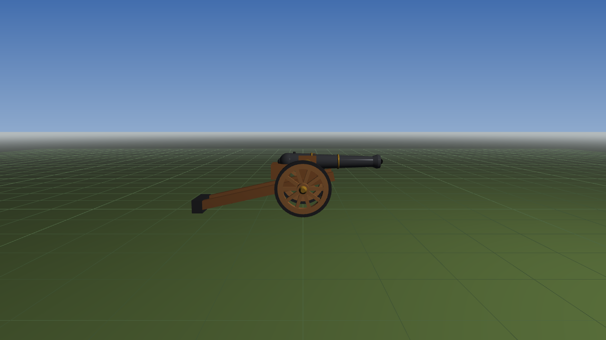 | 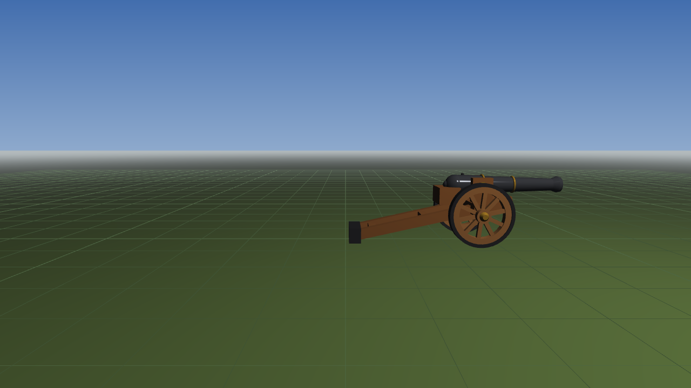 |

*Camera fixed in **world** space so translation and rotation are both visible.
The carriage has advanced 2.6 grid squares and the spokes have turned through
−240.27° — two thirds of a turn, which is why the 10-spoke pattern (36° apart)
does not repeat.*

### 4.4 Rotation about a pivot that is not the origin

A rotation matrix rotates about the origin. To rotate about an arbitrary point
`p` one conjugates:

> **R_p(θ) = T(p) · R_z(θ) · T(−p)**

In the renderer the `T(−p)` factor is absent, and this is deliberate rather than
an omission: the barrel mesh is *authored* in a local frame whose origin already
sits at the trunnion, so the geometry arrives pre-multiplied by `T(−p)` in the
modelling stage. What the code writes,

```python
glTranslatef(*PIVOT)                    # T(p)
glRotatef(self.elevation, 0, 0, 1)      # R_z(theta)
self._draw_trunnions()                  # stays with the mount
glTranslatef(-self.recoil, 0, 0)        # T(-rho), along the barrel's own axis
self._draw_barrel()
```

is that formula with the inverse translation folded into the model. Note where
the trunnions are drawn: **after** the elevation rotation but **before** the
recoil translation, so they swing with the barrel but do not slide with it —
exactly as the real hardware behaves.

| θ = 0° | θ = 25° | θ = 45° |
|---|---|---|
| 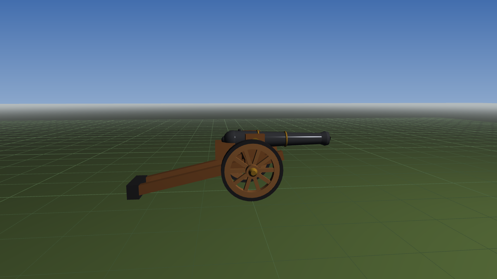 | 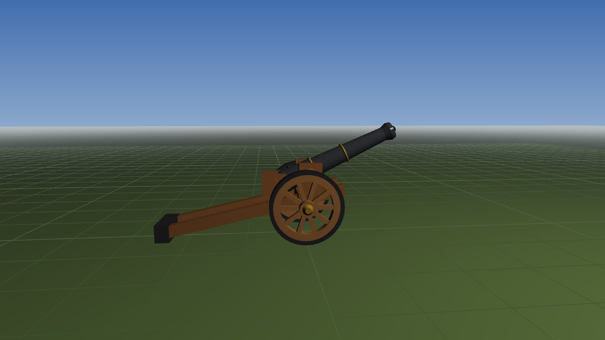 | 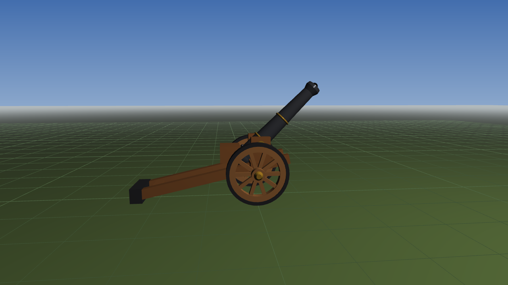 |

*Elevation, clamped to [0°, 45°]. The pivot stays fixed in the carriage while the
muzzle sweeps an arc of radius ℓ = 1.70 m about it; camera and light are
identical in all three frames.*

### 4.5 Where is the muzzle?

Firing needs the world position and direction of the muzzle, and guessing them
with trigonometry written a second time is how the ball ends up leaving from
inside the barrel. Instead `Cannon.barrel_matrix` rebuilds the composite matrix
in numpy — the same factors in the same order — and pushes two vectors through
it:

```
q̃ = M_barrel · (ℓ, 0, 0, 1)ᵀ        d̃ = M_barrel · (1, 0, 0, 0)ᵀ      ℓ = 1.70 m
```

Expanding the product gives the closed form

```
q = ( x + p_x + (ℓ − ρ)·cos θ ,  p_y + (ℓ − ρ)·sin θ ,  0 )
d = ( cos θ , sin θ , 0 )
```

and `verify.py` confirms the matrix chain and the closed form agree to `0.0e+00`
m at θ ∈ {0°, 32°, 45°} with ρ ∈ {0, 0.30} m. Because `d̃` carries `w = 0` it
picks up the rotation but not the translations, so it is already the unit barrel
axis (`|d| = 1.000000`).

### 4.6 Recoil as a damped harmonic oscillator

On firing, the barrel is given a backwards impulse and then pulled home by an
elastic mount. Writing `ρ(t) ≥ 0` for the distance slid back along its own axis:

```
ρ̈ + c·ρ̇ + k·ρ = 0 ,      ρ(0) = 0 ,   ρ̇(0) = v₀
```

with `k = 90.0 s⁻²`, `c = 2ζ√k = 16.128 s⁻¹`, `v₀ = 3.40 m/s`. Then

```
ω_n = √k              = 9.4868 rad/s
ζ   = c / (2√k)       = 0.850          → under-damped
ω_d = ω_n·√(1 − ζ²)   = 4.9975 rad/s
```

Under-damping is chosen deliberately: a critically damped return (ζ = 1) creeps
back and reads as sluggish, whereas a small overshoot looks mechanical. The
solution is

```
ρ(t)  = (v₀ / ω_d) · e^(−ζ ω_n t) · sin(ω_d t)
t_max = (1/ω_d) · arctan( ω_d / (ζ ω_n) )      = 0.1110 s
ρ_max                                          = 0.1464 m
```

The renderer does not evaluate that closed form; it integrates the ODE with
semi-implicit (symplectic) Euler, which stays stable at interactive time-steps:

```
ρ̇ ← ρ̇ + (−k·ρ − c·ρ̇)·Δt
ρ  ← ρ + ρ̇·Δt
```

Measured against the analytic solution:

| Δt | peak ρ (m) | t of peak (s) | error |
|---:|---:|---:|---:|
| 1/240 | 0.1375 | 0.108 | 6.09 % |
| 1/480 | 0.1419 | 0.110 | 3.05 % |
| 1/4000 | 0.1459 | 0.111 | 0.37 % |

First-order convergence, as expected; the barrel settles to within 2 % of rest
after ≈ 0.55 s in every case.

| at rest, ρ = 0 | t = 0.11 s after firing, near ρ_max |
|---|---|
| 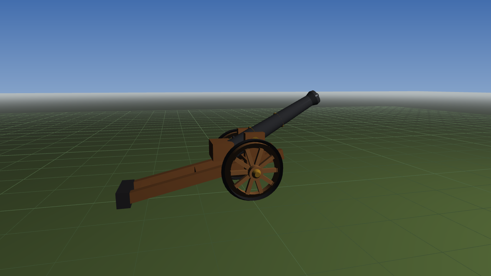 | 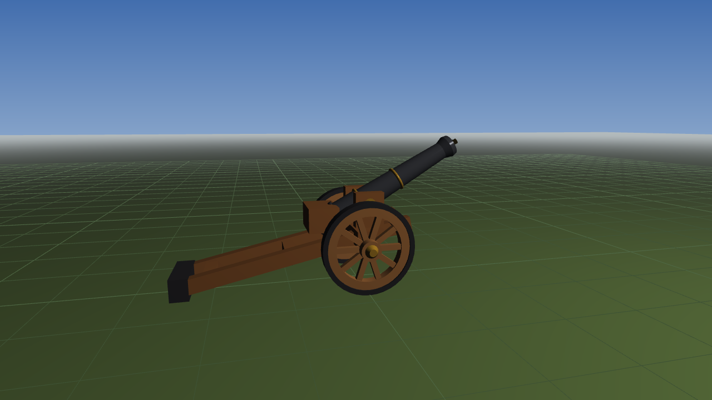 |

Because `T(−ρ,0,0)` sits **inside** the elevation rotation, the world-space
displacement is automatically along the elevated barrel:
`Δq = −ρ·(cos θ, sin θ, 0)`. At θ = 25° and ρ = 0.30 m, `verify.py` measures
`(−0.2719, −0.1268, 0)` m against a predicted `(−0.2719, −0.1268, 0)` m.

### 4.7 Projectile motion

The ball leaves the muzzle at `q` with velocity `v₀ = v_m·d`, `v_m = 15 m/s`,
and thereafter feels only `g = (0, −9.81, 0) m/s²`:

```
p(t) = q + v₀·t + ½·g·t²
```

Solving the vertical component for the height `y_f` at which the ball stops gives
the flight time and the range:

```
t_f = [ v_m sin θ + √( (v_m sin θ)² + 2g(q_y − y_f) ) ] / g
X   = v_m cos θ · t_f
```

The HUD displays this live, so the analytic prediction can be read off while the
simulated ball is still in the air. The simulation uses the same semi-implicit
Euler scheme as the recoil. For constant acceleration that scheme has an exactly
known bias — after `n` steps of size Δt:

```
p_n = q + n·Δt·v₀ + g·n(n+1)/2·Δt²  =  (q + v₀t + ½gt²)  +  ½·g·Δt·t
                                        └── exact ──┘      └─ bias ─┘
```

i.e. the numerical ball sits `½·g·Δt·t` **below** the true parabola, so it lands
slightly early and slightly short. At Δt = 1/240 s and t ≈ 1.8 s that is about
3.7 cm — and indeed every simulated range is a little under the analytic one:

| θ | t_f exact (s) | t_f sim (s) | X exact (m) | X sim (m) | rel. error |
|---:|---:|---:|---:|---:|---:|
| 10° | 0.8598 | 0.8583 | 12.7015 | 12.6794 | 0.174 % |
| 20° | 1.3090 | 1.3083 | 18.4506 | 18.4415 | 0.050 % |
| 30° | 1.7578 | 1.7542 | 22.8348 | 22.7873 | 0.208 % |
| 35° | 1.9717 | 1.9708 | 24.2265 | 24.2162 | 0.043 % |
| 45° | 2.3645 | 2.3625 | 25.0796 | 25.0581 | 0.086 % |

Note that the optimum elevation is **not** 45° in general — it is 45° only for a
launch and landing at the same height; firing from `q_y ≈ 2 m` shifts the optimum
a little below it.

On contact the ball is reflected with restitution `e = 0.35` and tangential
damping 0.72 (`v_y ← −e·v_y`), and is put to rest once `|v_y| < 0.8 m/s`, which
stops the infinite bouncing a constant-restitution model would otherwise produce.

| t = 14 ms: flash, ball leaving | the completed parabola, θ = 35° |
|---|---|
| 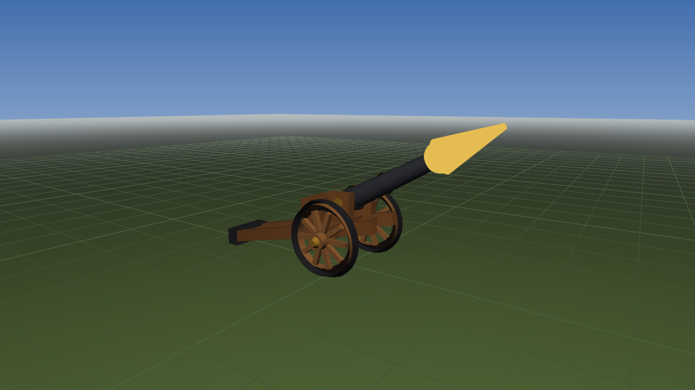 | 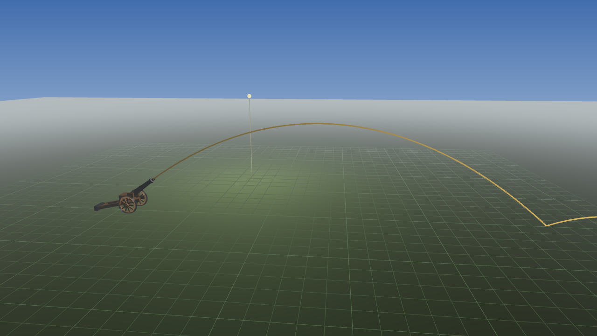 |

*The trail is a poly-line of the ball's own history, so the shape on the right
**is** the integrated trajectory, not a drawn curve. Its span matches the 24.2 m
predicted by the range formula.*

### 4.8 Viewing and projection

**Camera.** The camera orbits a target `t` (the cannon, optionally offset
down-range) at azimuth α, elevation β and distance r:

```
e = t + r·( cos β cos α ,  sin β ,  cos β sin α )
```

`gluLookAt` then builds an orthonormal eye basis from `e`, `t` and the up hint
`u_h = (0,1,0)`:

```
f = (t − e)/‖t − e‖        s = (f × u_h)/‖f × u_h‖        u = s × f

     ⎡ s_x   s_y   s_z  0 ⎤
V =  ⎢ u_x   u_y   u_z  0 ⎥ · T(−e)
     ⎢−f_x  −f_y  −f_z  0 ⎥
     ⎣  0     0     0   1 ⎦
```

The rows are the eye basis because the matrix is the *inverse* of the camera's
placement: `V = (R·T(e))⁻¹ = T(−e)·Rᵀ` written out. The third row is negated
because OpenGL's eye space looks down `−Z`. Pitch is clamped to [−5°, 85°] so `f`
never becomes parallel to `u_h`, which would make `s` undefined.

**Perspective.** With vertical FOV ϑ = 50°, aspect a = w/h, near n = 0.1 and far
f = 200, `gluPerspective` loads

```
     ⎡ cot(ϑ/2)/a      0            0             0      ⎤
P =  ⎢     0       cot(ϑ/2)         0             0      ⎥      cot 25° = 2.1445
     ⎢     0           0      (f+n)/(n−f)   2fn/(n−f)    ⎥
     ⎣     0           0           −1             0      ⎦
```

The `−1` in the last row copies `−z_eye` into `w_clip`; the subsequent divide by
`w` is what makes distant objects small, and it is also what makes depth
non-linear:

```
z_ndc = (f+n)/(n−f) + 2fn / ((n−f)·(−z_eye))
```

so half the depth buffer is spent inside `z_eye ∈ [−2n, −n]`. This is why
n = 0.1 m and not 0.001 m: with the far plane at 200 m, a near plane a thousand
times closer would crush the usable depth precision and produce z-fighting on the
barrel bands, which are only 2 cm thick.

| low hero | high overview | down-range |
|---|---|---|
| 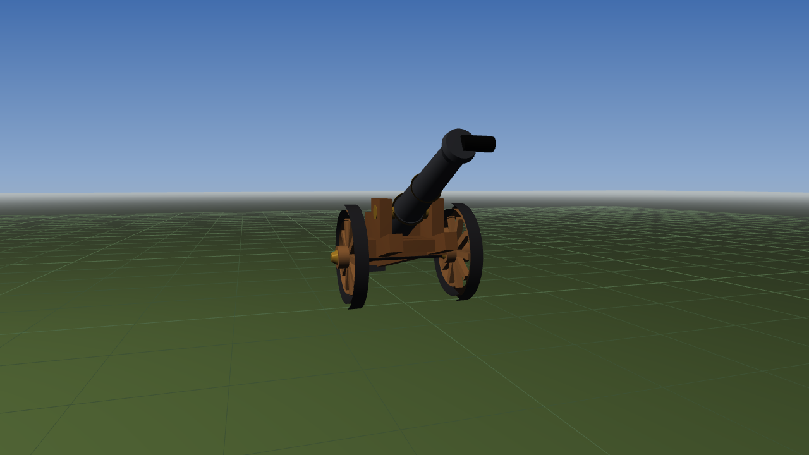 | 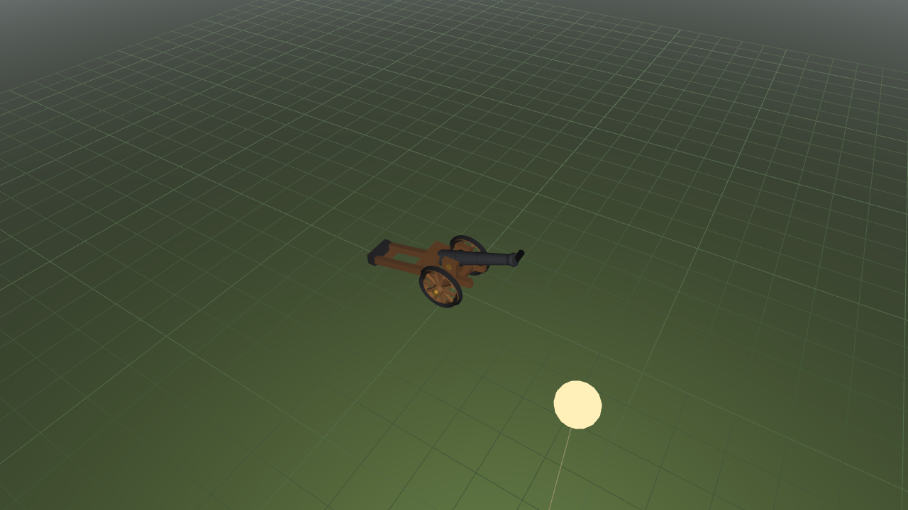 | 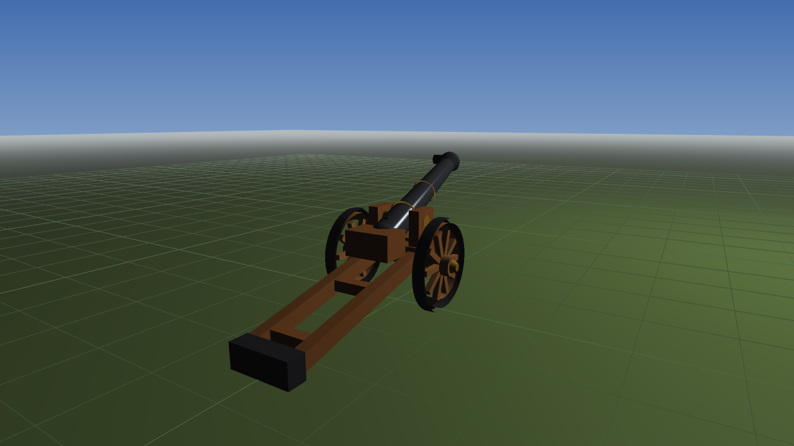 |

*Three of the five camera presets (`C`). Perspective foreshortening is obvious in
the grid: equal 1 m squares converge towards the horizon.*

### 4.9 Normals

**The normal matrix.** A normal is not a direction that can be transformed by
`M`. If `t` is a surface tangent, `N·t = 0` must still hold afterwards, i.e.
`N′·(M t) = 0`. Substituting `N′ = A·N` gives `Nᵀ Aᵀ M t = 0` for all `t`, so
`Aᵀ M = I` and

> **A = (M⁻¹)ᵀ**

which is what `gl_NormalMatrix` contains. This project uses only translations and
rotations, for which `(M⁻¹)ᵀ = M`, so the distinction is invisible here — but it
is the reason the shader is written with `gl_NormalMatrix` rather than
`mat3(gl_ModelViewMatrix)`, and it would matter the moment a non-uniform
`glScalef` were introduced.

**Analytic normals for a truncated cone.** Nearly every part of the cannon —
barrel sections, muzzle swell, axle, hub, wheel rims — is a truncated cone, so
its normal is worth deriving properly. Parameterise the lateral surface from
radius `r₀` at `z = 0` to `r₁` at `z = h`:

```
P(φ,t) = ( r(t)·cos φ , r(t)·sin φ , h·t ) ,   r(t) = r₀ + (r₁ − r₀)·t
∂P/∂φ  = ( −r sin φ , r cos φ , 0 )
∂P/∂t  = ( (r₁−r₀) cos φ , (r₁−r₀) sin φ , h )

∂P/∂φ × ∂P/∂t = r·( h cos φ , h sin φ , r₀ − r₁ )
```

> **N = ( h cos φ , h sin φ , r₀ − r₁ ) / √( h² + (r₁ − r₀)² )**

The radius factor divides out, so the normal depends only on φ — it is constant
along each ruling, which is exactly why a cone shades with straight highlight
bands. For a plain cylinder (`r₀ = r₁`) it collapses to `(cos φ, sin φ, 0)`; the
naive guess of using that for a *tapered* section is wrong by
`arctan((r₀−r₁)/h)`, which for the barrel's chase is **2.0°** — small, but enough
to misplace a tight specular highlight. Check 5 of `verify.py` confirms the
formula is unit length to `2.2e−16` and orthogonal to both tangents to `1.8e−17`.

Spheres use `N = P/r`; the torus (brass astragal rings) uses
`N = (cos α cos β, sin α cos β, sin β)`.

### 4.10 The Phong reflection model

Each fragment's colour is

```
I = m_e
  + k_a ⊗ i_a^global
  + 1/(k_c + k_l·d + k_q·d²) · [ k_a ⊗ i_a
                               + k_d ⊗ i_d · max(N·L, 0)
                               + k_s ⊗ i_s · max(R·V, 0)^n ]
```

where ⊗ is component-wise multiplication over RGB, `d = ‖P_light − P‖`, and

```
L = (P_light − P)/d        V = −P/‖P‖  (eye space)        R = 2(N·L)N − L
```

The three terms do three different jobs, and the project can show each in
isolation:

- **Ambient** — a constant floor standing in for all the light that has bounced
  off everything else. Pressing `L` kills the direct light and leaves only
  `m_e + k_a ⊗ i_a^global`. The scene becomes a flat silhouette, which is the
  point: ambient alone carries no shape information.
- **Diffuse** — Lambert's cosine law, `N·L`. It depends on where the light is but
  not on where the eye is, so it does not move when you orbit. This is what gives
  the carriage its solidity.
- **Specular** — the mirror lobe, `(R·V)ⁿ`. It depends on the eye, so it slides
  across the barrel as either the camera or the light moves. The exponent `n`
  controls tightness: `n = 8` for wood spreads a weak sheen over the whole plank,
  `n = 96` for iron concentrates it into a thin streak.

**Attenuation and the light type.** With `w = 1` the light is a point source at a
finite distance, `L` is recomputed per fragment, and the
`1/(k_c + k_l d + k_q d²)` factor applies (`k_c = 1`, `k_l = 0.010`,
`k_q = 0.0004`). Pressing `N` sets `w = 0`: the position becomes a direction, `L`
is constant everywhere, and attenuation is disabled — the sun-at-infinity model.
The difference is easiest to see on the large ground plane, which loses its pool
of light and becomes uniformly lit.

**Materials.** Two are required to contrast; the project ships five.

| Material | k_a | k_d | k_s | n |
|---|---|---|---|---:|
| Oak (carriage) | (0.14, 0.09, 0.05) | (0.52, 0.32, 0.16) | (0.10, 0.08, 0.06) | 8 |
| Light oak (wheels) | (0.16, 0.11, 0.06) | (0.60, 0.40, 0.22) | (0.12, 0.10, 0.08) | 10 |
| Cast iron (barrel) | (0.06, 0.07, 0.08) | (0.19, 0.20, 0.23) | (0.92, 0.94, 1.00) | 96 |
| Brass (fittings) | (0.16, 0.12, 0.04) | (0.62, 0.47, 0.13) | (0.85, 0.75, 0.45) | 64 |
| Iron tyre | (0.05, 0.05, 0.06) | (0.13, 0.13, 0.15) | (0.55, 0.55, 0.60) | 48 |
| Field (ground) | (0.10, 0.13, 0.08) | (0.34, 0.44, 0.24) | (0.04, 0.05, 0.04) | 4 |

Wood and iron differ by roughly 9× in specular strength and 12× in exponent —
that ratio, not the base colour, is what makes one look like timber and the other
like metal.

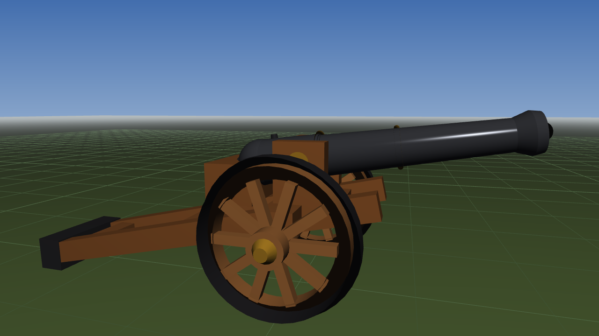

*Two materials under one light. The oak beams and spokes show a broad, almost
invisible sheen (k_s ≈ 0.1, n = 8) and read as matte; the barrel carries a narrow
white streak (k_s ≈ 0.95, n = 96) and reads as polished iron. The brass hub cap
sits between the two. Nothing here is a painted highlight — all of it comes out
of the equation above.*

**Why the highlight needs the light in the right place.** A specular streak
appears where the mirror condition `R = V` is met, equivalently where
`L + V ∥ N`. On a cylinder of axis `â` every normal satisfies `N·â = 0`, so a
*perfect* highlight exists only if

> **(L + V) · â = 0**

that is, only if the light and the eye lie on opposite sides of the plane through
the barrel perpendicular to its axis. When they lie on the same side,
`max_φ(N·H)` can be as low as 0.89, and raised to n = 96 that is `1.4e−5` —
effectively black. This is not a defect; it is the model behaving correctly, and
it is why the light is placed at azimuth 122° against a camera at 58° for the
shading figures.

| light at 120° | light at 10° | directional (w = 0) |
|---|---|---|
| 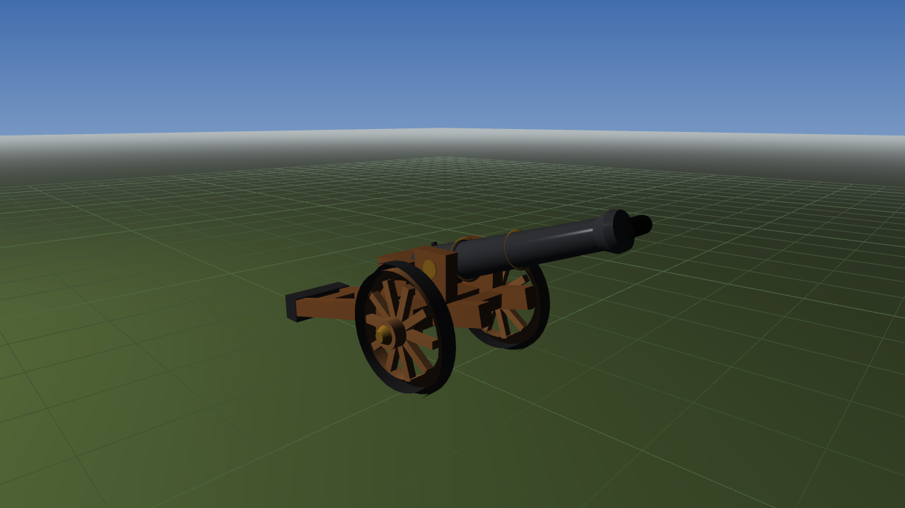 | 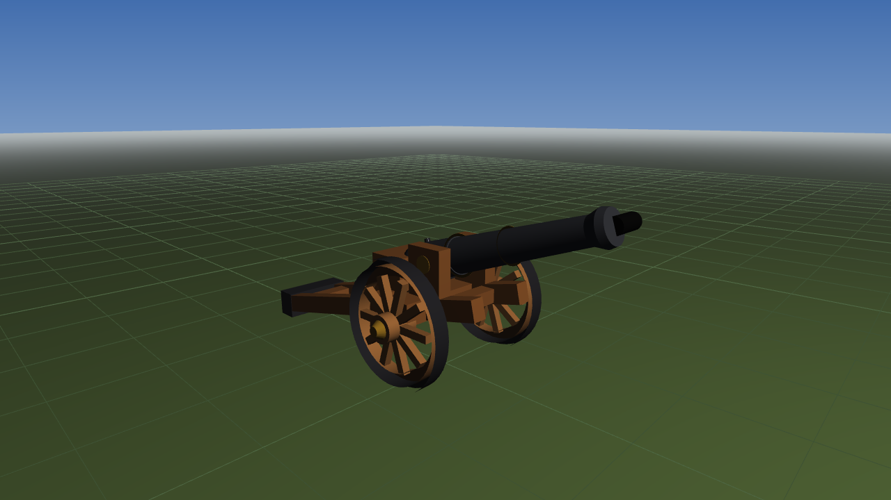 | 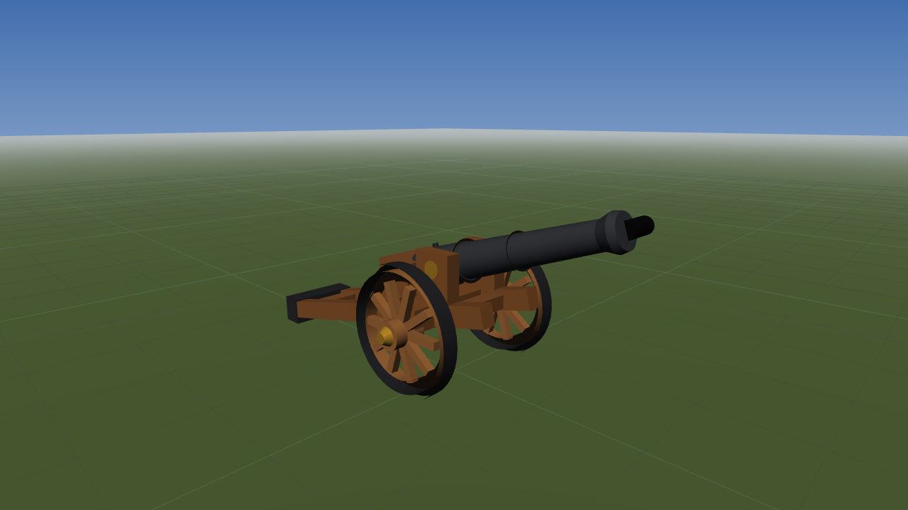 |

*Identical camera, identical materials, moved light. In (a) the mirror condition
is satisfied and the barrel carries a bright streak; in (b) the light has swung
to the eye's own side and the streak vanishes while the diffuse shading merely
shifts. In (c) the same light is made directional: the falloff across the ground
disappears.*

### 4.11 Gouraud versus Phong shading

The reflection model says *what* to compute; shading says *where*. The
fixed-function pipeline evaluates the model once per vertex and interpolates the
resulting colour across the triangle (**Gouraud** shading). The GLSL path
interpolates the **normal** and evaluates the model once per fragment (**Phong**
shading). Since a specular lobe of exponent 96 is far narrower than a triangle,
per-vertex evaluation either misses the highlight entirely or smears it into a
polygonal blob.

Pressing `F` switches paths at runtime. Crucially, both paths read the **same**
`glMaterial`/`glLight` state — the shader uses the legacy `gl_FrontMaterial` and
`gl_LightSource[0]` built-ins — so the comparison isolates the shading frequency
and nothing else.

| per-fragment Phong | per-vertex Gouraud | light off: the ambient term alone |
|---|---|---|
| 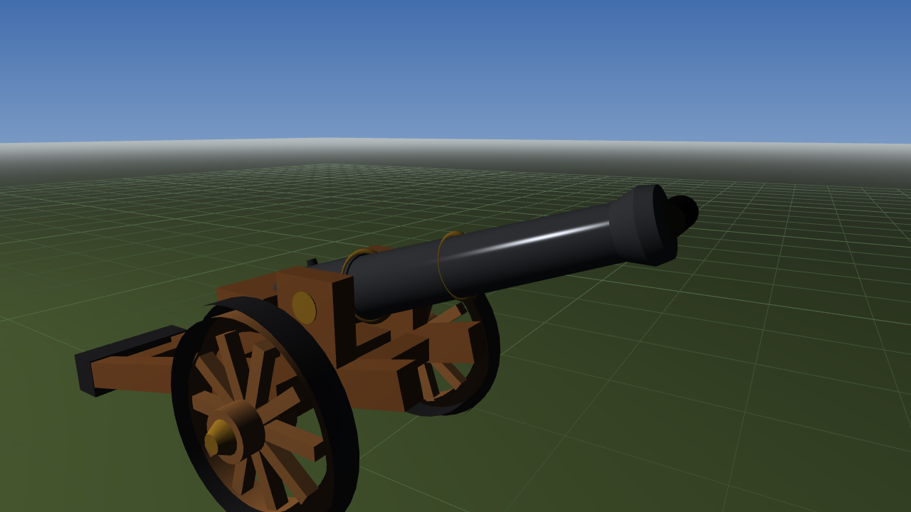 | 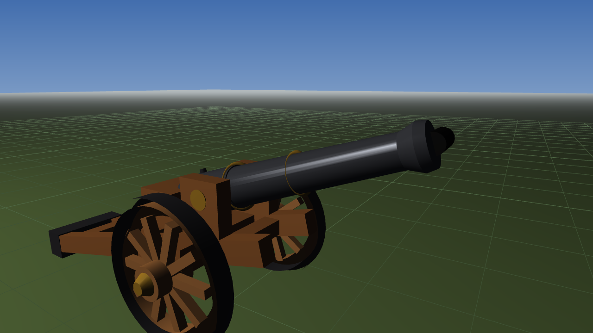 | 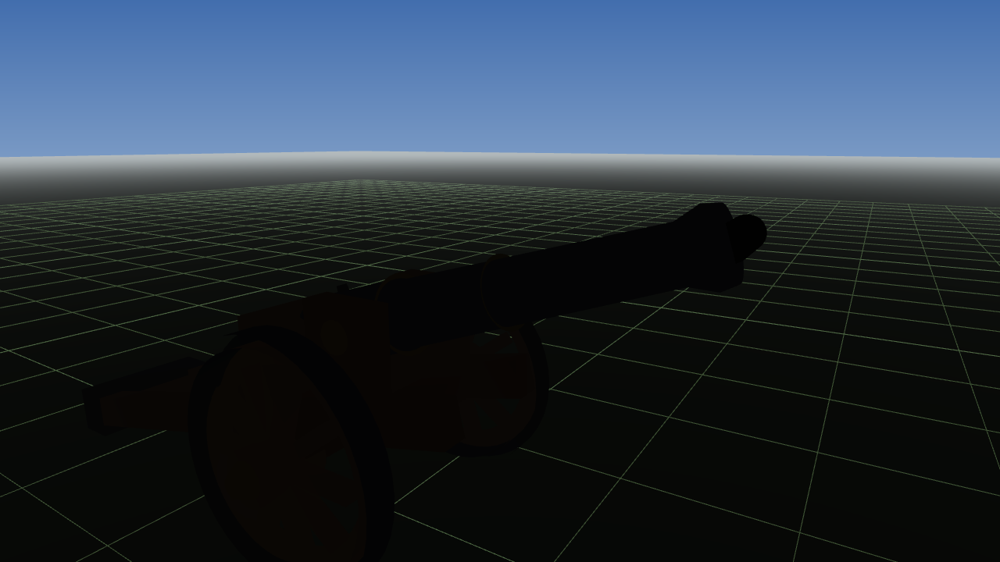 |

Measured over the whole frame, the first two differ by more than 4/255 on
**8.82 %** of pixels, with a maximum channel difference of **88/255**; peak
luminance is **255** under Phong against **205** under Gouraud, and the Gouraud
highlight is visibly banded along the 40 slices of the tube.

### 4.12 Atmospheric fog

The ground plane is finite (100 × 100 m) and its edge would otherwise be a hard
line across the sky. Both paths therefore apply exponential-squared fog in eye
space,

```
f = exp( −(ϱ·z_eye)² )        C = f·C_lit + (1 − f)·C_fog        ϱ = 0.020 m⁻¹
```

and the lowest stop of the sky gradient is set to `C_fog`, so the plane dissolves
into the horizon. At the 3–9 m working distance of the cannon `f > 0.99`, so the
model itself is essentially unfogged.

---

## 5. Implementation notes

### 5.1 The shader

```glsl
varying vec3 vNormalEye;   // interpolated NORMAL -> Phong (not Gouraud) shading
varying vec3 vPosEye;
uniform bool uLightEnabled, uBlinn;
uniform vec3 uFogColor;  uniform float uFogDensity;

void main() {
    vec3 N = normalize(vNormalEye);
    vec3 color = gl_FrontLightModelProduct.sceneColor.rgb;  // emission + k_a * global ambient

    if (uLightEnabled) {
        vec4  lpos = gl_LightSource[0].position;   // already in eye space
        vec3  Lv   = lpos.xyz - vPosEye * lpos.w;  // w = 0  ->  directional
        float d    = length(Lv);
        vec3  L    = Lv / max(d, 1e-6);

        float att = 1.0;
        if (lpos.w > 0.5)
            att = 1.0 / (gl_LightSource[0].constantAttenuation
                       + gl_LightSource[0].linearAttenuation    * d
                       + gl_LightSource[0].quadraticAttenuation * d * d);

        vec3  V   = normalize(-vPosEye);           // local viewer
        float ndl = max(dot(N, L), 0.0);
        float spec = 0.0;
        if (ndl > 0.0) {
            if (uBlinn) { vec3 H = normalize(L + V);
                          spec = pow(max(dot(N, H), 0.0), gl_FrontMaterial.shininess); }
            else        { vec3 R = reflect(-L, N);
                          spec = pow(max(dot(R, V), 0.0), gl_FrontMaterial.shininess); }
        }
        color += att * (gl_LightSource[0].ambient.rgb  * gl_FrontMaterial.ambient.rgb
                      + gl_LightSource[0].diffuse.rgb  * gl_FrontMaterial.diffuse.rgb  * ndl
                      + gl_LightSource[0].specular.rgb * gl_FrontMaterial.specular.rgb * spec);
    }
    float z = length(vPosEye);
    color = mix(uFogColor, color, clamp(exp(-(uFogDensity*z)*(uFogDensity*z)), 0.0, 1.0));
    gl_FragColor = vec4(color, gl_FrontMaterial.diffuse.a);
}
```

If compilation or linking fails on any driver, the exception is caught,
`PhongShader.available` stays `False`, and the program runs entirely on the
fixed-function pipeline. Nothing else in the code has to know which path is live.

**Blinn–Phong.** Pressing `B` swaps `(R·V)ⁿ` for `(N·H)ⁿ` with `H = ⟨L+V⟩`. Since
the angle between `N` and `H` is about half the angle between `R` and `V`, the
Blinn lobe is roughly twice as wide for the same `n`; matching the two requires
`n_Blinn ≈ 4·n_Phong`.

### 5.2 Drawing unlit geometry inside a lit frame

The projectile trails, the light marker and the HUD are flat-coloured. Simply
calling `glDisable(GL_LIGHTING)` is **not** enough when a shader is bound, because
the shader ignores that state entirely and would keep shading them with the last
material — an early version of this project drew the trails almost black for
exactly that reason. `lighting.unlit` is a context manager that drops out of both
the shader and fixed-function lighting and restores whichever was active:

```python
with unlit():                 # leaves the program, disables GL_LIGHTING
    glBegin(GL_LINE_STRIP)
    ...                       # glColor3f now actually reaches the framebuffer
    glEnd()
```

### 5.3 Geometry budget

| Part | Primitive | Tessellation |
|---|---|---|
| Trail beams, transoms, cheeks, spokes | box | 6 quads each |
| Barrel (breech, reinforce, chase, swell, bore) | truncated cones + sphere | 40 slices |
| Wheel tyre and felloe | tube (annulus) | 40 slices |
| Wheel hub, axle, trunnions | cylinders | 16–24 slices |
| Astragal rings | torus | 32 × 12 |
| Cannonball | UV sphere | 20 × 14 |
| Ground | tessellated quad grid | 150 × 150 |

The ground is finely tessellated on purpose: under the fixed-function per-vertex
path a single large quad would sample the point light at only four corners and
the pool of light would vanish.

---

## 6. Results

The scene runs at the display refresh rate on the test machine. The HUD reports a
**measured** frame rate obtained by timing 30 consecutive `render()` calls with
`glFinish` barriers, not an estimate.

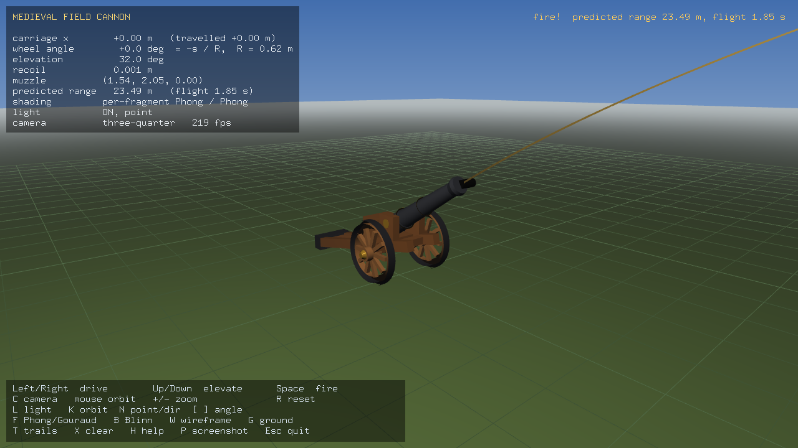

*The live HUD reports the carriage position and distance travelled, the wheel
angle beside the −s/R rule that produced it, the elevation, the instantaneous
recoil, the muzzle point, and the analytic range prediction for the shot
currently in the air.*

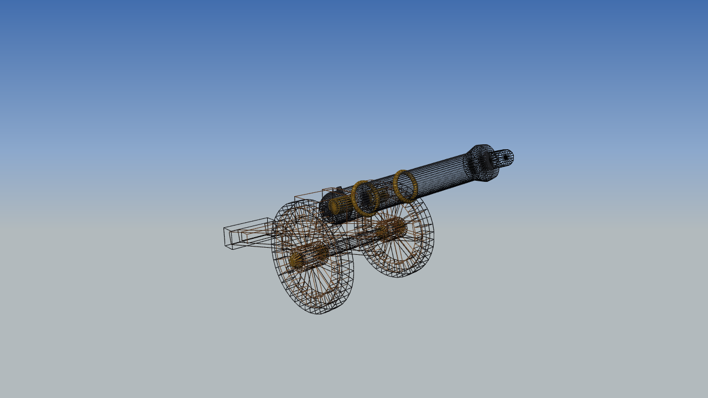

*Wireframe (`W`). The structure is visible: 10 box spokes per wheel, the annular
tyre and felloe, the stack of truncated cones that forms the barrel, and the
sphere at the breech. No external model files are used — every vertex is
generated by `utils.py`.*

---

## 7. Limitations and extensions

- **No shadows.** The cannon does not cast one, the most noticeable absence. A
  planar projection shadow onto `y = 0` would be a single extra matrix and would
  cost almost nothing.
- **One light.** The rig supports `GL_MAX_LIGHTS = 8`; the shader hard-codes
  `gl_LightSource[0]` and would need a loop.
- **Legacy GLSL.** Using the deprecated built-ins keeps the shader and
  fixed-function paths in perfect agreement — ideal for the Gouraud/Phong
  comparison — but a modern core-profile port would have to pass materials and
  lights as explicit uniforms.
- **Flat ground, no drag.** The projectile ignores air resistance and the terrain
  is a plane; both are deliberate, per the brief's instruction to keep the scope
  tight.
- **No textures.** All surface variety comes from the material coefficients,
  which is what makes the lighting model so legible in the figures.

---

## 8. Verification output

Produced by `python verify.py`. Every number quoted in section 4 comes from this
run; the full text is in [`verification.txt`](verification.txt).

```
1.  Rolling constraint    phi = -s / R
  wheel radius R          : 0.6200 m
  distance driven s       : 2.6000 m
  expected  -s/R          :  -240.2726 deg
  simulated wheel_angle   :  -240.2726 deg
  error                   : 2.672e-12 deg
  rim arc length R|phi|   : 2.6000 m  (must equal s)

2.  Muzzle point from the composite matrix
  elev 32.0 deg, recoil 0.00 m
    matrix chain   : (  3.0417,   2.0509,  0.000)
    closed form    : (  3.0417,   2.0509,  0.000)
    |difference|   : 0.000e+00 m
    axis direction : (0.8480, 0.5299, 0.0000)   |d| = 1.000000

3.  Projectile: semi-implicit Euler vs. the closed-form parabola
   elev    t_exact      t_sim    R_exact      R_sim   rel.err
   10.0     0.8598     0.8583    12.7015    12.6794    0.174 %
   20.0     1.3090     1.3083    18.4506    18.4415    0.050 %
   30.0     1.7578     1.7542    22.8348    22.7873    0.208 %
   35.0     1.9717     1.9708    24.2265    24.2162    0.043 %
   45.0     2.3645     2.3625    25.0796    25.0581    0.086 %

4.  Recoil: damped harmonic oscillator
  damping ratio zeta = c / 2 sqrt(k)   : 0.8500  (under-damped)
  analytic peak time  t_p              : 0.1110 s
  analytic peak       x(t_p)           : 0.1464 m
  dt = 1/4000   peak 0.1459 m at t = 0.111 s, |err| vs analytic 0.37 %

5.  Analytic normals of the truncated cone are correct
  max | |N| - 1 |          : 2.220e-16
  max |N . tangent|        : 1.841e-17   (0 => N is the true surface normal)

6.  Hierarchy: a child inherits every ancestor transform
  muzzle at x=0.0 : (1.6407, 1.8685, 0.000)
  muzzle at x=4.0 : (5.6407, 1.8685, 0.000)
  delta           : (4.0000, 0.0000, 0.000)   <- pure translation of the root
```
