# কামান (Cannon) প্রজেক্ট — সম্পূর্ণ কোড ওয়াকথ্রু

> এই ডকুমেন্টটা `Project1/` ফোল্ডারের C++ / OpenGL কোডের লাইন-বাই-লাইন ব্যাখ্যা।
> ধরে নেওয়া হয়েছে আপনি **C++ জানেন**, কিন্তু **OpenGL বা গ্রাফিক্সের কিছুই জানেন না**।
>
> প্রতিটা অংশে একই ছন্দে এগোনো হয়েছে:
> **১. কনসেপ্ট** (সহজ ভাষায় + অঙ্ক কষে) → **২. ছবি** (কোডটা আসলে কী বানায়) → **৩. কোড** (ধাপে ধাপে)।
>
> ছবিগুলো কল্পনা করে আঁকা না — `Project1/tools/RenderDocShots.cpp` দিয়ে **আসল কোড চালিয়ে** রেন্ডার করা।
> কোড বদলে `mingw32-make shots` দিলে ছবিগুলোও বদলে যাবে।

---

## সূচিপত্র

- [পর্ব ০ — পুরো জিনিসটা এক নজরে (ব্ল্যাক বক্স)](#পর্ব-০--পুরো-জিনিসটা-এক-নজরে-ব্ল্যাক-বক্স)
- [পর্ব ১ — OpenGL আসলে কী করে?](#পর্ব-১--opengl-আসলে-কী-করে)
- [পর্ব ২ — স্থানাঙ্ক ব্যবস্থা (Coordinate System)](#পর্ব-২--স্থানাঙ্ক-ব্যবস্থা-coordinate-system)
- [পর্ব ৩ — ম্যাট্রিক্স: গ্রাফিক্সের প্রাণ](#পর্ব-৩--ম্যাট্রিক্স-গ্রাফিক্সের-প্রাণ)
- [পর্ব ৪ — আলো (Lighting) আর Normal ভেক্টর](#পর্ব-৪--আলো-lighting-আর-normal-ভেক্টর)
- [পর্ব ৫ — এন্ট্রি পয়েন্ট: `Main.cpp` ধাপে ধাপে](#পর্ব-৫--এন্ট্রি-পয়েন্ট-maincpp-ধাপে-ধাপে)
- [পর্ব ৬ — GPU-তে ডেটা পাঠানো: VBO, EBO, VAO, Mesh](#পর্ব-৬--gpu-তে-ডেটা-পাঠানো-vbo-ebo-vao-mesh)
- [পর্ব ৭ — শেডার দুটো: `lit.vert` আর `lit.frag`](#পর্ব-৭--শেডার-দুটো-litvert-আর-litfrag)
- [পর্ব ৮ — `Primitives.cpp`: সব আকৃতির কারখানা](#পর্ব-৮--primitivescpp-সব-আকৃতির-কারখানা)
- [পর্ব ৯ — `Part` আর `Local::`: জিনিস ঘোরানো ও বসানো](#পর্ব-৯--part-আর-local-জিনিস-ঘোরানো-ও-বসানো)
- [পর্ব ১০ — `Transform`, `Dimensions.h`, `Palette.h`](#পর্ব-১০--transform-dimensionsh-paletteh)
- [পর্ব ১১ — `Wheel`: চাকা বানানো](#পর্ব-১১--wheel-চাকা-বানানো)
- [পর্ব ১২ — `Carriage`: কামানের কাঠামো](#পর্ব-১২--carriage-কামানের-কাঠামো)
- [পর্ব ১৩ — `Shaft`: নল (Barrel)](#পর্ব-১৩--shaft-নল-barrel)
- [পর্ব ১৪ — Scene Graph: সব জোড়া লাগানো](#পর্ব-১৪--scene-graph-সব-জোড়া-লাগানো)
- [পর্ব ১৫ — আপনার যাত্রা (key চাপলে কী হয়)](#পর্ব-১৫--আপনার-যাত্রা-key-চাপলে-কী-হয়)
- [পর্ব ১৬ — Phase 2: `Projectile` — কামানের গুলি, পদার্থবিদ্যা সহ](#পর্ব-১৬--phase-2-projectile--কামানের-গুলি-পদার্থবিদ্যা-সহ)
- [পর্ব ১৭ — Phase 2: `Wall` — ভাঙা যায় এমন দেয়াল](#পর্ব-১৭--phase-2-wall--ভাঙা-যায়-এমন-দেয়াল)
- [পর্ব ১৮ — `Main.cpp` Phase 2 লুপ: spawn, update, draw](#পর্ব-১৮--maincpp-phase-2-লুপ-spawn-update-draw)
- [পর্ব ১৯ — বিল্ড ও রান](#পর্ব-১৯--বিল্ড-ও-রান)
- [পর্ব ২০ — নিজে হাতে পরীক্ষা করুন](#পর্ব-২০--নিজে-হাতে-পরীক্ষা-করুন)
- [শব্দকোষ (Glossary)](#শব্দকোষ-glossary)

---

## পর্ব ০ — পুরো জিনিসটা এক নজরে (ব্ল্যাক বক্স)

ভেতরে না তাকিয়ে, বাইরে থেকে দেখলে প্রোগ্রামটা এই:

```
    ইনপুট                       ┌─────────────────┐                আউটপুট
  ─────────────                 │                 │             ─────────────
  কী-বোর্ড:                     │   app.exe       │            একটা জানালা যেখানে
    ← →  গাড়ি চালানো    ─────►  │  (C++/OpenGL)   │  ─────►    ৩D কামান দেখা যায়,
    ↑ ↓  নল ওঠানো-নামানো        │                 │            সেকেন্ডে ~৬০ বার
    Esc  বন্ধ                   └─────────────────┘            নতুন করে আঁকা হয়
```

**ফাইনাল আউটপুট এরকম দেখায়:**

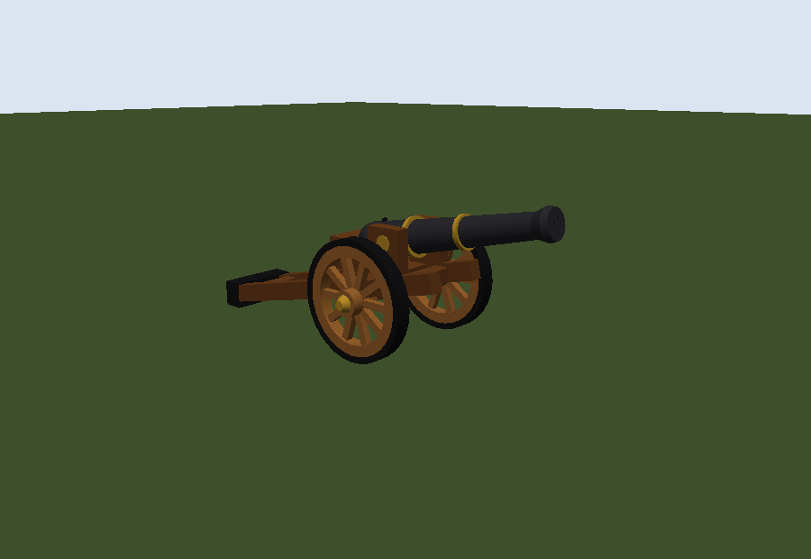

### মডিউল ম্যাপ

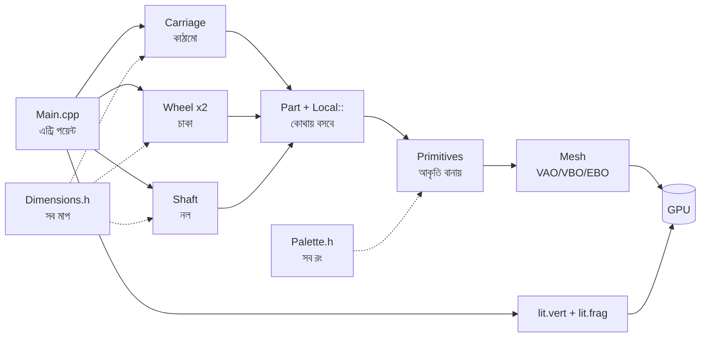
```mermaid
flowchart LR
  Main[Main.cpp<br/>এন্ট্রি পয়েন্ট] --> Carriage[Carriage<br/>কাঠামো]
  Main --> Wheel[Wheel x2<br/>চাকা]
  Main --> Shaft[Shaft<br/>নল]
  Carriage --> Part[Part + Local::<br/>কোথায় বসবে]
  Wheel --> Part
  Shaft --> Part
  Part --> Prim[Primitives<br/>আকৃতি বানায়]
  Prim --> Mesh[Mesh<br/>VAO/VBO/EBO]
  Mesh --> GPU[(GPU)]
  Main --> Shader[lit.vert + lit.frag] --> GPU
  Dim[Dimensions.h<br/>সব মাপ] -.-> Carriage
  Dim -.-> Wheel
  Dim -.-> Shaft
  Pal[Palette.h<br/>সব রং] -.-> Prim
```

> ক্যাপশন: `Main.cpp` তিনটা বড় অবজেক্ট বানায়; প্রত্যেকে `Part`-এর লিস্ট; প্রতিটা `Part` এর ভেতরে `Primitives` এর বানানো একটা `Mesh` — যা শেষমেশ GPU-তে যায়। ডটেড লাইনগুলো শুধু কনস্ট্যান্ট (মাপ আর রং) সরবরাহ করে।

### ফাইলগুলোর ভূমিকা

| ফাইল | কাজ | স্তর |
|---|---|---|
| `Main.cpp` | `main()`, জানালা খোলা, রেন্ডার লুপ | সবচেয়ে উপরে |
| `Carriage.*` | কাঠের কাঠামো — কামানের "শরীর" | অবজেক্ট |
| `Wheel.*` | স্পোক-ওয়ালা চাকা | অবজেক্ট |
| `Shaft.*` | কামানের নল | অবজেক্ট |
| `Dimensions.h` | সব মাপ (মিটারে), এক জায়গায় | কনস্ট্যান্ট |
| `Palette.h` | সব রং, এক জায়গায় | কনস্ট্যান্ট |
| `Part.h/.cpp` | `{Mesh, matrix}` + `Local::` হেল্পার | আঠা |
| `Transform.*` | position + rotation + scale → ম্যাট্রিক্স | আঠা |
| `Primitives.*` | বক্স/সিলিন্ডার/গোলক... বানানোর কারখানা | জ্যামিতি |
| `Mesh.*` | এক আকৃতির GPU ডেটা ধরে রাখে | GPU |
| `VAO/VBO/EBO.*` | OpenGL বাফার মোড়ক (wrapper) | GPU |
| `shaderClass.*` | শেডার ফাইল লোড ও কম্পাইল করে | GPU |
| `lit.vert`, `lit.frag` | GPU-তে চলা আসল শেডার কোড | GPU |

---

## পর্ব ১ — OpenGL আসলে কী করে?

### ১.১ মূল ধারণা: GPU হলো একটা কারখানা

আপনার CPU একটা খুব বুদ্ধিমান কর্মী — জটিল কাজ পারে, কিন্তু একবারে একটা-দুটা।
আপনার GPU হলো **হাজার হাজার বোকা কর্মীর একটা কারখানা** — প্রত্যেকে খুব সহজ কাজ পারে,
কিন্তু সবাই **একসাথে** করে।

গ্রাফিক্সের পুরো ট্রিকটা হলো: ছবি আঁকার কাজটাকে এমনভাবে ভাগ করা যাতে
হাজারটা বোকা কর্মী একসাথে করতে পারে।

### ১.২ সবকিছু ত্রিভুজ (Triangle)

OpenGL শুধু **তিনটা জিনিস** আঁকতে পারে: বিন্দু, রেখা, আর **ত্রিভুজ**।
গোলক নেই, বক্স নেই, সিলিন্ডার নেই। কিচ্ছু নেই।

তাহলে আমরা গোলক পাই কী করে? — অনেকগুলো ত্রিভুজ জোড়া দিয়ে।

```
একটা চারকোনা (quad) = ২টা ত্রিভুজ

   D ●────────● C          ত্রিভুজ ১ = A, B, C
     │ ╲      │            ত্রিভুজ ২ = A, C, D
     │   ╲    │
     │     ╲  │
   A ●────────● B
```

এই প্রজেক্টে আপনার পুরো কামানটা **প্রায় ৫,০০০ ত্রিভুজ** — আর কিছু না।

### ১.৩ Vertex (শীর্ষবিন্দু) কী?

একটা ত্রিভুজের কোণার বিন্দুকে বলে **vertex**। কিন্তু vertex মানে শুধু অবস্থান (position) না —
আপনি প্রতিটা vertex-এর সাথে যা খুশি তথ্য জুড়ে দিতে পারেন।

এই প্রজেক্টে প্রতিটা vertex-এ **৯টা `float`** আছে:

```
┌──────────────────┬──────────────────┬──────────────────┐
│  position (x,y,z)│  normal (x,y,z)  │  color (r,g,b)   │
│   ৩টা float      │   ৩টা float      │   ৩টা float      │
└──────────────────┴──────────────────┴──────────────────┘
        ↑ কোথায়            ↑ কোন দিকে মুখ      ↑ কী রং
                            (আলোর জন্য লাগে)
```

মোট ৯ × ৪ বাইট = **৩৬ বাইট প্রতি vertex**। এই সংখ্যাটা মনে রাখুন,
[পর্ব ৬](#পর্ব-৬--gpu-তে-ডেটা-পাঠানো-vbo-ebo-vao-mesh)-এ আবার লাগবে।

### ১.৪ পাইপলাইন (Pipeline): ত্রিভুজ থেকে পিক্সেল

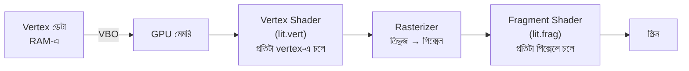
```mermaid
flowchart LR
  A[Vertex ডেটা<br/>RAM-এ] -->|VBO| B[GPU মেমরি]
  B --> C["Vertex Shader<br/>(lit.vert)<br/>প্রতিটা vertex-এ চলে"]
  C --> D[Rasterizer<br/>ত্রিভুজ → পিক্সেল]
  D --> E["Fragment Shader<br/>(lit.frag)<br/>প্রতিটা পিক্সেলে চলে"]
  E --> F[স্ক্রিন]
```

> ক্যাপশন: আপনি শুধু দুটো বাক্স লেখেন — vertex shader আর fragment shader। বাকিটা GPU নিজে করে।

দুটো শেডারের কাজ দুই রকম:

| | **Vertex Shader** (`lit.vert`) | **Fragment Shader** (`lit.frag`) |
|---|---|---|
| কতবার চলে | প্রতিটা **vertex**-এ একবার | প্রতিটা **পিক্সেলে** একবার |
| এই প্রজেক্টে | ~১০,০০০ বার/ফ্রেম | ~৭,০০,০০০ বার/ফ্রেম (১০০০×৭০০ জানালা) |
| কাজ | বিন্দুটা স্ক্রিনের কোথায় যাবে ঠিক করা | পিক্সেলটার রং কী হবে ঠিক করা |

**গুরুত্বপূর্ণ:** এই দুটো ফাংশন GPU-তে চলে, C++-এ না। এরা GLSL নামের আলাদা ভাষায় লেখা
(দেখতে C-এর মতো)। `lit.vert` আর `lit.frag` — এই দুটো **টেক্সট ফাইল**, প্রোগ্রাম চালু হওয়ার সময়
পড়ে GPU-তে কম্পাইল হয়।

---

## পর্ব ২ — স্থানাঙ্ক ব্যবস্থা (Coordinate System)

### ২.১ আমাদের নিয়ম

পুরো প্রজেক্টে **একটাই** নিয়ম মানা হয়েছে (`Dimensions.h`-এর উপরে লেখা আছে):

```
    +Y  ↑  উপরে (up)
        │
        │
        └──────►  +X  সামনে (forward) — নল যেদিকে তাক করে
       ╱
      ╱
    +Z   ডানে (right) — চাকার অ্যাক্সেল এই বরাবর
```

প্রতিটা ছবিতে এই তিনটা রঙিন কাঠি দেখবেন — এগুলো এই অক্ষ (axis) তিনটা:

| রং | অক্ষ | মানে |
|---|---|---|
| 🔴 লাল | +X | সামনে |
| 🟢 সবুজ | +Y | উপরে |
| 🔵 নীল | +Z | ডানে |

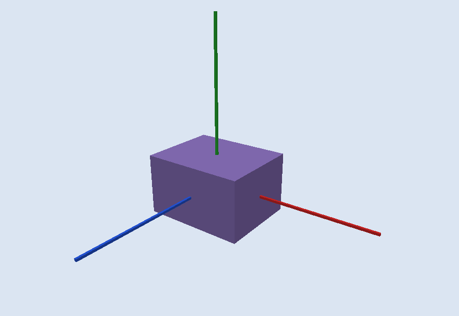

> ছবি: একটা বক্স, আর তিনটা অক্ষ। লাল কাঠি আপনার দিকে-ডানে আসছে (+X = সামনে), সবুজ উপরে (+Y), নীল বাঁ-দিকে-সামনে (+Z)। মনে রাখুন — লাল কাঠিই কামানের নলের দিক।

### ২.২ একক (Unit): সবকিছু মিটারে

`Dimensions.h`-এর সব সংখ্যা **মিটারে**। চাকার ব্যাসার্ধ `0.62f` মানে ৬২ সেন্টিমিটার —
বাস্তব কামানের চাকার মতোই।

OpenGL-এর কাছে "মিটার" বলে কিছু নেই, এটা শুধু আমাদের নিজেদের সিদ্ধান্ত।
কিন্তু একটা একক ঠিক করে নিলে সব মাপ নিজে থেকেই মিলে যায়।

---

## পর্ব ৩ — ম্যাট্রিক্স: গ্রাফিক্সের প্রাণ

> এই পর্বটাই পুরো ডকের সবচেয়ে গুরুত্বপূর্ণ অংশ। এটা বুঝে গেলে বাকি সব সহজ।

### ৩.১ সমস্যাটা কী?

`Primitives::CreateBox()` একটা বক্স বানায় **সবসময় origin-এ (০,০,০)**।
কিন্তু আমার তো ১১টা কাঠের টুকরো দরকার, ১১টা আলাদা জায়গায়, আলাদা কোণে।

তাহলে কি ১১ বার আলাদা আলাদা করে vertex লিখতে হবে? **না।**

**একটাই** বক্স বানিয়ে, প্রতিবার আঁকার আগে GPU-কে বলে দিই:
*"এই বক্সটা আঁকো, কিন্তু আগে প্রতিটা বিন্দুকে এইভাবে সরিয়ে/ঘুরিয়ে নাও।"*

সেই "এইভাবে সরিয়ে/ঘুরিয়ে নাও" নির্দেশটাই একটা **৪×৪ ম্যাট্রিক্স**।

### ৩.২ কেন ৪×৪, ৩×৩ না?

৩D বিন্দু তো (x, y, z) — তিনটা সংখ্যা। তাহলে ৩×৩ ম্যাট্রিক্স যথেষ্ট হওয়ার কথা।

**ঘোরানোর (rotation) জন্য ৩×৩ ঠিকই কাজ করে। কিন্তু সরানোর (translation) জন্য করে না।**

কারণ ম্যাট্রিক্স গুণ সবসময় origin-কে origin-এ রেখে দেয়:

```
[a b c]   [0]   [0]
[d e f] × [0] = [0]     ← origin সবসময় origin-ই থাকে
[g h i]   [0]   [0]
```

কিন্তু "২ মিটার সামনে সরাও" মানে origin-কেও সরাতে হবে। ৩×৩ দিয়ে অসম্ভব।

**সমাধান:** একটা চতুর্থ সংখ্যা `w` জুড়ে দিন, যেটা বিন্দুর জন্য সবসময় `1`:

```
বিন্দু (point):    (x, y, z, 1)   ← w = 1, সরানো যায়
দিক (direction):   (x, y, z, 0)   ← w = 0, সরানো যায় না (দিকের তো অবস্থান নেই!)
```

এটাকে বলে **homogeneous coordinates**। এখন ৪×৪ ম্যাট্রিক্স দিয়ে সরানোও সম্ভব:

```
[1 0 0 tx]   [x]   [x + tx]
[0 1 0 ty] × [y] = [y + ty]     ← w=1 হওয়ায় শেষ কলামটা যোগ হয়ে গেল
[0 0 1 tz]   [z]   [z + tz]
[0 0 0  1]   [1]   [   1   ]
```

> 💡 এই `w=0` বনাম `w=1` পার্থক্যটা কোডেও কাজে লাগে। `lit.vert`-এ দেখবেন
> `vec4(aPos, 1.0)` — position, তাই `w=1`। কিন্তু normal ভেক্টর (একটা *দিক*)
> ঘোরানোর সময় `mat3(model)` ব্যবহার করা হয়েছে, মানে ৪র্থ সারি-কলাম বাদ —
> কারণ দিককে সরানো যায় না, শুধু ঘোরানো যায়।

### ৩.৩ Translation ম্যাট্রিক্স — অঙ্ক কষে দেখি

**"বিন্দুটাকে ২ মিটার সামনে (+X) আর ৩ মিটার উপরে (+Y) সরাও।"**

```
        T(2, 3, 0)          বিন্দু (1, 0, 0)
    ┌              ┐        ┌   ┐       ┌     ┐
    │ 1  0  0   2  │        │ 1 │       │ 1+2 │   │ 3 │
    │ 0  1  0   3  │   ×    │ 0 │   =   │ 0+3 │ = │ 3 │
    │ 0  0  1   0  │        │ 0 │       │ 0+0 │   │ 0 │
    │ 0  0  0   1  │        │ 1 │       │  1  │   │ 1 │
    └              ┘        └   ┘       └     ┘
```

হাতে মিলিয়ে দেখুন — প্রথম সারি: `1×1 + 0×0 + 0×0 + 2×1 = 3` ✓

কোডে: `glm::translate(glm::mat4(1.0f), glm::vec3(2, 3, 0))`
(`glm::mat4(1.0f)` মানে **identity matrix** — যে ম্যাট্রিক্স কিছুই বদলায় না, ১ দিয়ে গুণ করার মতো।)

### ৩.৪ Rotation ম্যাট্রিক্স — অঙ্ক কষে দেখি

Z-অক্ষের চারদিকে θ কোণে ঘোরানোর ম্যাট্রিক্স:

```
            Rz(θ)
    ┌                        ┐
    │ cosθ  -sinθ   0    0   │
    │ sinθ   cosθ   0    0   │
    │  0      0     1    0   │      ← z অপরিবর্তিত থাকে
    │  0      0     0    1   │
    └                        ┘
```

**উদাহরণ ১: Rz(90°) দিয়ে (1, 0, 0) ঘোরাই**

cos 90° = 0, sin 90° = 1:

```
x' = 0×1 − 1×0 = 0
y' = 1×1 + 0×0 = 1
z' = 0
```

ফল: **(1,0,0) → (0,1,0)**, মানে **+X চলে গেল +Y-তে**। সামনের দিকটা উপরের দিকে ঘুরে গেল। ✓

**উদাহরণ ২: Rz(−90°) দিয়ে (0, 1, 0) ঘোরাই** ← এটাই `Local::AlongX` করে

cos(−90°) = 0, sin(−90°) = −1:

```
x' = 0×0 − (−1)×1 = 1
y' = (−1)×0 + 0×1 = 0
z' = 0
```

ফল: **(0,1,0) → (1,0,0)**, মানে **+Y চলে গেল +X-এ**।

এটাই পুরো প্রজেক্টের একটা মূল ট্রিক: `Primitives` সব আকৃতি বানায় **+Y বরাবর দাঁড় করানো**,
আর `Local::AlongX` সেটাকে **+X বরাবর শুইয়ে দেয়**। কামানের নল এভাবেই সামনে তাক করে।

**X-অক্ষের চারদিকে ঘোরানো** (এটা `Local::AlongZ` ব্যবহার করে):

```
            Rx(θ)
    ┌                        ┐
    │  1     0      0     0  │
    │  0   cosθ  -sinθ    0  │
    │  0   sinθ   cosθ    0  │
    │  0     0      0     1  │
    └                        ┘

Rx(90°) দিয়ে (0,1,0):   y' = 0×1 = 0,  z' = 1×1 = 1   →  (0, 0, 1)
মানে +Y চলে গেল +Z-তে। দাঁড়ানো সিলিন্ডার কাত হয়ে অ্যাক্সেল হয়ে গেল।
```

### ৩.৫ 🔥 গুণের ক্রম (Order) — সবচেয়ে বেশি ভুল এখানেই হয়

**ম্যাট্রিক্স গুণ বিনিময়যোগ্য না (not commutative): `A × B ≠ B × A`**

আর OpenGL/GLM-এ ম্যাট্রিক্স **ডান থেকে বাঁয়ে** প্রয়োগ হয়। মানে:

```
M = T × R       →   আগে R (ঘোরাও), তারপর T (সরাও)
M = R × T       →   আগে T (সরাও), তারপর R (ঘোরাও)
```

এই পার্থক্যটা চোখে দেখা যায়। একই বক্স, একই কোণ, একই দূরত্ব — শুধু ক্রম আলাদা:

**ক্রম ১: `Rz(θ) × T(d)` → আগে সরাও, তারপর ঘোরাও** (`Local::TurnMove`)

ধরুন বক্সের কেন্দ্র (0,0,0), d = (0.6, 0, 0), θ = 90°:

```
ধাপ ১ — T প্রয়োগ:   (0,0,0)  →  (0.6, 0, 0)      [ডানে সরে গেল]
ধাপ ২ — Rz(90) প্রয়োগ: (0.6,0,0) →  (0, 0.6, 0)   [origin-এর চারদিকে ঘুরে উপরে চলে গেল]
```

বক্সটা origin থেকে ০.৬ দূরে থেকেই **চারদিকে ঘুরল**। ৮ বার ভিন্ন কোণে করলে:

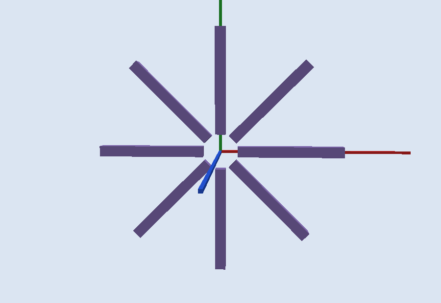

> ছবি: `Local::TurnMove(angle, vec3(0.6, 0, 0))` — ৮টা একই বক্স, শুধু কোণ আলাদা। চাকার স্পোক ঠিক এভাবেই বানানো।

**ক্রম ২: `T(d) × Rz(θ)` → আগে ঘোরাও, তারপর সরাও** (`Local::MoveTurn`)

```
ধাপ ১ — Rz(90) প্রয়োগ:  (0,0,0) → (0,0,0)       [origin-এ আছে, ঘুরেও কোথাও যায় না]
ধাপ ২ — T প্রয়োগ:       (0,0,0) → (0.6, 0, 0)   [ডানে সরে গেল]
```

বক্সটা **নিজের জায়গায় নিজের চারদিকে কাত হলো**, তারপর সরল:

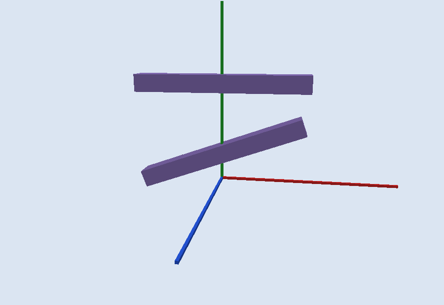

> ছবি: উপরেরটা সোজা (`Local::Move`), নিচেরটা ২০° কাত (`Local::MoveTurn`)। কামানের কাঠামোর লম্বা বিম দুটো ঠিক এভাবে কাত করা।

**মনে রাখার সহজ নিয়ম:**

| আপনি চান | ব্যবহার করুন | ম্যাট্রিক্স |
|---|---|---|
| জিনিসটা **নিজের জায়গায় কাত** হোক | `MoveTurn(p, θ)` | `T(p) × Rz(θ)` |
| জিনিসটা **origin-কে কেন্দ্র করে চারদিকে ছড়াক** | `TurnMove(θ, p)` | `Rz(θ) × T(p)` |

### ৩.৬ MVP: তিনটা ম্যাট্রিক্স, তিনটা কাজ

`lit.vert`-এ এই একটা লাইনই পুরো ৩D-এর হৃদয়:

```glsl
gl_Position = proj * view * model * vec4(aPos, 1.0);
```

ডান থেকে বাঁয়ে পড়ুন:

```
  aPos            model            view             proj
(নিজের জগৎ) ──► (দুনিয়ার জগৎ) ──► (ক্যামেরার জগৎ) ──► (স্ক্রিন)

  চাকার একটা      সেই বিন্দুটা     ক্যামেরা থেকে      দূরের জিনিস
  স্পোকের কোণা    মাঠের কোথায়      কতদূরে, কোন দিকে   ছোট দেখানো
```

| ম্যাট্রিক্স | কী করে | কোডে কোথায় |
|---|---|---|
| **model** | অবজেক্টের নিজের স্থানাঙ্ক → দুনিয়ার স্থানাঙ্ক | `DrawParts()`-এ প্রতিটা part-এর জন্য আলাদা |
| **view** | দুনিয়া → ক্যামেরার চোখ | `glm::lookAt(eye, target, up)` |
| **proj** | ক্যামেরা → স্ক্রিনের ২D | `glm::perspective(fov, aspect, near, far)` |

`perspective()` হলো সেই জিনিস যা **দূরের বস্তু ছোট দেখায়**। এটা না দিলে সব
সমান সাইজের দেখাবে (isometric গেমের মতো)।

```cpp
mat4 proj = perspective(radians(45.0f), 1000.0f/700.0f, 0.1f, 100.0f);
//                      ↑ দেখার কোণ    ↑ পর্দার অনুপাত  ↑কাছে ↑দূরে
```

`0.1f` আর `100.0f` হলো **near ও far plane** — এর কাছের বা দূরের কিছু আঁকা হবে না।
কামান ৫ মিটার দূরে, মাঠ ১২০ মিটার চওড়া — তাই `100.0f` যথেষ্ট।

---

## পর্ব ৪ — আলো (Lighting) আর Normal ভেক্টর

### ৪.১ আলো ছাড়া কেমন দেখায়?

ধরুন আমরা শুধু রং দিয়ে দিলাম, আলোর হিসাব করলাম না:

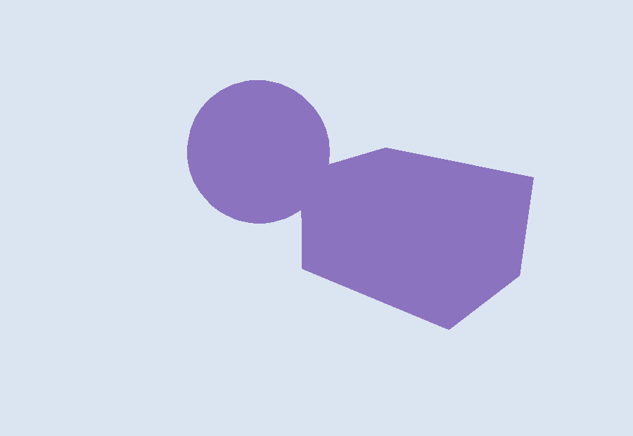

> ছবি: একটা গোলক আর একটা বক্স, আলো ছাড়া। গোলকটা নিরেট বেগুনি **চাকতি** — গোল কিনা বোঝার উপায় নেই। বক্সের তিনটা তল একই রঙের, তাই কোণাগুলো অদৃশ্য।

এখন একই দুটো আকৃতি, আলোর হিসাব করে:

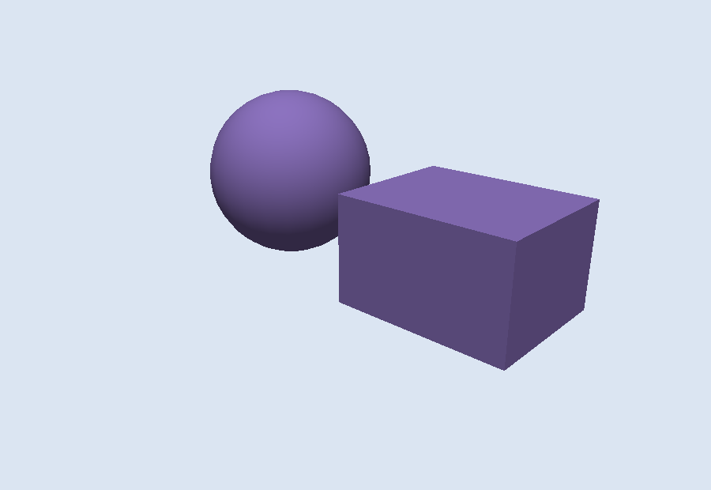

> ছবি: এখন গোলকটা **গোল**, বক্সটার তিনটা তল আলাদা উজ্জ্বলতায়। একটাই জিনিস বদলেছে — প্রতিটা পিক্সেলের উজ্জ্বলতা তার তল কোন দিকে মুখ করে আছে তার উপর নির্ভর করছে।

**শিক্ষা:** ৩D দেখানোর জন্য আকৃতিই যথেষ্ট না — **আলোই** গভীরতা তৈরি করে।

### ৪.২ Normal ভেক্টর কী?

**Normal** হলো একটা তলের গায়ে লম্বভাবে দাঁড়ানো তীর — "এই তলটা কোন দিকে মুখ করে আছে"।

```
        normal (0,1,0)
             ↑
    ─────────────────     ← একটা টেবিলের উপরিতল, উপরের দিকে মুখ


    normal (1,0,0)  →  │   ← একটা দেয়াল, ডানদিকে মুখ
                       │
```

প্রতিটা vertex-এ তার normal আলাদা করে সংরক্ষণ করা থাকে (মনে আছে, ৯ float-এর মাঝের ৩টা?)।

### ৪.৩ Lambert-এর সূত্র — অঙ্ক কষে দেখি

মূল ধারণাটা খুব স্বজ্ঞাত (intuitive):

> একটা তল যত **সরাসরি** আলোর দিকে মুখ করে, তত **উজ্জ্বল**।
> যত **কাত** হয়ে থাকে, তত **অনুজ্জ্বল**।

"কতটা সরাসরি মুখ করে আছে" মাপার গাণিতিক যন্ত্র = **ডট গুণফল (dot product)**।

দুটো একক ভেক্টরের জন্য: `A · B = cos(তাদের মধ্যকার কোণ)`

```
কোণ ০°   (সরাসরি মুখোমুখি)  →  cos 0°  =  1.0   →  সবচেয়ে উজ্জ্বল
কোণ ৬০°                      →  cos 60° =  0.5   →  অর্ধেক উজ্জ্বল
কোণ ৯০°  (পাশ ফিরে)          →  cos 90° =  0.0   →  অন্ধকার
কোণ ১৮০° (উল্টো দিকে)        →  cos 180°= −1.0   →  আলো পড়ছেই না
```

`lit.frag`-এর আসল সূত্র:

```glsl
float diffuse = max(dot(normal, -lightDir), 0.0);
float brightness = 0.35 + 0.65 * diffuse;
```

**পুরো অঙ্কটা কষে দেখি।** `Main.cpp`-এ আলোর দিক:

```cpp
vec3 lightDir = normalize(vec3(-0.4f, -1.0f, -0.5f));
```

প্রথমে normalize করি (দৈর্ঘ্য ১ বানাই):

```
|L| = √(0.4² + 1.0² + 0.5²) = √(0.16 + 1.0 + 0.25) = √1.41 = 1.1874

L̂ = (−0.4/1.1874, −1.0/1.1874, −0.5/1.1874) = (−0.337, −0.842, −0.421)
```

`lightDir` হলো আলো **যেদিকে যাচ্ছে** (সূর্য থেকে নিচে)। তাই তলে পড়া আলোর দিক = `−L̂`:

```
−L̂ = (0.337, 0.842, 0.421)
```

এখন তিনটা আলাদা তলের হিসাব:

**(ক) উপরের তল**, normal = (0, 1, 0):
```
dot = 0×0.337 + 1×0.842 + 0×0.421 = 0.842
brightness = 0.35 + 0.65 × 0.842 = 0.35 + 0.547 = 0.897   → ৯০% উজ্জ্বল ☀️
```

**(খ) সামনের তল**, normal = (1, 0, 0):
```
dot = 1×0.337 + 0×0.842 + 0×0.421 = 0.337
brightness = 0.35 + 0.65 × 0.337 = 0.35 + 0.219 = 0.569   → ৫৭% উজ্জ্বল
```

**(গ) পেছনের তল**, normal = (−1, 0, 0):
```
dot = −1×0.337 = −0.337
max(−0.337, 0) = 0        ← ঋণাত্মক মানে আলো পড়ছে না
brightness = 0.35 + 0.65 × 0 = 0.35                       → ৩৫% (ম্লান, কিন্তু কালো না)
```

এই `0.35` কেই বলে **ambient** — "চারদিক থেকে আসা ছড়ানো আলো"। এটা না দিলে
ছায়ার দিকটা **একদম কালো** হয়ে যেত, যেটা বাস্তবে হয় না (আকাশ থেকেও তো আলো আসে)।

উপরের তিনটা সংখ্যা — **0.897, 0.569, 0.35** — উপরের বক্সের ছবিটায় ঠিক এই তিন রকম
উজ্জ্বলতাই দেখছেন।

---

## পর্ব ৫ — এন্ট্রি পয়েন্ট: `Main.cpp` ধাপে ধাপে

এবার আসল কোড। প্রোগ্রাম এখান থেকেই শুরু হয়।

### ৫.১ ধাপ ১: জানালা খোলা

```cpp
glfwInit();

glfwWindowHint(GLFW_CONTEXT_VERSION_MAJOR, 3);
glfwWindowHint(GLFW_CONTEXT_VERSION_MINOR, 3);
glfwWindowHint(GLFW_OPENGL_PROFILE, GLFW_OPENGL_CORE_PROFILE);
```

- **GLFW** একটা লাইব্রেরি যা Windows/Linux/Mac-এ জানালা খোলা আর কী-বোর্ড পড়া সামলায়।
  OpenGL নিজে জানালা খুলতে পারে না — সে শুধু আঁকতে পারে।
- `3, 3` মানে **OpenGL 3.3** চাইছি।
- `CORE_PROFILE` মানে **আধুনিক OpenGL** — পুরোনো `glBegin()/glEnd()` স্টাইল বন্ধ।
  (পাইথন ভার্সনে `legacy/` ফোল্ডারে সেই পুরোনো স্টাইল ব্যবহার হয়েছিল; C++ ভার্সনে
  শেডার-ভিত্তিক আধুনিক স্টাইল, কারণ এটাই এখন সব জায়গায় চলে।)

```cpp
GLFWwindow* window = glfwCreateWindow(width, height, "Medieval Cannon - Phase 1", NULL, NULL);
if (window == NULL) { ... return -1; }
glfwMakeContextCurrent(window);
```

`glfwMakeContextCurrent` — "এখন থেকে সব OpenGL কমান্ড **এই** জানালায় যাবে।"

### ৫.২ ধাপ ২: GLAD আর মৌলিক সেটিংস

```cpp
gladLoadGL();
glViewport(0, 0, width, height);
glEnable(GL_DEPTH_TEST);
```

**`gladLoadGL()` কেন লাগে?**
OpenGL-এর ফাংশনগুলো আপনার গ্রাফিক্স ড্রাইভারের ভেতরে থাকে, কোনো `.lib` ফাইলে না।
রানটাইমে ড্রাইভার থেকে প্রতিটা ফাংশনের ঠিকানা খুঁজে আনতে হয়। GLAD সেই বিরক্তিকর
কাজটা করে দেয়। **এটা না ডাকলে সব OpenGL ফাংশন `nullptr`, প্রোগ্রাম ক্র্যাশ করবে।**

**`glEnable(GL_DEPTH_TEST)` কেন সবচেয়ে জরুরি?**

এটা ছাড়া যে জিনিস **পরে আঁকা হয়** সেটা আগেরটার উপরে চলে আসে — দূরে থাকুক বা কাছে।
মানে পেছনের চাকা সামনের চাকার উপরে এসে বসত।

Depth test চালু থাকলে GPU প্রতিটা পিক্সেলের জন্য একটা **গভীরতার মান (depth)** মনে রাখে
এবং নতুন পিক্সেল আঁকার আগে চেক করে — *"এটা কি আগেরটার চেয়ে কাছে? না হলে বাদ।"*

```
depth test ছাড়া:           depth test সহ:
┌──────────┐               ┌──────────┐
│  পেছনের  │               │ সামনের   │   ← যেটা সত্যিই কাছে,
│  চাকা    │ ← ভুল!        │ চাকা     │      সেটাই দেখা যায় ✓
└──────────┘               └──────────┘
```

### ৫.৩ ধাপ ৩: শেডার লোড করা

```cpp
Shader shaderProgram("lit.vert", "lit.frag");
```

`shaderClass.cpp` এই দুটো টেক্সট ফাইল পড়ে, GPU-তে পাঠায়, কম্পাইল করায়, দুটোকে
জোড়া লাগিয়ে একটা "shader program" বানায়।

> ⚠️ **তাই `app.exe` অবশ্যই `Project1/` ফোল্ডারের ভেতর থেকে চালাতে হবে** —
> ফাইল দুটো আপেক্ষিক পথে (relative path) খোঁজা হয়। `build_mingw/` থেকে চালালে
> শেডার পাবে না।

### ৫.৪ ধাপ ৪: দৃশ্য (scene) বানানো

```cpp
Mesh ground = Primitives::CreatePlane(120.0f, 120.0f, Palette::Grass);

Carriage carriage;

Wheel leftWheel (Dim::WheelRadius, Dim::WheelWidth, Dim::SpokeCount,
                 vec3(0.0f, Dim::WheelRadius, -Dim::WheelTrack));
Wheel rightWheel(Dim::WheelRadius, Dim::WheelWidth, Dim::SpokeCount,
                 vec3(0.0f, Dim::WheelRadius,  Dim::WheelTrack));

Shaft shaft(vec3(Dim::PivotX, Dim::PivotY, Dim::PivotZ));
shaft.Elevate(12.0f);
```

লক্ষ্য করুন — এখানে **একটাও কাঁচা সংখ্যা নেই**, সব `Dim::` থেকে আসছে।

**চাকার Y মান `Dim::WheelRadius` কেন?**
চাকার কেন্দ্র যদি ঠিক তার ব্যাসার্ধ সমান উঁচুতে থাকে, তাহলে তার **নিচের কিনারা ঠিক
মাটি (Y=0) ছোঁবে**। এটাই একমাত্র উচ্চতা যেখানে চাকা মাটিতে বসে — না ভাসে, না ডোবে।

```
       ●  ← কেন্দ্র, উচ্চতা = R = 0.62
      ╱ ╲
     │   │  R
      ╲ ╱
  ─────●─────  ← মাটি, Y = 0 ✓
```

**Z মান `±Dim::WheelTrack`** — একটা চাকা বাঁয়ে, একটা ডানে, মাঝখানে কাঠামো।

### ৫.৫ ধাপ ৫: ক্যামেরা

```cpp
mat4 view = lookAt(vec3(4.8f, 2.7f, 5.5f),   // চোখ কোথায়
                   vec3(0.05f, 0.70f, 0.0f), // কোথায় তাকিয়ে আছে
                   vec3(0.0f, 1.0f, 0.0f));  // কোনদিক "উপরে"
mat4 proj = perspective(radians(45.0f), float(width)/float(height), 0.1f, 100.0f);
```

`lookAt` এর তিনটা যুক্তি ভাবুন এভাবে — **ক্যামেরাম্যান কোথায় দাঁড়িয়ে**,
**কোনদিকে তাকিয়ে**, আর **মাথা কোনদিকে** (এটা না দিলে ক্যামেরা উল্টো হয়ে থাকতে পারে)।

এই দুটো ম্যাট্রিক্স **লুপের বাইরে** একবার বানানো, কারণ Phase 1-এ ক্যামেরা নড়ে না।

### ৫.৬ ধাপ ৬: Uniform-এর ঠিকানা

```cpp
GLuint viewLoc     = glGetUniformLocation(shaderProgram.ID, "view");
GLuint projLoc     = glGetUniformLocation(shaderProgram.ID, "proj");
GLuint modelLoc    = glGetUniformLocation(shaderProgram.ID, "model");
GLuint lightDirLoc = glGetUniformLocation(shaderProgram.ID, "lightDir");
```

**Uniform** = এমন একটা ভেরিয়েবল যা C++ থেকে শেডারে পাঠানো হয়, এবং **পুরো draw call জুড়ে
একই থাকে** (তাই নাম "uniform" — অভিন্ন)।

তুলনা করুন:

| | কোথা থেকে আসে | প্রতি vertex-এ বদলায়? |
|---|---|---|
| **attribute** (`aPos`, `aNormal`, `aColor`) | VBO থেকে | হ্যাঁ |
| **uniform** (`model`, `view`, `proj`, `lightDir`) | C++ থেকে | না |

`glGetUniformLocation` শেডারের ভেতর ওই নামের ভেরিয়েবলের "স্লট নম্বর" ফেরত দেয়।
নাম দিয়ে খোঁজা ধীর, তাই একবার খুঁজে রেখে দেওয়া হচ্ছে।

### ৫.৭ ধাপ ৭: রেন্ডার লুপ

```cpp
double lastFrameTime = glfwGetTime();

while (!glfwWindowShouldClose(window)) {
    double currentTime = glfwGetTime();
    float deltaTime = float(currentTime - lastFrameTime);
    lastFrameTime = currentTime;
```

**`deltaTime` কেন দরকার?** এটা আগের ফ্রেম থেকে এই ফ্রেম পর্যন্ত কত সেকেন্ড লেগেছে।

ধরুন আপনি লিখলেন `elevation += 0.5f;` প্রতি ফ্রেমে। তাহলে:
- ধীর কম্পিউটারে (৩০ FPS) → সেকেন্ডে ১৫° ঘুরবে
- দ্রুত কম্পিউটারে (১৪৪ FPS) → সেকেন্ডে ৭২° ঘুরবে

**একই প্রোগ্রাম, ভিন্ন গতি!** সমাধান — গতিকে সবসময় সময় দিয়ে গুণ করুন:

```cpp
shaft.Elevate(elevationSpeedDegPerSec * deltaTime);   // ৩০ °/সেকেন্ড, সব মেশিনে
```

```
৩০ FPS মেশিনে:   deltaTime = 0.0333  →  30 × 0.0333 = 1.0°  প্রতি ফ্রেম × 30 ফ্রেম = 30°/সে ✓
১৪৪ FPS মেশিনে:  deltaTime = 0.0069  →  30 × 0.0069 = 0.21° প্রতি ফ্রেম × 144 ফ্রেম = 30°/সে ✓
```

**ইনপুট:**

```cpp
if (glfwGetKey(window, GLFW_KEY_UP) == GLFW_PRESS) {
    shaft.Elevate(elevationSpeedDegPerSec * deltaTime);
}
...
float drive = 0.0f;
if (glfwGetKey(window, GLFW_KEY_RIGHT) == GLFW_PRESS) drive += driveSpeed * deltaTime;
if (glfwGetKey(window, GLFW_KEY_LEFT)  == GLFW_PRESS) drive -= driveSpeed * deltaTime;
if (drive != 0.0f) {
    carriage.MoveForward(drive);
    leftWheel.Roll(drive);
    rightWheel.Roll(drive);
}
```

একই `drive` মানটা কাঠামো আর দুই চাকা — তিন জায়গায় যাচ্ছে। এটাই
"পিছলে না গিয়ে গড়ানো" (rolling without slipping) নিশ্চিত করে ([পর্ব ১১](#পর্ব-১১--wheel-চাকা-বানানো) দেখুন)।

**আঁকা:**

```cpp
glClearColor(0.55f, 0.72f, 0.87f, 1.0f);              // আকাশি নীল
glClear(GL_COLOR_BUFFER_BIT | GL_DEPTH_BUFFER_BIT);   // রং আর গভীরতা — দুটোই মুছি
shaderProgram.Activate();
```

> ⚠️ `GL_DEPTH_BUFFER_BIT` **অবশ্যই** মুছতে হবে। না মুছলে গত ফ্রেমের গভীরতার মান
> থেকে যাবে, আর এই ফ্রেমের জিনিসপত্র "পেছনে আছে" ভেবে বাদ পড়তে থাকবে —
> স্ক্রিন ফাঁকা বা অদ্ভুত দেখাবে।

```cpp
glUniformMatrix4fv(viewLoc, 1, GL_FALSE, value_ptr(view));
glUniformMatrix4fv(projLoc, 1, GL_FALSE, value_ptr(proj));
glUniform3fv(lightDirLoc, 1, value_ptr(lightDir));
```

`value_ptr()` — GLM-এর `mat4` অবজেক্ট থেকে ১৬টা `float`-এর কাঁচা পয়েন্টার বের করে,
কারণ OpenGL C API, সে GLM-এর ক্লাস চেনে না।

```cpp
mat4 carriageMatrix = carriage.GetMatrix();
carriage.Draw(shaderProgram, mat4(1.0f));       // কাঠামো — দুনিয়ার সাপেক্ষে
leftWheel.Draw(shaderProgram, carriageMatrix);  // চাকা — কাঠামোর সাপেক্ষে
rightWheel.Draw(shaderProgram, carriageMatrix);
shaft.Draw(shaderProgram, carriageMatrix);      // নল — কাঠামোর সাপেক্ষে
```

এই চার লাইনই পুরো **scene graph** ([পর্ব ১৪](#পর্ব-১৪--scene-graph-সব-জোড়া-লাগানো) দেখুন)।

```cpp
    glfwSwapBuffers(window);
    glfwPollEvents();
}
```

- **`glfwSwapBuffers`** — **double buffering**। দুটো ক্যানভাস আছে: একটা আপনি দেখছেন,
  আরেকটায় আঁকা হচ্ছে। আঁকা শেষ হলে দুটো অদলবদল হয়। এক ক্যানভাসে আঁকলে
  আধা-আঁকা ছবি চোখে পড়ত (flicker)।
- **`glfwPollEvents`** — অপারেটিং সিস্টেমের জমা হওয়া ঘটনা (কী চাপা, মাউস নড়া,
  জানালা বন্ধ) প্রক্রিয়া করে। এটা না ডাকলে **জানালা "সাড়া দিচ্ছে না" হয়ে যাবে**।

### ৫.৮ ধাপ ৮: পরিষ্কার করা

```cpp
ground.Delete();  carriage.Delete();  leftWheel.Delete();
rightWheel.Delete();  shaft.Delete();  shaderProgram.Delete();
glfwDestroyWindow(window);
glfwTerminate();
```

GPU মেমরি C++ এর destructor নিজে থেকে ছাড়ে না — OpenGL-কে **স্পষ্টভাবে** বলতে হয়।
তাই প্রতিটা ক্লাসে হাতে-লেখা `Delete()`।

---

## পর্ব ৬ — GPU-তে ডেটা পাঠানো: VBO, EBO, VAO, Mesh

### ৬.১ তিনটা বস্তু, তিনটা কাজ

| নাম | পুরো নাম | কাজ | উপমা |
|---|---|---|---|
| **VBO** | Vertex Buffer Object | কাঁচা vertex সংখ্যাগুলো GPU মেমরিতে রাখে | কাঁচামালের গুদাম |
| **EBO** | Element Buffer Object | কোন কোন vertex মিলে ত্রিভুজ — সেই সূচি | "কোন ৩টা জোড়া দিতে হবে" তালিকা |
| **VAO** | Vertex Array Object | VBO-র সংখ্যাগুলো কীভাবে পড়তে হবে সেই নিয়ম | গুদামের ম্যানুয়াল |

### ৬.২ EBO কেন লাগে? — একটা হিসাব

একটা চারকোনা আঁকতে ২টা ত্রিভুজ = ৬টা কোণা দরকার। কিন্তু আলাদা বিন্দু তো মাত্র ৪টা!

```
   D●────────●C        ত্রিভুজ ১ = A, B, C
    │ ╲      │         ত্রিভুজ ২ = A, C, D
    │   ╲    │
   A●────────●B        A আর C দুবার করে লাগছে
```

**EBO ছাড়া:** ৬টা vertex × ৩৬ বাইট = **২১৬ বাইট**
**EBO সহ:** ৪টা vertex × ৩৬ বাইট + ৬টা index × ৪ বাইট = ১৪৪ + ২৪ = **১৬৮ বাইট**

গোলকের মতো জিনিসে, যেখানে প্রতিটা বিন্দু ৬টা ত্রিভুজে ব্যবহার হয়, সাশ্রয় আরও বিশাল।

`CreatePlane()` এ ঠিক এটাই দেখবেন:

```cpp
PushVertex(vertices, glm::vec3(-hw, 0.0f, -hd), up, color);  // 0
PushVertex(vertices, glm::vec3( hw, 0.0f, -hd), up, color);  // 1
PushVertex(vertices, glm::vec3( hw, 0.0f,  hd), up, color);  // 2
PushVertex(vertices, glm::vec3(-hw, 0.0f,  hd), up, color);  // 3

indices = { 0, 1, 2,    0, 2, 3 };   // ৪টা বিন্দু, ২টা ত্রিভুজ
```

### ৬.৩ VAO: "এই সংখ্যাগুলো কীভাবে পড়ব?"

GPU-র কাছে VBO শুধু একগাদা `float`। কোনটা position, কোনটা normal — সে জানে না।
VAO সেটাই বলে দেয়। `Mesh.cpp`-এ:

```cpp
vao.LinkAttrib(vbo, 0, 3, GL_FLOAT, 9 * sizeof(GLfloat), (void*)0);
vao.LinkAttrib(vbo, 1, 3, GL_FLOAT, 9 * sizeof(GLfloat), (void*)(3 * sizeof(GLfloat)));
vao.LinkAttrib(vbo, 2, 3, GL_FLOAT, 9 * sizeof(GLfloat), (void*)(6 * sizeof(GLfloat)));
//             ↑    ↑  ↑                ↑ stride            ↑ offset
//             |    |  └─ কয়টা float
//             |    └──── attribute নম্বর (শেডারের layout(location=N))
//             └───────── কোন VBO থেকে
```

ছবি এঁকে দেখি — VBO-র ভেতরটা:

```
বাইট:   0      12      24      36      48      60      72
        ├───────┼───────┼───────┼───────┼───────┼───────┤
        │ pos   │normal │ color │ pos   │normal │ color │
        │       │       │       │       │       │       │
        └─ vertex ০ (৩৬ বাইট) ──┴─ vertex ১ (৩৬ বাইট) ──┘

attribute 0 (pos):    offset 0,  প্রতি ৩৬ বাইটে একবার
attribute 1 (normal): offset 12, প্রতি ৩৬ বাইটে একবার
attribute 2 (color):  offset 24, প্রতি ৩৬ বাইটে একবার
```

- **stride** = এক vertex থেকে পরের vertex পর্যন্ত কত বাইট = `9 * 4` = **৩৬**
- **offset** = এই vertex-এর শুরু থেকে এই attribute কত বাইট পরে

এই ৩টা সংখ্যা (৯, ৩, ৬) **অবশ্যই** `Primitives.cpp`-এর `PushVertex()` যে ক্রমে লেখে
তার সাথে মিলতে হবে, আর `lit.vert`-এর `layout(location = N)` এর সাথেও।
**তিন জায়গায় একই চুক্তি** — একটা বদলালে তিনটাই বদলাতে হবে।

### ৬.৪ `Mesh` ক্লাস

```cpp
Mesh::Mesh(std::vector<GLfloat> vertices, std::vector<GLuint> indices)
    : vbo(vertices.data(), vertices.size() * sizeof(GLfloat)),
      ebo(indices.data(), indices.size() * sizeof(GLuint)),
      indexCount(static_cast<GLsizei>(indices.size()))
{
    vao.Bind();  vbo.Bind();  ebo.Bind();
    vao.LinkAttrib(...);  // ৩ বার
    vao.Unbind(); vbo.Unbind(); ebo.Unbind();
}
```

**খেয়াল করুন ক্রমটা।** VBO আর EBO **initializer list**-এ তৈরি হয়, মানে
কনস্ট্রাক্টরের `{ }` শুরু হওয়ার **আগেই**। তখন VAO এখনো bind করা হয়নি।
তাই ভেতরে গিয়ে আবার সব bind করা হচ্ছে — **VAO আগে** — যাতে VAO "মনে রাখে"
কোন VBO/EBO আর কোন লেআউট তার।

OpenGL একটা **স্টেট মেশিন**: "এখন যেটা bind করা আছে" সেটাতেই কাজ হয়।
এই bind/unbind নাচটা তাই এড়ানো যায় না।

```cpp
void Mesh::Draw() {
    vao.Bind();
    glDrawElements(GL_TRIANGLES, indexCount, GL_UNSIGNED_INT, 0);
}
```

মাত্র দুই লাইন — কারণ সব প্রস্তুতি কনস্ট্রাক্টরে হয়ে গেছে। `glDrawElements` হলো সেই
মুহূর্ত যেখানে GPU আসলে কাজ শুরু করে।

---

## পর্ব ৭ — শেডার দুটো: `lit.vert` আর `lit.frag`

### ৭.১ `lit.vert` — Vertex Shader

```glsl
#version 330 core
layout (location = 0) in vec3 aPos;
layout (location = 1) in vec3 aNormal;
layout (location = 2) in vec3 aColor;

out vec3 fragNormal;
out vec3 fragColor;

uniform mat4 model;
uniform mat4 view;
uniform mat4 proj;

void main()
{
   gl_Position = proj * view * model * vec4(aPos, 1.0);
   fragNormal = mat3(model) * aNormal;
   fragColor = aColor;
}
```

লাইন ধরে ধরে:

| লাইন | ব্যাখ্যা |
|---|---|
| `layout (location = 0) in vec3 aPos;` | VAO-র attribute ০ থেকে আসছে। এই `0, 1, 2` সংখ্যাগুলোই `LinkAttrib`-এর দ্বিতীয় যুক্তি। |
| `out vec3 fragNormal;` | fragment shader-এ পাঠানো হবে। মাঝখানে GPU নিজে থেকে **interpolate** করে (নিচে দেখুন)। |
| `gl_Position = ...` | **বাধ্যতামূলক**। এটাই আউটপুট — বিন্দুটা স্ক্রিনের কোথায়। নাম বদলানো যাবে না। |
| `fragNormal = mat3(model) * aNormal;` | normal-ও ঘোরাতে হবে, নইলে বস্তু ঘুরলে আলো ঘুরবে না। |
| `fragColor = aColor;` | রং শুধু পাস করে দিচ্ছে। |

**`mat3(model)` কেন, `model` না?**

`mat3()` মানে ৪×৪ থেকে উপরের-বাঁয়ের ৩×৩ অংশটা নেওয়া — যেখানে **শুধু ঘোরানো ও
স্কেল** থাকে, **সরানো (translation) থাকে না**। Normal একটা *দিক*; দিককে সরানোর কোনো মানে নেই।

> ⚠️ **সতর্কতা (কোডেও কমেন্ট করা আছে):** এই সরলীকরণ শুধু তখনই ঠিক যখন
> **non-uniform scale নেই** (মানে `scale` সবসময় `(1,1,1)`, বা তিন দিকে সমান)।
> যদি কখনো `transform.scale = vec3(2, 1, 1)` করেন, normal ভুল হয়ে যাবে আর আলো অদ্ভুত দেখাবে।
> তখন লাগবে `transpose(inverse(mat3(model)))`। **এই প্রজেক্টে কোথাও non-uniform scale নেই**,
> তাই সহজ রূপটাই রাখা হয়েছে।

**Interpolation — GPU-র জাদু:**

```
        vertex A (normal উপরে)
              ●
             ╱ ╲
            ╱   ╲       ← এই ভেতরের পিক্সেলগুলোর normal
           ╱  ·  ╲         GPU নিজে থেকে মিশিয়ে (interpolate) বানায়
          ╱       ╲
         ●─────────●
   vertex B      vertex C
```

আপনি শুধু ৩টা কোণার মান দেন, GPU মাঝের হাজারটা পিক্সেলের মান নিজে হিসাব করে।
এজন্যই গোলক মসৃণ দেখায় যদিও সেটা সমতল ত্রিভুজ দিয়ে বানানো।

### ৭.২ `lit.frag` — Fragment Shader

```glsl
#version 330 core

in vec3 fragNormal;
in vec3 fragColor;
out vec4 FragColor;

uniform vec3 lightDir;

void main()
{
   vec3 normal = normalize(fragNormal);
   float diffuse = max(dot(normal, -lightDir), 0.0);
   float brightness = 0.35 + 0.65 * diffuse;
   FragColor = vec4(fragColor * brightness, 1.0);
}
```

| লাইন | ব্যাখ্যা |
|---|---|
| `in vec3 fragNormal;` | vertex shader-এর `out` এর সাথে **নাম মিলতে হবে**। |
| `normalize(fragNormal)` | interpolate করার পরে দৈর্ঘ্য আর ঠিক ১ থাকে না, তাই আবার ১ বানানো। dot product সঠিক হওয়ার শর্ত। |
| `max(..., 0.0)` | ঋণাত্মক মানে "উল্টো দিকে মুখ" — সেটা ০ ধরা হয় ([পর্ব ৪.৩](#৪৩-lambert-এর-সূত্র--অঙ্ক-কষে-দেখি) দেখুন)। |
| `0.35 + 0.65 * diffuse` | ambient + diffuse। যোগফল সর্বোচ্চ `0.35 + 0.65 = 1.0` — কখনো ১ ছাড়ায় না, তাই রং "পুড়ে" সাদা হয়ে যায় না। |
| `vec4(..., 1.0)` | শেষ সংখ্যাটা **alpha** = ১.০ = সম্পূর্ণ অস্বচ্ছ। |

---

## পর্ব ৮ — `Primitives.cpp`: সব আকৃতির কারখানা

### ৮.১ সবার জন্য একটা নিয়ম

> **যা কিছু `Primitives` বানায়, সব +Y বরাবর দাঁড় করানো অবস্থায় বানায়।**

কোনো ফাংশনে "কোনদিকে মুখ করবে" বলার সুযোগ নেই। কেন? কারণ তাহলে প্রতিটা
ফাংশনে দিক সামলানোর কোড লিখতে হতো। তার বদলে **দিক ঘোরানোর কাজটা
`Local::AlongX` / `Local::AlongZ` করে** ([পর্ব ৯](#পর্ব-৯--part-আর-local-জিনিস-ঘোরানো-ও-বসানো))।

এই একটা সিদ্ধান্তে জ্যামিতির কোড অর্ধেক হয়ে গেছে।

### ৮.২ `PushVertex()` — ভিত্তি

```cpp
static void PushVertex(std::vector<GLfloat>& vertices, glm::vec3 pos,
                       glm::vec3 normal, glm::vec3 color) {
    vertices.push_back(pos.x);    vertices.push_back(pos.y);    vertices.push_back(pos.z);
    vertices.push_back(normal.x); vertices.push_back(normal.y); vertices.push_back(normal.z);
    vertices.push_back(color.r);  vertices.push_back(color.g);  vertices.push_back(color.b);
}
```

৯টা `float`, সবসময় **একই ক্রমে**। প্রতিটা `CreateX()` এটাই ব্যবহার করে, তাই
vertex-এর গঠন **একটাই জায়গায় লেখা** — বদলাতে হলে এক জায়গায় বদলালেই হলো।

### ৮.৩ `CreateBox()` — সবচেয়ে সহজ


```cpp
struct Face { glm::vec3 normal, a, b, c, d; };
const Face faces[6] = {
    { { 0, 0,  1}, {-hx,-hy, hz}, { hx,-hy, hz}, { hx, hy, hz}, {-hx, hy, hz} }, // সামনে (+Z)
    { { 0, 0, -1}, ... },  // পেছনে (−Z)
    ...
};
for (const Face& f : faces) {
    GLuint base = static_cast<GLuint>(vertices.size() / 9);
    PushVertex(vertices, f.a, f.normal, color);
    ... // b, c, d
    indices.insert(indices.end(), { base, base + 1, base + 2 });
    indices.insert(indices.end(), { base, base + 2, base + 3 });
}
```

**🔑 সবচেয়ে গুরুত্বপূর্ণ প্রশ্ন: বক্সের তো কোণা মাত্র ৮টা। তাহলে ২৪টা vertex কেন?**

কারণ **একটা কোণা ৩টা তলের অংশ**, আর প্রতিটা তলের normal আলাদা:

```
        ↑ (0,1,0) উপরের তলের normal
        │
        ●──→ (1,0,0) ডান তলের normal
       ╱
      ↙ (0,0,1) সামনের তলের normal

   একটাই বিন্দু, কিন্তু ৩টা আলাদা normal দরকার!
```

কিন্তু **একটা vertex-এ একটাই normal রাখা যায়**। তাই প্রতিটা তল তার **নিজের ৪টা কোণা**
পায়, নিজের normal সহ। ৬ তল × ৪ কোণা = **২৪ vertex**।

এটা "অপচয়" মনে হতে পারে, কিন্তু এটাই একমাত্র উপায় যাতে বক্সের কোণাগুলো **ধারালো**
থাকে। শেয়ার করলে GPU normal মিশিয়ে ফেলত আর বক্সটা ফোলা বেলুনের মতো দেখাত।

`base = vertices.size() / 9` — এই তলের প্রথম vertex-এর সূচক (৯ দিয়ে ভাগ কারণ প্রতি vertex ৯ float)।

### ৮.৪ `CreateCone()` — আসল ঘোড়া

এই একটা ফাংশনই সিলিন্ডার, কোণক (cone), আর ঢালু নল — তিনটাই বানায়।

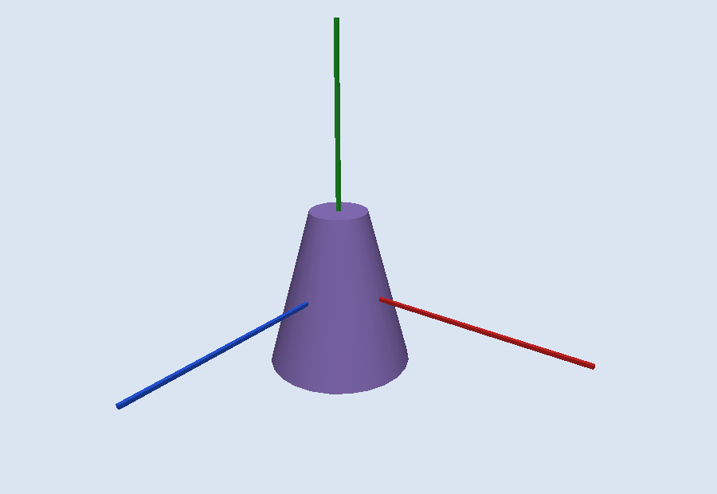

> ছবি: `CreateCone(0.45f, 0.18f, 1.0f, 24, color)` — নিচে চওড়া (০.৪৫), উপরে সরু (০.১৮)।

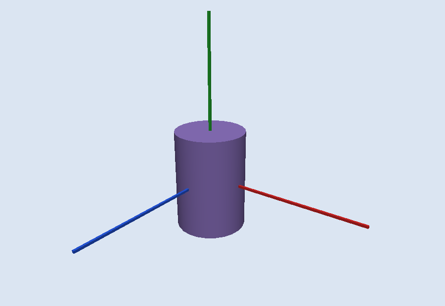

> ছবি: `CreateCylinder(0.35f, 1.0f, 24, color)` — এটা আসলে `CreateCone` ই, দুই ব্যাসার্ধ সমান দিয়ে:
> ```cpp
> Mesh CreateCylinder(float radius, float height, ...) {
>     return CreateCone(radius, radius, height, segments, color, centered, yOffset);
> }
> ```

**বৃত্তকে ত্রিভুজ দিয়ে বানানো:**

```cpp
float angle = 2.0f * glm::pi<float>() * float(i) / float(segments);
float cx = cosf(angle);
float cz = sinf(angle);
```

`segments = 24` মানে বৃত্তটা ২৪ ভাগে ভাগ, প্রতি ভাগ `360/24 = 15°`।

```
segments = 4       segments = 8         segments = 32
   ◇                  ⬡                     ○
(চারকোনা!)        (আটকোনা)            (মসৃণ বৃত্তের মতো)
```

`cos` আর `sin` দিয়ে একক বৃত্তের (unit circle) বিন্দু পাওয়া যায়, তারপর `radius` দিয়ে গুণ।

**ঢালু তলের normal — অঙ্কটা:**

```cpp
const float slopeY = (height > 0.0f) ? (radiusBottom - radiusTop) / height : 0.0f;
...
glm::vec3 normal = glm::normalize(glm::vec3(cx, radialNormalY, cz));
```

সোজা সিলিন্ডারে পাশের দেয়াল খাড়া, তাই normal ঠিক বাইরের দিকে: `(cos, 0, sin)`।

কিন্তু কোণকে দেয়াল **হেলে** আছে, তাই normal-ও একটু **উপরের দিকে** হেলবে:

```
   সিলিন্ডার              কোণক
   │  →  normal          ╲  ↗  normal একটু উপরে হেলানো
   │                      ╲
   │  →                    ╲  ↗
   │                        ╲
```

হেলার পরিমাণ = দেয়ালের ঢাল = `(নিচের ব্যাসার্ধ − উপরের ব্যাসার্ধ) / উচ্চতা`

**উদাহরণ — কামানের নলের "chase" অংশ:**
```
radiusBottom = 0.175, radiusTop = 0.125, height = 1.42

slopeY = (0.175 − 0.125) / 1.42 = 0.05 / 1.42 = 0.0352

normal (angle=0 তে) = normalize(1, 0.0352, 0) ≈ (0.9994, 0.0352, 0)
```
প্রায় অনুভূমিক — ঠিকই আছে, কারণ নলের ঢাল খুব মৃদু।

**উদাহরণ — উপরের খাড়া কোণক:**
```
slopeY = (0.45 − 0.18) / 1.0 = 0.27
normal = normalize(1, 0.27, 0) ≈ (0.965, 0.261, 0)   ← স্পষ্ট উপরের দিকে হেলানো
```

**তিনটা আলাদা তল, তিনবার একই বিন্দু:**

```cpp
GLuint wallBottom = AddRing(vertices, radiusBottom, yMin, segments, color, vec3(0), true, slopeY);
GLuint wallTop    = AddRing(vertices, radiusTop,    yMax, segments, color, vec3(0), true, slopeY);
StitchRings(indices, wallBottom, wallTop, segments);

GLuint capBottom = AddRing(vertices, radiusBottom, yMin, segments, color, vec3(0,-1,0), false);
// ... + কেন্দ্রের বিন্দু, তারপর পাখার মতো ত্রিভুজ

GLuint capTop = AddRing(vertices, radiusTop, yMax, segments, color, vec3(0,1,0), false);
// ... একই জিনিস, উল্টো দিকে
```

বক্সের মতোই — **নিচের রিংয়ের বিন্দুগুলো দুবার** তৈরি হয়: একবার পাশের দেয়ালের জন্য
(বাইরের দিকে normal), একবার নিচের ঢাকনার জন্য (নিচের দিকে normal)।

**vertex গোনা (segments = 24):**
```
পাশের দেয়াল:   24 + 24  = 48
নিচের ঢাকনা:   24 + 1   = 25   (রিং + কেন্দ্র)
উপরের ঢাকনা:   24 + 1   = 25
                       ─────
মোট                     98 vertex
```

**`StitchRings()` — দুটো রিং জোড়া দেওয়া:**

```cpp
for (int i = 0; i < segments; i++) {
    int next = (i + 1) % segments;   // ← শেষ থেকে ০-তে ফিরে আসে, বৃত্ত বন্ধ হয়
    GLuint a0 = ringA + i, a1 = ringA + next;
    GLuint b0 = ringB + i, b1 = ringB + next;
    indices.insert(indices.end(), { a0, a1, b1 });
    indices.insert(indices.end(), { a0, b1, b0 });
}
```

```
ringB:   b0 ●────● b1
            │ ╲  │      ত্রিভুজ ১ = a0, a1, b1
            │   ╲│      ত্রিভুজ ২ = a0, b1, b0
ringA:   a0 ●────● a1
```

`% segments` টা জরুরি — `i = 23` এ `next = 0` হয়, মানে শেষ টুকরোটা প্রথমটার সাথে
জোড়া লাগে আর বৃত্ত **বন্ধ** হয়। এটা না থাকলে বৃত্তে একটা ফাঁক থেকে যেত।

**`centered` প্যারামিটারটা কী করে?**

```cpp
const float yMin = (centered ? -height / 2.0f : 0.0f) + yOffset;
const float yMax = (centered ?  height / 2.0f : height) + yOffset;
```

```
centered = true            centered = false
    ┌───┐  +h/2                ┌───┐  +h
    │   │                      │   │
    │─●─│   ০  ← কেন্দ্র       │   │
    │   │                      │   │
    └───┘  −h/2                └─●─┘   ০  ← গোড়া
```

**কেন দুরকম দরকার?** কারণ ঘোরানো সবসময় **local origin-এর চারদিকে** হয়।
- চাকার জন্য `centered = true` — চাকা নিজের **কেন্দ্র** ঘিরে ঘোরে।
- নলের টুকরোগুলোর জন্য `centered = false` — তাহলে প্রতিটা টুকরো তার শুরুর বিন্দু থেকে
  সামনে বাড়ে, আর পরেরটা ঠিক যেখানে আগেরটা শেষ হয়েছে সেখান থেকে শুরু করা যায়।

### ৮.৫ `CreateTube()` — ফুটো সহ চাকতি

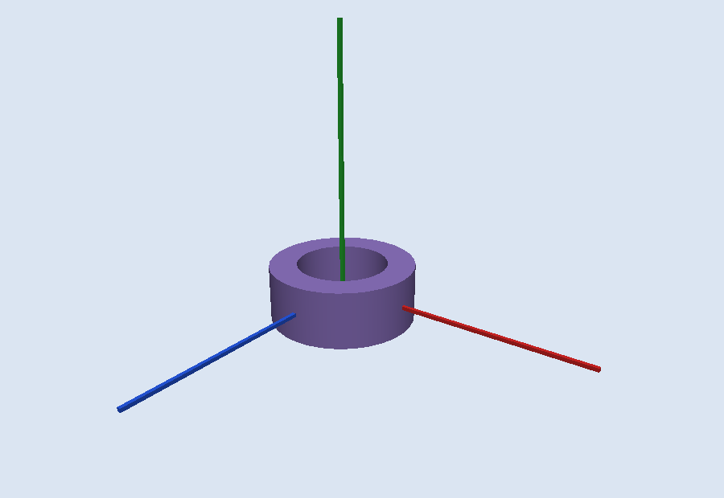

```cpp
GLuint outerBottom = AddRing(vertices, outerRadius, yMin, ...);   // বাইরের দেয়াল
GLuint outerTop    = AddRing(vertices, outerRadius, yMax, ...);
StitchRings(indices, outerBottom, outerTop, segments);

GLuint innerBottom = AddRing(vertices, innerRadius, yMin, ...);   // ভেতরের দেয়াল
GLuint innerTop    = AddRing(vertices, innerRadius, yMax, ...);
for (GLuint v = innerBottom; v < innerTop + segments; v++) {
    vertices[v * 9 + 3] = -vertices[v * 9 + 3];   // normal উল্টে দিচ্ছি
    vertices[v * 9 + 4] = -vertices[v * 9 + 4];
    vertices[v * 9 + 5] = -vertices[v * 9 + 5];
}
```

**ভেতরের normal উল্টে দেওয়া হচ্ছে কেন?**

```
        বাইরের দেয়াল              ভেতরের দেয়াল (ফুটোর গা)
   ←──│         │──→            │  →     ←  │
      │         │               │           │
   ←──│         │──→            │  →     ←  │
      normal বাইরে              normal ভেতরে (অক্ষের দিকে)
```

ফুটোর ভেতরে তাকালে আপনি দেয়ালের **ভেতরের** পিঠ দেখছেন। তার normal অক্ষের দিকে
মুখ করা উচিত, বাইরে না। না উল্টালে ফুটোর ভেতরটা ভুল উজ্জ্বলতায় দেখাত।

`v * 9 + 3, +4, +5` — মনে আছে vertex-এর গঠন? `[pos.x, pos.y, pos.z, **nrm.x, nrm.y, nrm.z**, r, g, b]` —
সূচক ৩, ৪, ৫ হলো normal।

**এই আকৃতিটাই চাকাকে চাকা বানায়** — কারণ স্পোকের ফাঁক দিয়ে ওপাশ দেখা যায়।
নিরেট চাকতি হলে চাকাটা কালো "ডোনাট" দেখাত।

### ৮.৬ `CreateSphere()` — অক্ষাংশ-দ্রাঘিমাংশ

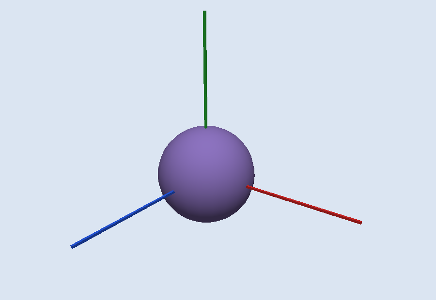

```cpp
for (int stack = 0; stack <= stacks; stack++) {
    float phi = glm::pi<float>() * float(stack) / float(stacks);   // 0 .. π
    float y = cosf(phi);
    float ringRadius = sinf(phi);
    for (int slice = 0; slice <= slices; slice++) {
        float theta = 2.0f * glm::pi<float>() * float(slice) / float(slices);  // 0 .. 2π
        glm::vec3 dir(ringRadius * cosf(theta), y, ringRadius * sinf(theta));
        PushVertex(vertices, dir * radius, dir, color);
        //                   ↑ অবস্থান    ↑ normal — একই ভেক্টর!
    }
}
```

পৃথিবীর মানচিত্রের মতো ভাবুন:
- **`phi` (stack)** = অক্ষাংশ (latitude) — উত্তর মেরু থেকে দক্ষিণ মেরু, ০ থেকে π
- **`theta` (slice)** = দ্রাঘিমাংশ (longitude) — চারদিকে ঘুরে, ০ থেকে ২π

```
  stack=0   ●  উত্তর মেরু       phi=0,    cos(0)=1     →  y = +1
           ╱│╲
  stack=2 ●─┼─●  বিষুবরেখা      phi=π/2,  cos(π/2)=0   →  y = 0
           ╲│╱
  stack=4   ●  দক্ষিণ মেরু      phi=π,    cos(π)=−1    →  y = −1
```

`ringRadius = sin(phi)` — মেরুতে ০ (বিন্দু), বিষুবরেখায় ১ (সবচেয়ে চওড়া)। ঠিক যেমন হওয়া উচিত।

**🔑 সবচেয়ে সুন্দর অংশ: `PushVertex(vertices, dir * radius, dir, color)`**

গোলকের যেকোনো বিন্দুতে normal = **কেন্দ্র থেকে ওই বিন্দুর দিক**, যেটা ঠিক `dir` নিজেই!
তাই অবস্থান = `dir × radius`, আর normal = `dir` (যা ইতিমধ্যে একক ভেক্টর)। আলাদা হিসাব লাগে না।

**index-এর stride `slices + 1` কেন, `slices` না?**

কারণ প্রতিটা রিংয়ে **শেষ বিন্দুটা প্রথম বিন্দুর নকল** (theta = 0 আর theta = 2π একই জায়গা)।
`<=` দেখুন লুপে। এই নকলটা রাখা হয় যাতে texture ঠিকমতো মোড়ানো যায় ভবিষ্যতে।

### ৮.৭ `CreatePlane()` — মাটি

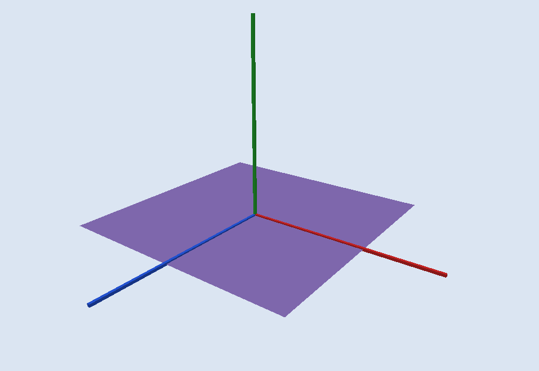

সবচেয়ে সহজ — ৪টা কোণা, ২টা ত্রিভুজ, সব normal উপরের দিকে `(0,1,0)`।

```cpp
Mesh ground = Primitives::CreatePlane(120.0f, 120.0f, Palette::Grass);
```

`120.0f` কেন এত বড়? কারণ ছোট হলে মাঠের **কিনারাটা** স্ক্রিনে দেখা যেত এবং সেটা
দিগন্তের বদলে "ম্যাটের শেষ প্রান্ত" মনে হতো। ১২০ মিটার হলে কিনারা ক্যামেরার দৃষ্টিসীমার
বাইরে চলে যায়।

`Main.cpp`-এ মাটিকে সামান্য নিচে নামানো হয়েছে:
```cpp
mat4 groundMatrix = translate(mat4(1.0f), vec3(0.0f, -0.01f, 0.0f));
```
কারণ কামানের পেছনের লোহার পাত ঠিক `Y = 0`-তে বসে। দুটো তল **হুবহু একই জায়গায়** থাকলে
GPU ঠিক করতে পারে না কোনটা সামনে — ফলে ঝিকিমিকি করে (একে বলে **z-fighting**)।
১ সেন্টিমিটার সরিয়ে দিলেই সমস্যা শেষ।

---

## পর্ব ৯ — `Part` আর `Local::`: জিনিস ঘোরানো ও বসানো

### ৯.১ সমস্যা

একটা চাকা মানে **একটা** আকৃতি না — ১৫টা আলাদা আকৃতি (টায়ার, কাঠের বেড়, ১০টা স্পোক,
হাব, ২টা পিতলের ঢাকনা) যারা **একসাথে নড়ে**।

প্রতিটার জন্য আলাদা ক্লাস বানানো পাগলামি হতো। তাই:

```cpp
struct Part {
    Mesh mesh;         // কী আঁকব
    glm::mat4 local;   // মালিকের ভেতরে কোথায় বসবে
};
```

একটা `Wheel` = `std::vector<Part>`। ব্যস।

### ৯.২ তিন স্তরের ম্যাট্রিক্স

```cpp
void DrawPartRange(Shader& shader, const glm::mat4& objectMatrix,
                   std::vector<Part>& parts, size_t first, size_t count) {
    GLuint modelLoc = glGetUniformLocation(shader.ID, "model");
    size_t last = std::min(first + count, parts.size());
    for (size_t i = first; i < last; i++) {
        glm::mat4 model = objectMatrix * parts[i].local;
        glUniformMatrix4fv(modelLoc, 1, GL_FALSE, glm::value_ptr(model));
        parts[i].mesh.Draw();
    }
}
```

সেই এক লাইন — `objectMatrix * parts[i].local` — খুলে লিখলে:

```
model = parentMatrix  ×  objectTransform  ×  part.local
         ↑                 ↑                    ↑
    কাঠামো মাঠের        চাকা কাঠামোর         স্পোক চাকার
    কোথায়?              কোথায়, কতটা        কোথায়?
                        গড়িয়েছে?          (কখনো বদলায় না)
```

তিনটা প্রশ্ন, তিনটা ম্যাট্রিক্স, গুণ করে দিলেই শেষ।

### ৯.৩ `Local::` হেল্পারগুলো

| হেল্পার | ম্যাট্রিক্স | কী করে | কোথায় ব্যবহৃত |
|---|---|---|---|
| `Move(p)` | `T(p)` | শুধু সরায় | ট্রান্সম, গালপাট্টা |
| `MoveTurn(p, θ)` | `T(p) × Rz(θ)` | নিজের জায়গায় কাত করে | কাত হওয়া বিম |
| `TurnMove(θ, p)` | `Rz(θ) × T(p)` | চারদিকে ছড়ায় | চাকার স্পোক |
| `AlongX(p)` | `T(p) × Rz(−90°)` | +Y → +X শোয়ায় | নলের সব টুকরো |
| `AlongZ(p)` | `T(p) × Rx(+90°)` | +Y → +Z শোয়ায় | অ্যাক্সেল, চাকার চাকতি |
| `AlongNegZ(p)` | `T(p) × Rx(−90°)` | +Y → −Z শোয়ায় | জোড়ার উল্টো অর্ধেক |

### ৯.৪ চোখে দেখা: একই সিলিন্ডার, তিন দিকে

তিনটাই **হুবহু একই `Mesh`**, শুধু `local` ম্যাট্রিক্স আলাদা:

**`Local::Move(vec3(0))` — যেমন বানানো হয়েছিল (+Y বরাবর):**

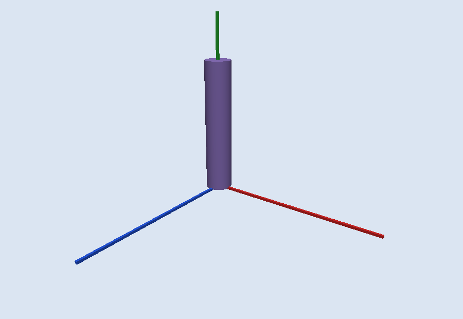

> সিলিন্ডারটা সবুজ কাঠির (+Y) সাথে মিলে আছে।

**`Local::AlongX(vec3(0))` — লাল কাঠি বরাবর শোয়ানো:**

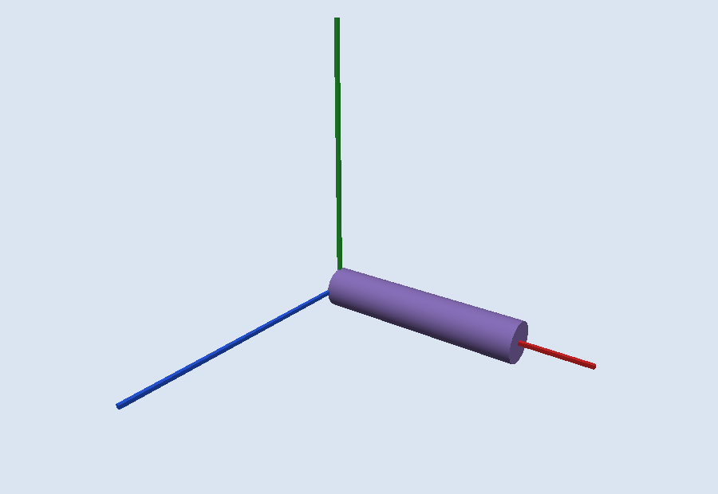

> এখন লাল কাঠির (+X) সাথে মিলে আছে। কামানের নল এভাবেই সামনে তাক করে।

**`Local::AlongZ(vec3(0))` — নীল কাঠি বরাবর শোয়ানো:**

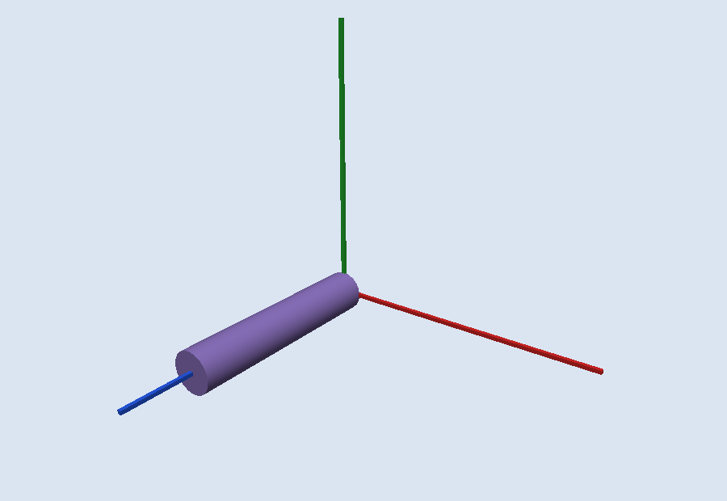

> এখন নীল কাঠির (+Z) সাথে মিলে আছে। চাকার অ্যাক্সেল এভাবেই পাশে যায়।

**একটাও নতুন vertex বানাতে হয়নি।** এটাই ম্যাট্রিক্সের শক্তি।

---

## পর্ব ১০ — `Transform`, `Dimensions.h`, `Palette.h`

### ১০.১ `Transform`

```cpp
glm::mat4 Transform::GetMatrix() const {
    glm::mat4 matrix = glm::mat4(1.0f);
    matrix = glm::translate(matrix, position);
    matrix = glm::rotate(matrix, glm::radians(rotationDegrees), rotationAxis);
    matrix = glm::scale(matrix, scale);
    return matrix;
}
```

**GLM-এর একটা ফাঁদ:** `glm::translate(M, v)` মানে `M × T(v)`, `T(v) × M` না!
তাই উপরের কোডটা আসলে:

```
Result = T(position) × R(angle, axis) × S(scale)
```

আর ডান-থেকে-বাঁয়ে প্রয়োগের নিয়মে প্রকৃত ক্রম হলো:

```
১. আগে scale করো
২. তারপর rotate করো
৩. সবশেষে position-এ সরাও
```

**এই ক্রমটাই একমাত্র যুক্তিসঙ্গত ক্রম।** উল্টো করলে কী হতো?
- আগে সরিয়ে পরে ঘোরালে → জিনিসটা নিজের জায়গায় না ঘুরে origin-এর চারদিকে কক্ষপথে ঘুরত
- আগে ঘুরিয়ে পরে scale করলে → scale-ও ঘুরে যেত, বস্তু বেঁকে যেত

`Transform` শুধু **একটা** ঘূর্ণন অক্ষ রাখে। Phase 1-এ এটাই যথেষ্ট, কারণ
চাকা ঘোরে Z ঘিরে, নল ওঠে Z ঘিরে — **দুটোই Z**, কাকতালীয়ভাবে না, কারণ
আমরা ইচ্ছে করে Z-কে "পাশের অক্ষ" বানিয়েছি।

### ১০.২ `Dimensions.h` — সব মাপ এক জায়গায়

```cpp
namespace Dim {
    inline constexpr float WheelRadius = 0.62f;
    inline constexpr float WheelTrack  = 0.68f;
    inline constexpr float PivotX = 0.10f, PivotY = 1.15f, PivotZ = 0.0f;
    ...
}
```

**কেন এটা এত গুরুত্বপূর্ণ?** কারণ **জিনিসগুলো এজন্যই একে অপরের সাথে ফিট করে।**

চাকা ঠিক অ্যাক্সেলের উপর বসে কারণ **দুটোই একই ধ্রুবক পড়ছে**:

```cpp
// Main.cpp — চাকা কোথায় বসবে
Wheel leftWheel(..., vec3(0.0f, Dim::WheelRadius, -Dim::WheelTrack));

// Carriage.cpp — অ্যাক্সেল কোথায় থাকবে
Local::AlongZ(glm::vec3(0.0f, Dim::WheelRadius, 0.0f))
//                            ↑ একই সংখ্যা!
```

`WheelRadius` বদলে `0.8f` করলে চাকা **আর** অ্যাক্সেল **দুটোই** একসাথে উঠে যাবে।
যদি দুই ফাইলে আলাদা করে `0.62f` লেখা থাকত, একটা বদলে অন্যটা ভুলে গেলে
চাকা অ্যাক্সেল থেকে খুলে ভেসে থাকত।

`inline constexpr` — C++17 ফিচার, হেডার-ওনলি ধ্রুবক, `.cpp` ফাইল লাগে না।

### ১০.৩ `Palette.h` — সব রং এক জায়গায়

```cpp
inline const glm::vec3 Wood      (0.42f, 0.24f, 0.11f);
inline const glm::vec3 DarkIron  (0.08f, 0.08f, 0.09f);
inline const glm::vec3 Brass     (0.72f, 0.55f, 0.15f);
```

RGB মান **০ থেকে ১**, ০ থেকে ২৫৫ না। `(0.42, 0.24, 0.11)` মানে ২৫৫-স্কেলে `(107, 61, 28)` — বাদামি।

---

## পর্ব ১১ — `Wheel`: চাকা বানানো

### ১১.১ চাকার নিজস্ব জগৎ

চাকা হলো **XY তলে শোয়ানো একটা চাকতি, অ্যাক্সেল Z বরাবর**।
তাই **গড়ানো = Z ঘিরে ঘোরা** — ঠিক যেমন নল ওঠা-নামাও Z ঘিরে।

```cpp
transform.position = axlePosition;
transform.rotationAxis = glm::vec3(0.0f, 0.0f, 1.0f);   // Z ঘিরে গড়ায়
transform.rotationDegrees = 0.0f;
```

### ১১.২ ধাপে ধাপে চাকা গড়া

**ধাপ ১ — লোহার টায়ার** (`CreateTube`, গাঢ় লোহা রং):

```cpp
parts.push_back({ Primitives::CreateTube(Dim::FelloeOuter, radius, width, segments, Palette::DarkIron),
                  Local::AlongZ(glm::vec3(0.0f)) });
```

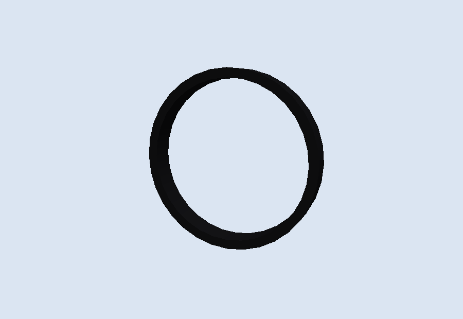

> `CreateTube(0.555, 0.62, 0.16, ...)` — ভেতরের ব্যাসার্ধ ০.৫৫৫, বাইরের ০.৬২। মাত্র ৬.৫ সেমি পুরু একটা বলয়। `AlongZ` দিয়ে শুইয়ে দেওয়া হয়েছে।

**ধাপ ২ — কাঠের বেড় (felloe)**, টায়ারের ঠিক ভেতরে, একটু সরু:

```cpp
parts.push_back({ Primitives::CreateTube(Dim::FelloeInner, Dim::FelloeOuter, width * 0.86f, segments, Palette::WoodLight),
                  Local::AlongZ(glm::vec3(0.0f)) });
```

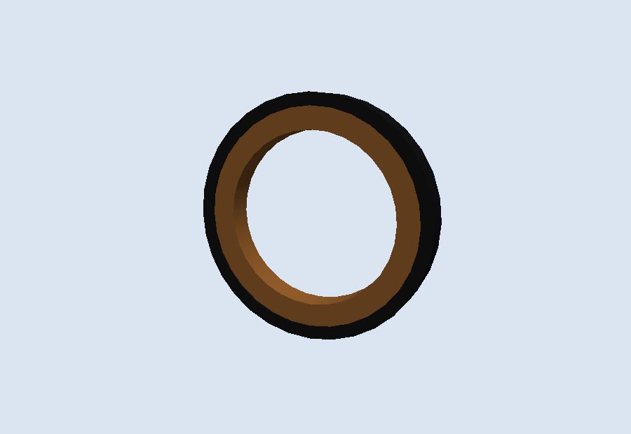

> `width * 0.86f` — কাঠটা টায়ারের চেয়ে একটু সরু, তাই লোহার টায়ারটা দুপাশে সামান্য বেরিয়ে থাকে, বাস্তব চাকার মতো।

**ধাপ ৩ — ১০টা স্পোক** ([পর্ব ৩.৫](#৩৫--গুণের-ক্রম-order--সবচেয়ে-বেশি-ভুল-এখানেই-হয়)-এর `TurnMove`):

```cpp
const float spokeLength = Dim::SpokeOuter - Dim::SpokeInner;   // 0.46 − 0.12 = 0.34
const float spokeMiddle = 0.5f * (Dim::SpokeInner + Dim::SpokeOuter);  // 0.29
for (int i = 0; i < spokeCount; i++) {
    float angle = 360.0f * float(i) / float(spokeCount);   // 0°, 36°, 72°, ...
    parts.push_back({ Primitives::CreateBox(spokeLength, Dim::SpokeThick, Dim::SpokeThick, Palette::WoodLight),
                      Local::TurnMove(angle, glm::vec3(spokeMiddle, 0.0f, 0.0f)) });
}
```

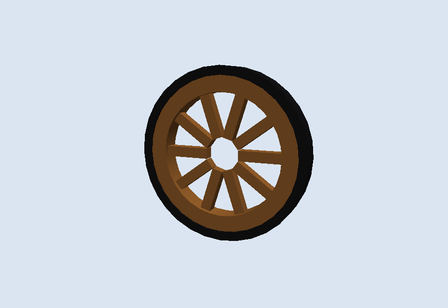

> ১০টা **হুবহু একই** বক্স, শুধু `angle` আলাদা (০°, ৩৬°, ৭২°, ...)। এখানে `TurnMove` লাগে কারণ আমরা চাই স্পোকগুলো **কেন্দ্র থেকে বাইরের দিকে ছড়াক**।

`spokeMiddle = 0.29` — বক্সের **কেন্দ্র** কেন্দ্র থেকে ০.২৯ দূরে, আর দৈর্ঘ্য ০.৩৪,
তাই বক্সটা ০.১২ থেকে ০.৪৬ পর্যন্ত বিস্তৃত। ঠিক হাব থেকে বেড় পর্যন্ত। ✓

**ধাপ ৪ — হাব আর পিতলের ঢাকনা:**

```cpp
parts.push_back({ Primitives::CreateCylinder(Dim::HubRadius, Dim::HubLength, 24, Palette::WoodLight),
                  Local::AlongZ(glm::vec3(0.0f)) });

const float hubEnd = Dim::HubLength / 2.0f;    // 0.16
parts.push_back({ Primitives::CreateCone(0.09f, 0.05f, 0.07f, 16, Palette::Brass, /*centered=*/false),
                  Local::AlongZ(glm::vec3(0.0f, 0.0f, hubEnd)) });
parts.push_back({ Primitives::CreateCone(0.09f, 0.05f, 0.07f, 16, Palette::Brass, /*centered=*/false),
                  Local::AlongNegZ(glm::vec3(0.0f, 0.0f, -hubEnd)) });
```

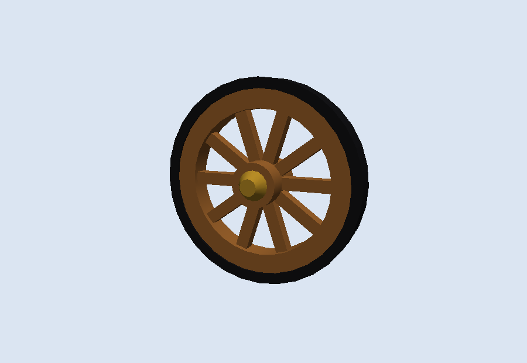

**`AlongZ` আর `AlongNegZ` — জোড়া বানানোর কায়দা:**

`centered = false` দেওয়ায় কোণকটা ০ থেকে ০.০৭ পর্যন্ত বাড়ে। তারপর:
```
AlongZ(0,0,+0.16)     →  Z = +0.16 থেকে +0.23  (ডানের ঢাকনা, বাইরের দিকে সরু)
AlongNegZ(0,0,−0.16)  →  Z = −0.16 থেকে −0.23  (বাঁয়ের ঢাকনা, বাইরের দিকে সরু)
```
দুটোই **বাইরের দিকে** সরু হচ্ছে — আয়নার মতো প্রতিসম। একই `Mesh`, শুধু ঘোরানোর দিক আলাদা।

### ১১.৩ 🔢 পিছলে না গিয়ে গড়ানো (Rolling without slipping)

```cpp
void Wheel::Roll(float distanceMoved) {
    transform.rotationDegrees -= glm::degrees(distanceMoved / radius);
}
```

**এই এক লাইনের পুরো অঙ্কটা:**

একটা চাকা মাটিতে না পিছলে গড়ালে, চাকা যত পথ পাড়ি দেয়, তার রিমের ততটুকু
**চাপ (arc)** মাটি ছোঁয়:

```
        চাপের দৈর্ঘ্য = R × θ        (θ রেডিয়ানে)

        যেহেতু পিছলাচ্ছে না:  R × θ = s  (অতিক্রান্ত দূরত্ব)

                              θ = s / R
```

**উদাহরণ — ১ মিটার চললে:**
```
R = 0.62 মিটার,  s = 1.0 মিটার

θ = 1.0 / 0.62 = 1.6129 রেডিয়ান

ডিগ্রিতে:  1.6129 × (180/π) = 1.6129 × 57.2958 = 92.4°
```

চাকাটা প্রায় সিকি পাক ঘুরল। যাচাই: চাকার পরিধি = `2πR` = `2 × 3.1416 × 0.62` = **৩.৮৯৬ মিটার**।
তাই ১ মিটারে ঘোরার কথা `1.0 / 3.896 = 0.2567` পাক = `0.2567 × 360°` = **৯২.৪°** ✓ মিলে গেছে।

**ঋণাত্মক চিহ্নটা (`-=`) কেন?**

```
কামান +X দিকে (ডানে) চলছে
   ────────►

চাকাকে +Z দিক থেকে (আপনার চোখের দিক থেকে) দেখলে
সেটা ঘড়ির কাঁটার দিকে (clockwise) ঘোরে।

কিন্তু গণিতে ধনাত্মক ঘূর্ণন = ঘড়ির কাঁটার উল্টো দিকে (counter-clockwise)।

তাই ঋণাত্মক চিহ্ন।  ← চিহ্ন ভুল দিলে চাকা উল্টো ঘুরবে,
                        গাড়ি সামনে যাবে কিন্তু চাকা পেছনে ঘুরবে!
```

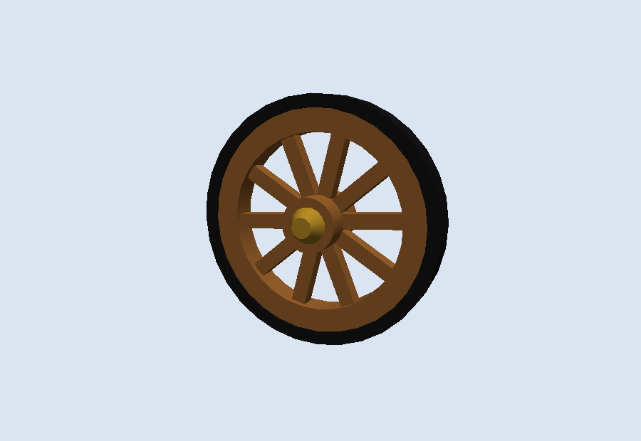

> ছবি: `wheel.Roll(0.35f)` ডাকার পরে — স্পোকগুলো আগের ছবির চেয়ে ঘুরে গেছে (৩৫ সেমি চলায় ৩২.৩° ঘুরেছে)।

---

## পর্ব ১২ — `Carriage`: কামানের কাঠামো

> এটাই সেই অংশ যা আগের ভার্সনে **ছিল না** — ফলে চাকা আর নল বাতাসে ভাসছিল।

### ১২.১ ধাপ ১: দুটো লম্বা বিম (trail beam)

বিমের **দুই প্রান্ত** জানা থাকলেই বাকি সব হিসাব করে নেওয়া যায়:

```cpp
const float runX = Dim::BeamRearX - Dim::BeamFrontX;   // −2.35 − 0.70 = −3.05
const float runY = Dim::BeamRearY - Dim::BeamFrontY;   //  0.17 − 0.85 = −0.68
const float beamLength = std::sqrt(runX * runX + runY * runY);
const float beamAngle = glm::degrees(std::atan2(-runY, -runX));
const glm::vec2 beamMiddle = PointOnBeam(0.5f);
```

**অঙ্কটা কষে দেখি:**

```
দৈর্ঘ্য  = √((−3.05)² + (−0.68)²) = √(9.3025 + 0.4624) = √9.7649 = 3.125 মিটার

কোণ     = atan2(0.68, 3.05) = atan(0.2230) = 12.56°

মধ্যবিন্দু = ((0.70 + (−2.35))/2, (0.85 + 0.17)/2) = (−0.825, 0.51)
```

```
             (0.70, 0.85) সামনের প্রান্ত, উঁচুতে
                  ●
                 ╱ │
    ৩.১২৫ মি   ╱   │ ০.৬৮
              ╱ 12.56°
             ●──────┘
    (−2.35, 0.17) পেছনের প্রান্ত, মাটিতে
           ├─── ৩.০৫ ───┤
```

**`atan2(-runY, -runX)` — ঋণাত্মক কেন?**
`runX, runY` মাপা হয়েছে **সামনে থেকে পেছনে**। কিন্তু আমরা চাই বিমের সামনের দিকটা
**উপরে** উঠুক, তাই কোণটা **পেছন থেকে সামনে** মাপতে হবে — সেজন্যই উল্টো চিহ্ন।

```cpp
for (float z : { -Dim::BeamZ, Dim::BeamZ }) {
    parts.push_back({ Primitives::CreateBox(beamLength, Dim::BeamThick, Dim::BeamWide, Palette::Wood),
                      Local::MoveTurn(glm::vec3(beamMiddle.x, beamMiddle.y, z), beamAngle) });
}
```

এখানে **`MoveTurn`** (`TurnMove` না!) — কারণ বিমটাকে **নিজের মাঝবিন্দু ঘিরে কাত** করতে চাই।


> দুটো কাত হওয়া কাঠের বিম — পেছনের দিক মাটিতে নেমে গেছে। এই কীলক আকৃতিই কামানের চেনা চেহারা।

### ১২.২ ধাপ ২: তিনটা আড়াআড়ি কাঠ (transom)

```cpp
static glm::vec2 PointOnBeam(float t) {
    return glm::vec2(Dim::BeamFrontX + t * (Dim::BeamRearX - Dim::BeamFrontX),
                     Dim::BeamFrontY + t * (Dim::BeamRearY - Dim::BeamFrontY));
}

for (float t : { 0.12f, 0.55f, 0.90f }) {
    glm::vec2 at = PointOnBeam(t);
    parts.push_back({ Primitives::CreateBox(0.16f, 0.14f, 2.0f * Dim::BeamZ, Palette::Wood),
                      Local::Move(glm::vec3(at.x, at.y, 0.0f)) });
}
```

`PointOnBeam(t)` হলো **linear interpolation (lerp)** — `t = 0` মানে সামনের প্রান্ত,
`t = 1` মানে পেছনের প্রান্ত, `t = 0.5` মানে ঠিক মাঝখানে।

```
t=0.12 এর হিসাব:
  x = 0.70 + 0.12 × (−3.05) = 0.70 − 0.366 = 0.334
  y = 0.85 + 0.12 × (−0.68) = 0.85 − 0.0816 = 0.768
```

এভাবে করায় transom গুলো **নিজে থেকেই বিমের ঢাল অনুসরণ করে** — বিমের প্রান্ত বদলালে
এগুলোও ঠিক জায়গায় সরে যাবে, হাতে কিছু বদলাতে হবে না।

গভীরতা `2.0f * Dim::BeamZ` = `2 × 0.32` = `0.64` — ঠিক দুই বিমের মাঝের পুরো ফাঁক।

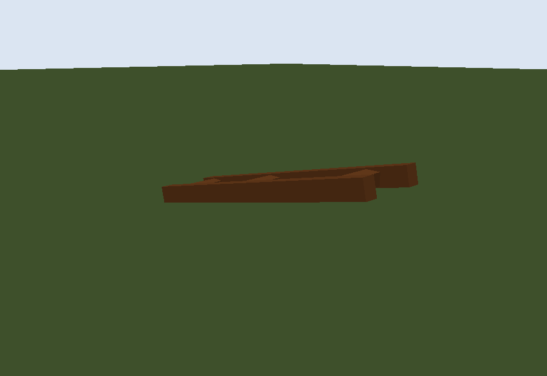

### ১২.৩ ধাপ ৩: পেছনের লোহার পাত (trail spade)

```cpp
parts.push_back({ Primitives::CreateBox(0.24f, 0.30f, 2.0f * Dim::BeamZ + 0.16f, Palette::DarkIron),
                  Local::Move(glm::vec3(Dim::BeamRearX - 0.06f, Dim::BeamRearY - 0.02f, 0.0f)) });
```

বাস্তবে এটাই মাটিতে গেঁথে যায় আর গোলা ছোড়ার সময় কামানকে পিছলে যেতে দেয় না।

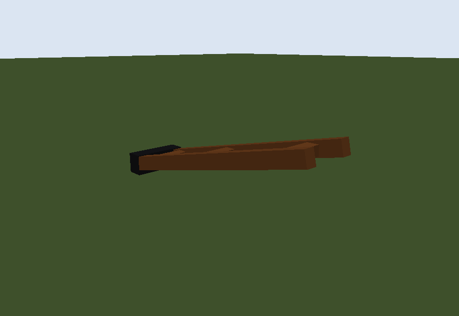

### ১২.৪ ধাপ ৪: গালপাট্টা (cheeks) — নলের খুঁটি

```cpp
float Carriage::BeamHeightAt(float x) {
    float t = (x - Dim::BeamFrontX) / (Dim::BeamRearX - Dim::BeamFrontX);
    return Dim::BeamFrontY + t * (Dim::BeamRearY - Dim::BeamFrontY);
}

const float cheekBase = BeamHeightAt(Dim::PivotX);
const float cheekHeight = Dim::PivotY - cheekBase + 0.18f;
for (float z : { -Dim::BeamZ, Dim::BeamZ }) {
    parts.push_back({ Primitives::CreateBox(0.40f, cheekHeight, Dim::BeamWide, Palette::Wood),
                      Local::Move(glm::vec3(Dim::PivotX, cheekBase + cheekHeight * 0.5f - 0.02f, z)) });
}
```

**`BeamHeightAt()` কী সমাধান করে?**

বিম কাত হয়ে আছে, তাই এর উচ্চতা জায়গাভেদে আলাদা। গালপাট্টা যদি ঠিক
বিমের উপরেই বসাতে হয়, তাহলে **ওই জায়গায়** বিমের উচ্চতা জানতে হবে।

```
হিসাব: PivotX = 0.10 তে বিমের উচ্চতা কত?

t = (0.10 − 0.70) / (−2.35 − 0.70) = (−0.60) / (−3.05) = 0.1967

y = 0.85 + 0.1967 × (0.17 − 0.85) = 0.85 + 0.1967 × (−0.68)
  = 0.85 − 0.1338 = 0.7162

তাহলে গালপাট্টার উচ্চতা = 1.15 − 0.7162 + 0.18 = 0.6138 মিটার
                          ↑pivot  ↑ভিত্তি      ↑একটু বাড়তি, যাতে নল
                                                 ভেতরে বসে, উপরে না ভাসে
```

**`cheekBase + cheekHeight * 0.5f`** কেন? কারণ `CreateBox` কেন্দ্রে বানায়।
বক্সের নিচ যদি `cheekBase`-এ রাখতে চাই, তবে কেন্দ্র রাখতে হবে
`cheekBase + উচ্চতা/2`-এ।

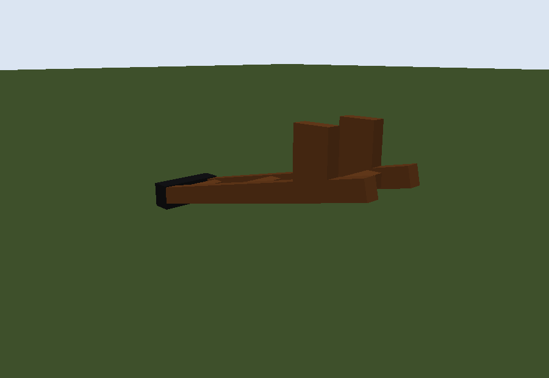

### ১২.৫ ধাপ ৫ ও ৬: quoin ব্লক, অ্যাক্সেল, বোলস্টার

```cpp
// breech-এর নিচের কাঠের ধাপ
parts.push_back({ Primitives::CreateBox(0.42f, 0.34f, 2.0f * Dim::BeamZ, Palette::Wood),
                  Local::Move(glm::vec3(Dim::PivotX - 0.62f, cheekBase + 0.22f, 0.0f)) });
```

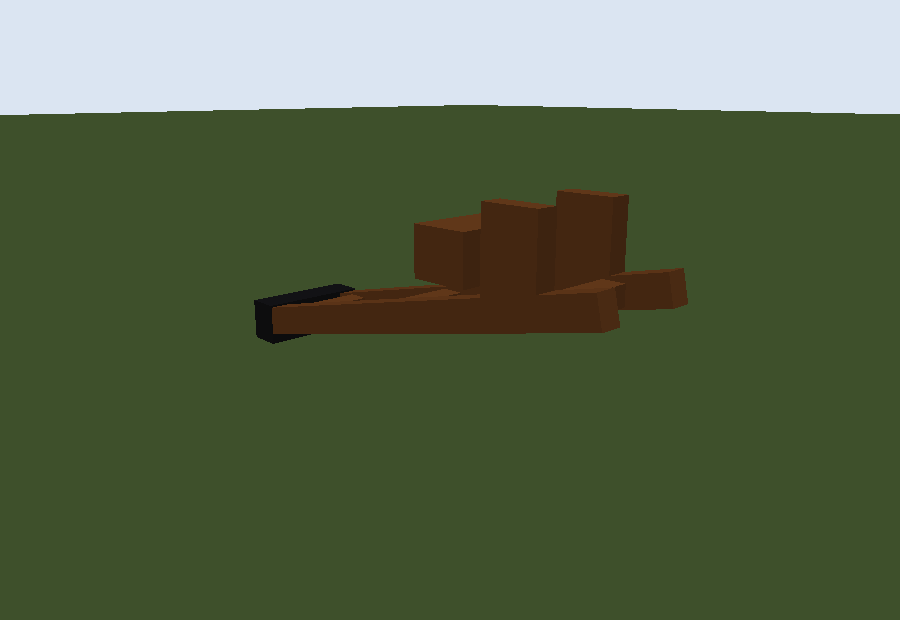

```cpp
const float axleHalfSpan = Dim::WheelTrack + 0.10f;    // 0.68 + 0.10 = 0.78
parts.push_back({ Primitives::CreateCylinder(0.065f, 2.0f * axleHalfSpan, 20, Palette::DarkIron),
                  Local::AlongZ(glm::vec3(0.0f, Dim::WheelRadius, 0.0f)) });

parts.push_back({ Primitives::CreateBox(0.26f, 0.22f, 2.0f * Dim::WheelTrack - 0.10f, Palette::Wood),
                  Local::Move(glm::vec3(0.0f, Dim::WheelRadius + 0.10f, 0.0f)) });
```

**`+ 0.10f` কেন?** অ্যাক্সেল চাকার চেয়ে **একটু লম্বা**, যাতে দুই মাথা হাবের ভেতর দিয়ে
বেরিয়ে থাকে — বাস্তব অ্যাক্সেলের মতো।

**অ্যাক্সেলের Y = `Dim::WheelRadius`** — ঠিক চাকার কেন্দ্রের উচ্চতায়। এটাই সেই
"একই ধ্রুবক পড়া" যা [পর্ব ১০.২](#১০২-dimensionsh--সব-মাপ-এক-জায়গায়)-এ বলা হয়েছে।

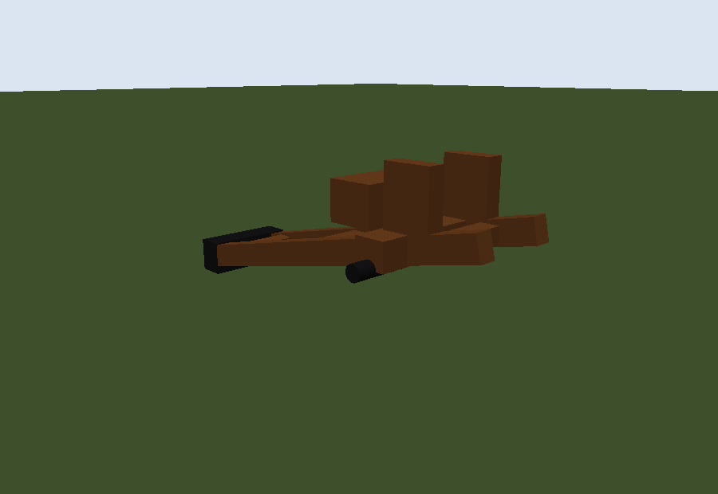

> সম্পূর্ণ কাঠামো: বিম, ট্রান্সম, পাত, গালপাট্টা, quoin, অ্যাক্সেল, বোলস্টার — ১১টা `Part`।

---

## পর্ব ১৩ — `Shaft`: নল (Barrel)

### ১৩.১ 🔑 সবচেয়ে চতুর সিদ্ধান্ত: origin-ই pivot

নলের **local origin = trunnion pivot** (যে বিন্দু ঘিরে নল ওঠানামা করে)।
নলের পেছনের মাথা না, ঠিক সেই কব্জার বিন্দু।

**কেন?** কারণ **ঘোরানো সবসময় local origin ঘিরেই হয়**।

```
❌ যদি origin নলের পেছনে হতো:
   elevation = Rz(θ), তারপর আবার "কিন্তু pivot তো অন্য জায়গায়" বলে
   T(−pivot) × Rz(θ) × T(+pivot) — তিনটা ম্যাট্রিক্স, ভুল করার তিনটা সুযোগ

✅ origin = pivot হলে:
   elevation = Rz(θ)।  ব্যস। একটা ম্যাট্রিক্স, শূন্য সংশোধন।
```

তাই সব X মান pivot থেকে মাপা — **ঋণাত্মক = pivot-এর পেছনে**, ধনাত্মক = সামনে:

```cpp
const float breech = Dim::BarrelBreechX;   // −0.45, মানে pivot-এর ৪৫ সেমি পেছনে
```

### ১৩.২ ধাপ ১: গোল breech আর cascabel

```cpp
barrelParts.push_back({ Primitives::CreateSphere(0.205f, 20, segments, Palette::Iron),
                        Local::Move(glm::vec3(breech, 0.0f, 0.0f)) });
barrelParts.push_back({ Primitives::CreateSphere(0.085f, 14, 16, Palette::Iron),
                        Local::Move(glm::vec3(breech - 0.16f, 0.0f, 0.0f)) });
barrelParts.push_back({ Primitives::CreateCylinder(0.045f, 0.14f, 14, Palette::Iron, /*centered=*/false),
                        Local::AlongX(glm::vec3(breech - 0.18f, 0.0f, 0.0f)) });
```

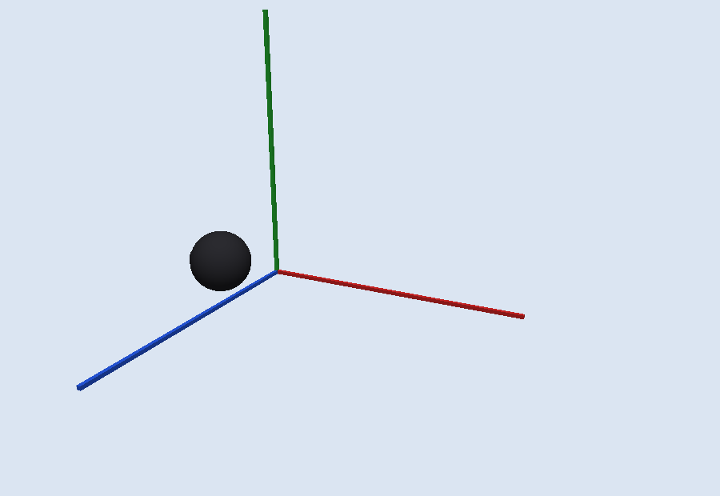

> লক্ষ্য করুন গোলকটা **অক্ষের কেন্দ্র (origin) থেকে বাঁয়ে**, মানে ঋণাত্মক X-এ — কারণ `breech = −0.45`।

### ১৩.৩ ধাপ ২: নলের শরীর — চারটা কোণকের শিকল

```cpp
// first reinforce: পেছনের মোটা অংশ (সবচেয়ে বেশি চাপ এখানে পড়ে)
barrelParts.push_back({ Primitives::CreateCone(0.200f, 0.185f, 0.55f, segments, Palette::Iron, false),
                        Local::AlongX(glm::vec3(breech, 0.0f, 0.0f)) });
// chase: লম্বা সরু অংশ
barrelParts.push_back({ Primitives::CreateCone(0.175f, 0.125f, 1.42f, segments, Palette::Iron, false),
                        Local::AlongX(glm::vec3(breech + 0.55f, 0.0f, 0.0f)) });
```

**শিকলের হিসাব — প্রতিটা টুকরো আগেরটা যেখানে শেষ, সেখান থেকে শুরু:**

```
টুকরো            শুরু X              দৈর্ঘ্য    শেষ X       ব্যাসার্ধ
─────────────────────────────────────────────────────────────────────
reinforce      −0.45               0.55      0.10       0.200 → 0.185
chase          −0.45+0.55 =  0.10  1.42      1.52       0.175 → 0.125
swell          −0.45+1.97 =  1.52  0.11      1.63       0.125 → 0.165  ← আবার চওড়া!
muzzle face    −0.45+2.08 =  1.63  0.07      1.70       0.165 → 0.150
                                                ↑
                              Dim::MuzzleX = 1.70 ✓ মিলে গেছে
```

`centered = false` এজন্যই দরকার — প্রতিটা টুকরো তার শুরুর X থেকে **সামনে বাড়ে**,
তাই শিকলটা উপর থেকে নিচে পড়লেই বোঝা যায়।

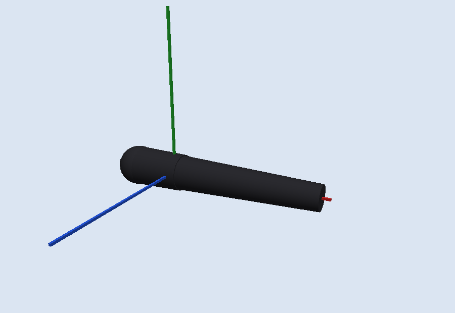

### ১৩.৪ ধাপ ৩: মুখের ফোলা অংশ (muzzle swell)

```cpp
barrelParts.push_back({ Primitives::CreateCone(0.125f, 0.165f, 0.11f, segments, Palette::Iron, false),
                        Local::AlongX(glm::vec3(breech + 1.97f, 0.0f, 0.0f)) });
barrelParts.push_back({ Primitives::CreateCone(0.165f, 0.150f, 0.07f, segments, Palette::Iron, false),
                        Local::AlongX(glm::vec3(breech + 2.08f, 0.0f, 0.0f)) });
```

লক্ষ্য করুন `0.125f → 0.165f` — ব্যাসার্ধ **বাড়ছে**। নল সরু হতে হতে হঠাৎ মুখের কাছে
আবার মোটা হয়ে একটা ঠোঁট বানায়। বাস্তব কামানে এটা থাকে।

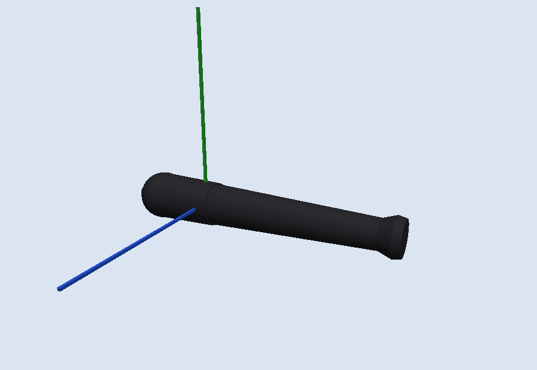

### ১৩.৫ ধাপ ৪: পিতলের বলয় আর টাচ হোল

```cpp
for (auto ring : { std::pair<float, float>{ 0.10f, 0.190f },
                   std::pair<float, float>{ 0.72f, 0.155f } }) {
    float x = ring.first, outer = ring.second;
    barrelParts.push_back({ Primitives::CreateTube(outer - 0.03f, outer + 0.022f, 0.05f, segments, Palette::Brass),
                            Local::AlongX(glm::vec3(x, 0.0f, 0.0f)) });
}
```

**নিরেট চাকতি না, `CreateTube` কেন?** কারণ বলয়টা নলের **চারপাশে** বসতে হবে।
ভেতরের ব্যাসার্ধ (`outer − 0.03`) নলের গায়ের একটু ভেতরে ঢুকে থাকে, যাতে ফাঁক না থাকে।

এখানে `CreateTube` **centered = true** (ডিফল্ট), তাই বলয়টা `x ± 0.025` জুড়ে — ঠিক ওই বিন্দুতে কেন্দ্রিত।

```cpp
barrelParts.push_back({ Primitives::CreateCone(0.035f, 0.028f, 0.07f, 12, Palette::DarkIron, false),
                        Local::Move(glm::vec3(breech + 0.15f, 0.16f, 0.0f)) });
```

টাচ হোল (যেখানে আগুন দেওয়া হয়) — **একমাত্র টুকরো যেটা খাড়া থাকে**, তাই
কোনো `AlongX`/`AlongZ` লাগেনি, শুধু `Move`।

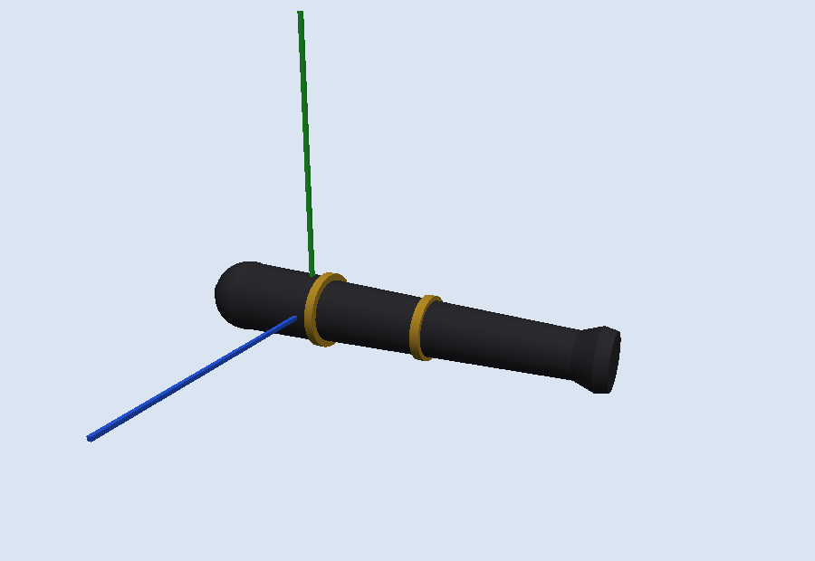

### ১৩.৬ ধাপ ৫: ফুটো (bore)

```cpp
barrelParts.push_back({ Primitives::CreateCylinder(Dim::BoreRadius, 0.30f, 20, Palette::Bore, false),
                        Local::AlongX(glm::vec3(Dim::MuzzleX - 0.30f, 0.0f, 0.0f)) });
```

`Dim::MuzzleX - 0.30f` = `1.70 − 0.30` = `1.40` থেকে শুরু করে `1.70` পর্যন্ত —
মানে নলের মুখ থেকে ৩০ সেমি **ভেতরে ঢুকে** একটা প্রায়-কালো সিলিন্ডার।


> এই ছোট্ট কালো বৃত্তটাই নলটাকে "ফাঁপা" দেখায়। এটা না থাকলে মুখটা নিরেট ধাতুর চাকতি মনে হতো।

### ১৩.৭ ধাপ ৬: Trunnion — কব্জা

```cpp
trunnionParts.push_back({ Primitives::CreateCone(0.09f, 0.085f, 0.24f, 20, Palette::Brass, false),
                          Local::AlongZ(glm::vec3(0.0f, 0.0f, 0.16f)) });
trunnionParts.push_back({ Primitives::CreateCone(0.09f, 0.085f, 0.24f, 20, Palette::Brass, false),
                          Local::AlongNegZ(glm::vec3(0.0f, 0.0f, -0.16f)) });
```


**খেয়াল করুন এগুলো আলাদা `vector`-এ রাখা।** কেন? `Draw()` দেখুন:

```cpp
void Shaft::Draw(Shader& shader, const glm::mat4& parentMatrix) {
    glm::mat4 mount = parentMatrix * glm::translate(glm::mat4(1.0f), transform.position);
    DrawParts(shader, mount, trunnionParts);              // ← elevation ছাড়া!

    DrawParts(shader, parentMatrix * transform.GetMatrix(), barrelParts);  // ← elevation সহ
}
```

**trunnion হলো কব্জা, কব্জার উপর ঝোলা জিনিস না।** দরজা ঘোরে, কিন্তু কব্জা ঘোরে না।
তাই trunnion শুধু `transform.position` পায়, `transform.GetMatrix()` (যাতে ঘূর্ণনও আছে) পায় না।

### ১৩.৮ Elevation — এক লাইনে

```cpp
void Shaft::Elevate(float deltaDegrees) {
    elevationDegrees = std::clamp(elevationDegrees + deltaDegrees, MinElevationDeg, MaxElevationDeg);
    transform.rotationDegrees = elevationDegrees;
}
```

`std::clamp(value, 0.0f, 45.0f)` — ০ এর নিচে বা ৪৫ এর উপরে যেতে দেয় না।
**সীমাটা `Shaft`-এর ভেতরে**, `Main.cpp`-এ না। তাই যেই `Elevate()` ডাকুক, সীমা মানতে বাধ্য।

**চোখে দেখুন — ঘূর্ণনটা ঠিক origin (অক্ষের কাটাকাটি বিন্দু) ঘিরে হচ্ছে:**

| ০° elevation | ৪৫° elevation |
|---|---|
| 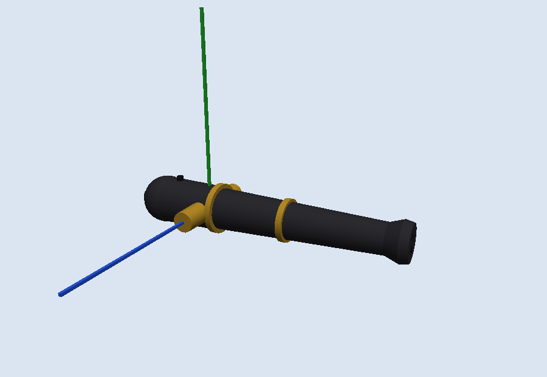 | 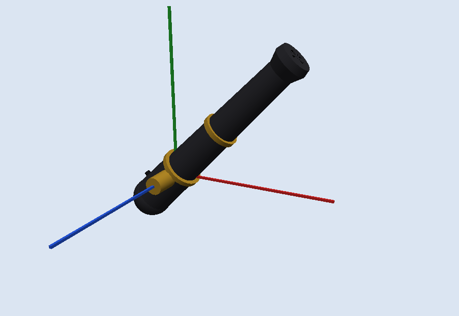 |

> লক্ষ্য করুন trunnion (পিতলের ছোট খুঁটি) **দুই ছবিতেই একই জায়গায়** আছে, শুধু নলটা তার
> চারদিকে ঘুরেছে। ঠিক যেমন হওয়া উচিত।

---

## পর্ব ১৪ — Scene Graph: সব জোড়া লাগানো

### ১৪.১ ধারণাটা

```
Carriage  (মূল/root)
   ├── Wheel বাঁ
   ├── Wheel ডান
   └── Shaft
```

কাঠামো নড়লে তার উপরের সবকিছু নড়ে — **কারণ তারা নিজেদের অবস্থান কাঠামোর সাপেক্ষে
হিসাব করে, মাঠের সাপেক্ষে না।**

```cpp
mat4 carriageMatrix = carriage.GetMatrix();
carriage.Draw(shaderProgram, mat4(1.0f));       // parent = দুনিয়া
leftWheel.Draw(shaderProgram, carriageMatrix);  // parent = কাঠামো
rightWheel.Draw(shaderProgram, carriageMatrix);
shaft.Draw(shaderProgram, carriageMatrix);
```

### ১৪.২ ধাপে ধাপে জোড়া লাগা

**শুধু কাঠামো:**

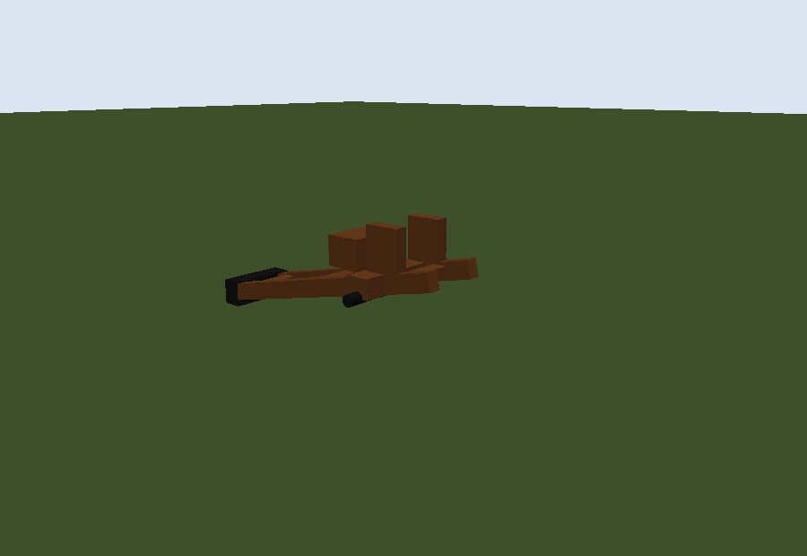

**+ দুটো চাকা:**

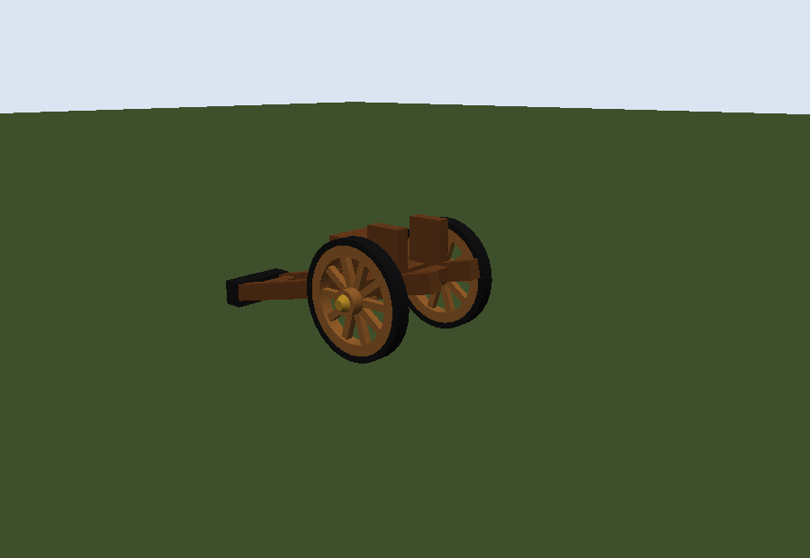

**+ নল = সম্পূর্ণ কামান:**


**সর্বোচ্চ elevation (৪৫°):**

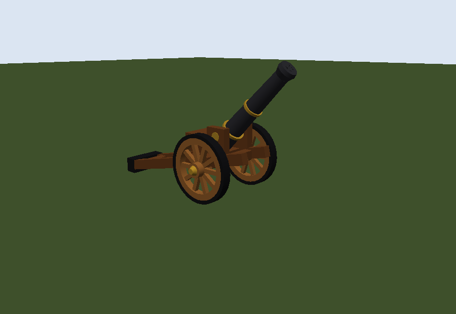

### ১৪.৩ চালিয়ে দেখা

```cpp
carriage.MoveForward(2.5f);
leftWheel.Roll(2.5f);
rightWheel.Roll(2.5f);
```

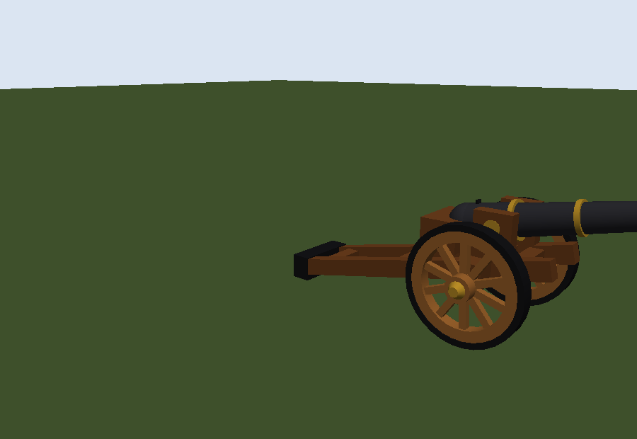

> ২.৫ মিটার এগিয়েছে। চাকার স্পোকগুলোর কোণ বদলে গেছে — `2.5 / 0.62 = 4.03` রেডিয়ান = **২৩১°** ঘুরেছে।

### ১৪.৪ ⚠️ parent matrix না দিলে কী হয়?

এই ছবিটা ইচ্ছে করে **ভুল** করে বানানো — চাকা আর নলকে `carriageMatrix`-এর বদলে
`mat4(1.0f)` (দুনিয়া) parent দেওয়া হয়েছে:

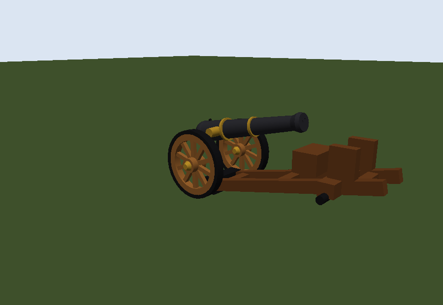

> কাঠামোটা ২.৫ মিটার এগিয়ে গেছে, কিন্তু চাকা আর নল **পড়ে আছে আগের জায়গায়**।
> কামান নিজের চাকা ফেলে চলে গেছে।

**এই এক ছবিই বুঝিয়ে দেয় scene graph জিনিসটা কী।** parent matrix ছাড়া প্রতিটা
অবজেক্টকে আলাদা করে "তুমিও ২.৫ মিটার এগোও" বলতে হতো — আর একটা ভুলে গেলেই এই অবস্থা।

### ১৪.৫ 🔢 পুরো ম্যাট্রিক্স শিকলটা

একটা স্পোকের একটা কোণা স্ক্রিনে পৌঁছাতে কতগুলো ধাপ পেরোয়:

```
স্পোকের কোণার local অবস্থান
        │
        ├─ × part.local          (TurnMove: স্পোক চাকার কোন কোণে)
        │
        ├─ × wheel.transform     (চাকা কাঠামোর কোথায় + কতটা গড়িয়েছে)
        │
        ├─ × carriage.transform  (কাঠামো মাঠের কোথায়)     ← "model" শেষ
        │
        ├─ × view                (ক্যামেরা থেকে কোথায়)
        │
        └─ × proj                (স্ক্রিনের কোথায়, দূরেরটা ছোট)
                │
                ▼
          পর্দার পিক্সেল
```

কোডে প্রথম তিনটা গুণ হয় CPU-তে (`DrawPartRange`-এ), শেষ দুটো GPU-তে (`lit.vert`-এ)।

---

## পর্ব ১৫ — আপনার যাত্রা (key চাপলে কী হয়)

ধরুন আপনি **→ (ডান তীর)** এক সেকেন্ড চেপে ধরলেন। ঠিক কী কী ঘটে:

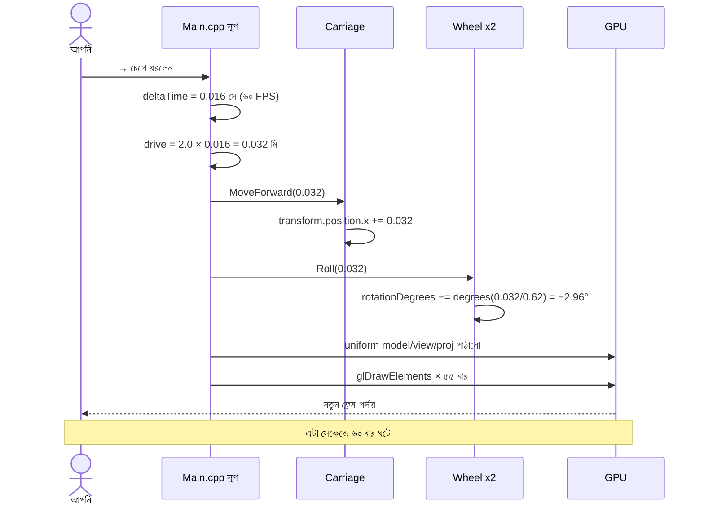
```mermaid
sequenceDiagram
    actor U as আপনি
    participant M as Main.cpp লুপ
    participant C as Carriage
    participant W as Wheel x2
    participant G as GPU

    U->>M: → চেপে ধরলেন
    M->>M: deltaTime = 0.016 সে (৬০ FPS)
    M->>M: drive = 2.0 × 0.016 = 0.032 মি
    M->>C: MoveForward(0.032)
    C->>C: transform.position.x += 0.032
    M->>W: Roll(0.032)
    W->>W: rotationDegrees −= degrees(0.032/0.62) = −2.96°
    M->>G: uniform model/view/proj পাঠানো
    M->>G: glDrawElements × ৫৫ বার
    G-->>U: নতুন ফ্রেম পর্দায়
    Note over U,G: এটা সেকেন্ডে ৬০ বার ঘটে
```

**এক সেকেন্ড পরে মোট:**

```
দূরত্ব  = 2.0 মি/সে × 1 সে = 2.0 মিটার
ঘূর্ণন  = degrees(2.0 / 0.62) = 184.8°   ← চাকা আধপাক ঘুরেছে
ফ্রেম   = ৬০টা
draw call = ৬০ × ৫৫ = ৩৩০০টা
```

**প্রতি ফ্রেমে ঠিক ৫৫টা draw call কেন?** গুনে দেখুন:

```
মাটি                    1
কাঠামো                 11
চাকা × ২               30   (প্রতি চাকায় ১৫টা Part)
trunnion                2
নল                     11
                      ────
মোট                    55
```

(৫৫ — প্রতিটা `Part`-এর জন্য একটা করে `glDrawElements`।)

---

## পর্ব ১৬ — Phase 2: `Projectile` — কামানের গুলি, পদার্থবিদ্যা সহ

Phase 1-এ কামান **দেখতে** পারতাম, চালাতে পারতাম, নল তুলতে পারতাম — কিন্তু
**কাজ** করত না। Phase 2 এটাকে "আগুন" দেয়: স্পেসবার চাপলে মুখ থেকে একটা
লোহার গোলা বেরিয়ে মাটিতে পড়ার আগে দেয়ালে আঘাত করে।

### ১৬.১ সমস্যাটা — ছোট্ট করে

```
    এই মুহূর্তে (t)                একটু পরে (t + dt)
                                            
    বল (v)        গুলি (pos)    →    বল (v − g·dt·ĵ)   গুলি (pos + v·dt)

    v.y -= g * dt;
    pos += v * dt;
```

`g` (মাধ্যাকর্ষণ) = 9.81 m/s² — পৃথিবীর সেই বিখ্যাত ৯.৮।

এটাকে বলে **semi-implicit Euler** — সবচেয়ে সহজ কাজের ইন্টিগ্রেটর।
পাইথন ভার্সনেও (`legacy/projectile.py`) এই একই সূত্র, আর `docs/verification.txt`
§2 তে একটা বন্ধ-ফর্ম সমাধানের সাথে মিলিয়ে দেখা হয়েছে যে এটা যথেষ্ট।

### ১৬.২ ক্লাসের গঠন

`Projectile` ক্লাসটা দৃশ্যের সবচেয়ে ছোট জিনিস — একটা sphere mesh,
একটা `position`, একটা `velocity`, একটা `radius`। ব্যস। এর কোনো parent
matrix নেই, কারণ মুখ থেকে বের হওয়ার পর গুলি আর কামানের "সন্তান" না —
সে তার নিজের জীবন কাটায়।

```cpp
// Projectile.h - অতি সংক্ষেপে
class Projectile {
public:
    Projectile(glm::vec3 muzzlePos, glm::vec3 velocity, float radius);
    void Update(float deltaTime, float gravity);
    void Draw(Shader& shader);
    glm::vec3 GetPosition() const;
    bool IsDead() const;

    static constexpr float LifetimeSeconds = 6.0f;
    static constexpr float DefaultSpeed    = 14.0f;
    static constexpr float Gravity         = 9.81f;

private:
    Mesh mesh;
    glm::vec3 position;
    glm::vec3 velocity;
    float radius;
    float ageSeconds = 0.0f;
    bool   dead      = false;
};
```

> **Mesh কেন member-initializer list-এ?** কারণ Mesh-এর কোনো default
> constructor নেই — সে GPU buffer IDs-এর মালিক, সেগুলো অবশ্যই `Primitives::CreateSphere`
> দিয়ে তৈরি হতে হবে। তাই `mesh(Primitives::CreateSphere(...))` initializer
> list-এই থাকে, body-তে পরে আর কিছু করার দরকার নেই।

### ১৬.৩ মুখের অবস্থান — কোথা থেকে ছোড়া হচ্ছে

গুলি মুখের **ডগা** থেকে বের হওয়া উচিত, নইলে কামানের ভেতর দিয়ে উড়ে
যাবে। মুখের অবস্থান সরাসরি `Shaft` ক্লাসের কাছে জিজ্ঞেস করি:

```cpp
// Shaft.cpp
glm::vec3 Shaft::GetMuzzleWorldPosition(const glm::mat4& parentMatrix) const {
    // মুখের ডগা barrel-space-এ (MuzzleX, 0, 0) বসে; shaft-এর পুরো
    // transform (অবস্থান + উচ্চতা) এবং তারপর parent (গাড়ি) লাগিয়ে
    // world-space পাই - ঠিক যেটা Draw() নলের জন্য ব্যবহার করে।
    glm::vec4 muzzleLocal(Dim::MuzzleX, 0.0f, 0.0f, 1.0f);
    return parentMatrix * transform.GetMatrix() * muzzleLocal;
}

glm::vec3 Shaft::GetForwardWorldDirection(const glm::mat4& parentMatrix) const {
    // বেগলনে (translation-মুক্ত) ম্যাট্রিক্সের ওপর দিয়ে +X অক্ষ
    // উঠিয়ে আনি — কারণ দিকনির্দেশনায় translation চাই না।
    glm::mat4 rotOnly = parentMatrix * glm::rotate(glm::mat4(1.0f),
                                                   glm::radians(elevationDegrees),
                                                   glm::vec3(0.0f, 0.0f, 1.0f));
    return glm::normalize(glm::vec3(rotOnly * glm::vec4(1.0f, 0.0f, 0.0f, 0.0f)));
}
```

`Main.cpp` এই দুটোকে একসাথে জুড়ে একটা নতুন গুলি তৈরি করে:

```cpp
mat4 carriageM = carriage.GetMatrix();
vec3 muzzle    = shaft.GetMuzzleWorldPosition(carriageM);
vec3 forward   = shaft.GetForwardWorldDirection(carriageM);
projectiles.emplace_back(muzzle, forward * Projectile::DefaultSpeed, Projectile::DefaultRadius);
```

এটাই সেই hierarchical-transform-এর "বড় মুহূর্ত" যেটার কথা [phase-2-plan.md](phase-2-plan.md)
বলে — শুট করার ঠিক **সেই মুহূর্তে** বর্তমান গাড়ির matrix জানা দরকার, তারপর
গুলি নিজস্ব world-space-এ চলে যায়।

### ১৬.৪ Update() এবং ধ্বংস

```cpp
void Projectile::Update(float deltaTime, float gravity) {
    velocity.y -= gravity * deltaTime;
    position   += velocity * deltaTime;
    ageSeconds += deltaTime;

    if (position.y < 0.0f || ageSeconds > LifetimeSeconds) {
        dead = true;
    }
}
```

`dead` ফ্ল্যাগ উঠলে `Main.cpp` `std::remove_if` দিয়ে ভেক্টর থেকে গুলিটা
মুছে দেয়। `IsDead()` ছাড়া আর কোনো উপায়ে destructor-এর সাথে এই ফ্ল্যাগ
জড়িত না — destructor শুধু `Mesh::Delete()` কল করে GPU buffer মুক্ত করে।

---

## পর্ব ১৭ — Phase 2: `Wall` — ভাঙা যায় এমন দেয়াল

কামানের গুলি কোথায় আঘাত করবে? একটা দেয়ালে। সেই দেয়ালটা
`Wall` ক্লাস — `rows × cols` টা ইটের একটা grid, প্রতিটা ইট একটা
axis-aligned বাক্স, প্রতিটা বাক্সের পাশে একটা `alive` ফ্ল্যাগ।

### ১৭.১ বিন্যাস

```
    মাটি y=0
    
    z ধরে কোনো ছড়িয়ে ছিটিয়ে নেই - দেয়াল সরলরৈখিক, X বরাবর
    
    ↓ ↓ ↓ ↓ ↓
    brick(brick, b ...)    y = 4·brickSize.y  (উপরের সারি)
    brick ...             y = 3·brickSize.y
    brick ...             y = 2·brickSize.y
    brick(brick, b ...)    y = 1·brickSize.y  (নিচের সারি)
    ──────────────────── y = 0  (মাটি)
    ↕ brickSize.y
    ↔ brickSize.x
```

এই সরলরেখা বিন্যাস বাছাই করা হয়েছে কারণ `CheckHit()` প্রতি ইটের জন্য
sphere-vs-AABB করে — একটা কাত, বাঁকা, বা দরজা-আছে এমন দেয়াল (যেটা Phase 3
এ আসবে) একই কাজ করবে, শুধু brick-এর সংখ্যা আর অবস্থান বদলাবে।

### ১৭.২ সংঘর্ষ পরীক্ষা — sphere vs AABB

গুলিকে একটা বল ধরি, প্রতিটা ইটকে একটা আয়তাকার বাক্স। গুলি বাক্সের
**সবচেয়ে কাছের বিন্দু** পর্যন্ত দূরত্ব ≤ বলের ব্যাসার্ধ হলে ধাক্�কা। গণিতটা
একদম পরিষ্কার:

```cpp
// প্রতি ইটের জন্য:
glm::vec3 half = brickSize * 0.5f;
glm::vec3 closest(
    std::fmax(-half.x, std::fmin(sphereCentre.x - centre.x, half.x)),  // X মাত্রায়
    std::fmax(-half.y, std::fmin(sphereCentre.y - centre.y, half.y)),  // Y মাত্রায়
    std::fmax(-half.z, std::fmin(sphereCentre.z - centre.z, half.z))   // Z মাত্রায়
);
float distSq = glm::dot(closest, closest);
if (distSq <= sphereRadius * sphereRadius) {
    brick.alive = false;   // ইট মরে গেছে!
}
```

`closest` ভেক্টর হলো "বল থেকে বাক্সের ভেতরের সবচেয়ে কাছের বিন্দুটা
কতদূরে"। `glm::clamp`-এর মতোই — `fmax(-half, fmin(delta, half))` মানে
"বাক্সের সীমানায় থাক বা ভেতরে ঢুকে যাও, যেটা আগে হয়"। যদি `closest`
শূন্য হয় তাহলে বল **ভেতরে** আছে (নিশ্চিত ধাক্কা), নাহলে এটাই বল থেকে
সবচেয়ে কাছের বিন্দুর দূরত্ব।

### ১৭.৩ কেন প্রতি ইটের নিজস্ব Mesh?

`Mesh` হলো GPU-র VAO/VBO/EBO-র মালিক — দুটো Mesh একই বাফার শেয়ার করতে
পারে না (একটা delete করলে অন্যটার ডেটা মরে যায়)। তাই ~20টা ছোট বাক্সের
জন্য 20টা আলাদা Mesh বানানো হচ্ছে। মেমোরিতে কয়েক কিলোবাইট — দৃশ্যের
বাকি সব কিছুর তুলনায় কিছুই না।

### ১৭.৪ প্রতিটা সারি 4 ইট উঁচু, প্রতিটা স্তম্ভ 5 ইট চওড়া

`Main.cpp` এ দেয়ালটা তৈরি হচ্ছে:

```cpp
const vec3 wallCentre(12.0f, 0.0f, 0.0f);          // gun-এর 12 m সামনে
const vec3 brickSize(0.40f, 0.40f, 0.40f);
Wall wall(wallCentre, /*rows=*/4, /*cols=*/5, brickSize);
```

মোট 20টা ইট, প্রতিটা 0.4 m ঘনক্ষ — মোট দেয়াল 2.0 m × 1.6 m। কামানের
গুলি 0.1 m ব্যাসার্ধ, এক-ফ্রেমে 14/60 ≈ 0.23 m যায় — ইটের চেয়ে ছোট,
কিন্তু সংঘর্ষ-বল আসলে বল+ইটের অর্ধেক = 0.3 m, তাই কোনো ইট মিস হওয়ার
সম্ভাবনা কম।

---

## পর্ব ১৮ — `Main.cpp` Phase 2 লুপ: spawn, update, draw

Phase 1 এ `Main.cpp` ছিল: পড়ো input → carriage/wheel/shaft update → draw।
Phase 2 এ যোগ হয়েছে: **spawn, update, draw** — তিনটা নতুন কাজ।

### ১৮.১ spawn — স্পেসবার চাপলে

```cpp
static bool spacePrev = false;   // আগের ফ্রেমে চাপা ছিল কিনা
bool spaceNow = glfwGetKey(window, GLFW_KEY_SPACE) == GLFW_PRESS;
if (spaceNow && !spacePrev) {   // শুধু press-এর edge-এ, hold-এ না
    mat4 carriageM = carriage.GetMatrix();
    vec3 muzzle = shaft.GetMuzzleWorldPosition(carriageM);
    vec3 forward = shaft.GetForwardWorldDirection(carriageM);
    projectiles.emplace_back(muzzle, forward * Projectile::DefaultSpeed, Projectile::DefaultRadius);
}
spacePrev = spaceNow;
```

`spaceNow && !spacePrev` হলো **edge detection** — বাটন press-এর
**শুরুতে** একবার, পরে ধরে রাখলে আর না। এটা Phase 1 এর continuous-input
(↑/↓, ←/→) এর চেয়ে আলাদা — কেউ চাইবে না স্পেসবার ধরে রাখলে প্রতি ফ্রেমে
একটা করে গুলি ছুটুক।

### ১৮.২ update — প্রতি গুলির Update(), তারপর দেয়ালের সাথে সংঘর্ষ

```cpp
for (Projectile& ball : projectiles) {
    ball.Update(deltaTime, Projectile::Gravity);
    wall.CheckHit(ball.GetPosition(), ball.GetRadius());
}
```

`Update()` বল উড়িয়ে দেয়, `CheckHit()` দেয় দেয়ালে গুলি লাগলো কিনা।
দুটোই একই `position` পড়ছে, তাই লুপের ক্রম গুরুত্বপূর্ণ না — ফ্রেমের
শেষে দুটোই consistent।

### ১৮.৩ মৃত গুলি ঝেড়ে ফেলা

```cpp
projectiles.erase(
    std::remove_if(projectiles.begin(), projectiles.end(),
                   [](const Projectile& b) { return b.IsDead(); }),
    projectiles.end());
```

এটা C++ এর ক্লাসিকাল **erase-remove idiom** — `std::remove_if`
predicate মিথ্যে বলা সব element-কে ভেক্টরের **শেষে** সরিয়ে নিয়ে গিয়ে
iterator-pair রিটার্ন করে, `erase` সেই রেঞ্জ মুছে দেয়। `Projectile`-এর
`Mesh::Delete()` মৃত গুলির destructor-এ চলে যায় না (কারণ এখনো alive
object-ই), কিন্তু alive অবস্থাতেই মুছে দিলে destructor-এই GPU buffer
free হয়।

### ১৮.৪ draw — একই `lit.vert`/`lit.frag`, একই shader

গুলি একই শেডার ব্যবহার করে (sphere-ও vertex+normal+color সমেত বানানো
হয়েছে, তাই `lit.frag` স্বাভাবিকভাবে Lambert diffuse + ambient দেয়)।
শুধু `model` matrix প্রতি গুলির জন্য আলাদা — গুলির অবস্থান অনুযায়ী।

```cpp
for (Projectile& ball : projectiles) {
    ball.Draw(shaderProgram);   // নিজের position ব্যবহার করে
}
```

### ১৮.৫ একটা ছোট ভিজ্যুয়াল যাচাই

Phase 2 এর behavior visually যাচাই করতে `tools/CapturePhase2.cpp` নামে
একটা throwaway tool বানানো হয়েছে (Makefile এ নেই, শুধু হাতে চালানোর
জন্য)। সেটা ৩ সেকেন্ড simulation forward চালায়, ৬টা গুলি ছোড়ে, তারপর
একটা screenshot নেয়। ফলাফল:

```
After 3s: alive wall bricks = 18 (out of 20), live balls = 1
```

২টা ইট মরেছে, ১টা গুলি এখনো উড়ছে। সেই screenshot এ লক্ষ্য করুন: দেয়ালে
দুটো ফুটো, মাঝখানে একটা গুলি — Phase 2 কাজ করছে।

---

## পর্ব ১৯ — বিল্ড ও রান

```powershell
cd Project1
mingw32-make            # কম্পাইল → build_mingw\app.exe
mingw32-make run        # কম্পাইল + চালানো
mingw32-make shots      # এই ডকের সব ছবি নতুন করে বানায়
mingw32-make clean      # exe মুছে দেয়
```

সরাসরি চালাতে চাইলে — **অবশ্যই `Project1/` এর ভেতর থেকে**:

```powershell
.\build_mingw\app.exe
```

`build_mingw/` থেকে চালালে শেডার ফাইল খুঁজে পাবে না ([পর্ব ৫.৩](#৫৩-ধাপ-৩-শেডার-লোড-করা) দেখুন)।

### নিয়ন্ত্রণ

| কী | কাজ |
|---|---|
| **→** | কামান সামনে চালানো (চাকা গড়ায়) |
| **←** | পেছনে |
| **↑** | নল উপরে তোলা (সর্বোচ্চ ৪৫°) |
| **↓** | নল নামানো (সর্বনিম্ন ০°) |
| **Space** | গুলি ছোড়া |
| **Esc** | বন্ধ |

---

## পর্ব ২০ — নিজে হাতে পরীক্ষা করুন

কোড বুঝতে সবচেয়ে ভালো উপায় — ভেঙে ফেলা আর ঠিক করা। প্রতিটার পরে
`mingw32-make run` দিন।

| # | যা বদলাবেন | কী হবে বলে ধারণা করুন | কী শিখবেন |
|---|---|---|---|
| ১ | `Dimensions.h`: `SpokeCount` → `20` | চাকায় ২০টা স্পোক | লুপ থেকে জ্যামিতি তৈরি |
| ২ | `Dimensions.h`: `WheelRadius` → `0.90f` | চাকা **আর** অ্যাক্সেল **দুটোই** বড় হবে | এক জায়গায় ধ্রুবক রাখার লাভ |
| ৩ | `Main.cpp`: `glEnable(GL_DEPTH_TEST)` মুছে দিন | পেছনের জিনিস সামনে চলে আসবে | depth buffer কেন দরকার |
| ৪ | `lit.frag`: `0.35 + 0.65 *` → `0.0 + 1.0 *` | ছায়ার দিক **একদম কালো** | ambient আলোর ভূমিকা |
| ৫ | `Wheel.cpp`: `TurnMove` → `MoveTurn` | ১০টা স্পোক এক জায়গায় জমা হবে | ম্যাট্রিক্স গুণের ক্রম |
| ৬ | `Wheel.cpp`: `Roll()`-এ `-=` → `+=` | গাড়ি সামনে যাবে, চাকা পেছনে ঘুরবে | ঘূর্ণনের চিহ্নের নিয়ম |
| ৭ | `Main.cpp`: চাকাকে `mat4(1.0f)` parent দিন | [এই ছবির](images/walkthrough/a6-noparent.png) মতো হবে | scene graph কী করে |
| ৮ | `Primitives.cpp`: `CreateCylinder`-এ segments `6` | চাকা ষড়ভুজ হয়ে যাবে | বৃত্ত আসলে বহুভুজ |
| ৯ | `Shaft.cpp`: সব `AlongX` → `AlongZ` | নল পাশে তাক করবে | orientation helper-এর কাজ |
| ১০ | `Main.cpp`: `lookAt`-এর প্রথম যুক্তি বদলান | ক্যামেরা অন্য জায়গা থেকে দেখবে | view matrix |
| ১১ | `Projectile.h`: `DefaultSpeed` → `30` | গুলি দেয়ালের অনেক উপর দিয়ে যাবে | muzzle speed আর trajectory |
| ১২ | `Projectile.h`: `Gravity` → `20` | গুলি অনেক তাড়াতাড়ি মাটিতে পড়বে | gravity-র প্রভাব |
| ১৩ | `Wall.cpp`: brick size `0.40` → `0.20` | দেয়াল অর্ধেক উঁচু হবে, বেশি ভাঙা যাবে | brick আকার |

---

## শব্দকোষ (Glossary)

- **VAO** — Vertex Array Object. VBO-র সংখ্যাগুলো কীভাবে পড়তে হবে সেই নিয়ম GPU-তে সংরক্ষণ করে।
- **VBO** — Vertex Buffer Object. কাঁচা vertex সংখ্যা GPU মেমরিতে রাখার বাফার।
- **EBO** — Element Buffer Object. কোন কোন vertex মিলে ত্রিভুজ, তার সূচির তালিকা।
- **GLSL** — OpenGL Shading Language. GPU-তে চলা শেডার লেখার ভাষা (`lit.vert`, `lit.frag`)।
- **GLAD** — রানটাইমে গ্রাফিক্স ড্রাইভার থেকে OpenGL ফাংশনের ঠিকানা এনে দেয় এমন লাইব্রেরি।
- **GLFW** — জানালা খোলা, কী-বোর্ড/মাউস পড়া সামলানোর ক্রস-প্ল্যাটফর্ম লাইব্রেরি।
- **GLM** — OpenGL Mathematics. `vec3`, `mat4` ইত্যাদি গণিতের ক্লাস দেয় (হেডার-ওনলি)।
- **MVP** — Model × View × Projection, তিনটা ম্যাট্রিক্সের গুণফল যা local বিন্দুকে পর্দায় নেয়।
- **normal** — তলের গায়ে লম্বভাবে দাঁড়ানো একক ভেক্টর; তল কোনদিকে মুখ করে তা বোঝায়।
- **ambient** — চারদিক থেকে আসা ছড়ানো আলো; ছায়ার দিক পুরো কালো হওয়া থেকে বাঁচায়।
- **diffuse** — তলে সরাসরি পড়া আলো; Lambert-এর সূত্রে `dot(normal, −lightDir)`।
- **z-fighting** — দুটো তল প্রায় একই গভীরতায় থাকলে GPU ঠিক করতে না পেরে ঝিকিমিকি করা।
- **double buffering** — এক ক্যানভাসে আঁকা, আরেকটা দেখানো; আঁকা শেষে অদলবদল। ঝিকিমিকি ঠেকায়।
- **stride** — VBO-তে এক vertex থেকে পরের vertex পর্যন্ত বাইট সংখ্যা (এখানে ৩৬)।
- **homogeneous coordinates** — (x, y, z, **w**) — চতুর্থ সংখ্যা যোগ করে ৪×৪ ম্যাট্রিক্সে translation সম্ভব করার কৌশল।
- **trunnion** — কামানের নলের দুপাশের ছোট খুঁটি, যার উপর নল ঘোরে (কব্জা)।
- **breech** — নলের পেছনের বন্ধ মোটা মাথা।
- **cascabel** — breech-এর পেছনের গোল হাতল।
- **felloe** — কাঠের চাকার বাইরের কাঠের বেড়, যার উপর লোহার টায়ার বসে।
- **trail beam** — কামানের কাঠামোর লম্বা কাত হওয়া কাঠ, যার পেছনের মাথা মাটিতে ঠেকে।
- **transom** — দুই trail beam-এর মাঝে আড়াআড়ি জোড়া দেওয়া কাঠ।
- **quoin** — breech-এর নিচের কাঠের কীলক/ধাপ।

---

## সব ছবি কীভাবে বানানো

এই ডকের প্রতিটা ছবি `Project1/tools/RenderDocShots.cpp` থেকে আসে। সেটা
**আসল ক্লাসগুলোই** ব্যবহার করে — আলাদা কোনো নকল জ্যামিতি না — একটা লুকানো
জানালায় রেন্ডার করে, `glReadPixels` দিয়ে পিক্সেল পড়ে, `.bmp` লিখে,
তারপর `tools/bmp2png.ps1` সেটা `.png` বানায়।

ধাপে ধাপে ছবিগুলো (যেমন "শুধু টায়ার", "টায়ার + বেড়") সম্ভব হয়েছে
`DrawPartRange()` দিয়ে, যেটা `Part` লিস্টের প্রথম N টা আঁকে।

কোড বদলালে ছবিও বদলাতে হলে:

```powershell
cd Project1
mingw32-make shots
```

> মানে **এই ডকের ছবিগুলো কখনো কোডের সাথে অমিল হবে না** — এক কমান্ডেই আবার মিলে যায়।
