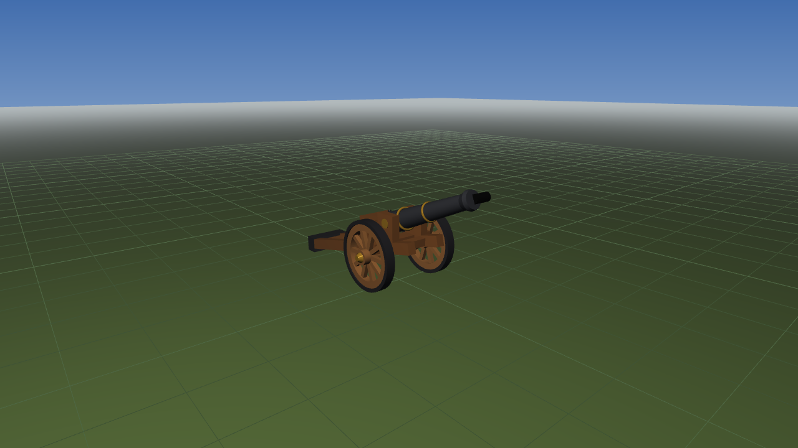

# Medieval Field Cannon — OpenGL

A 3-D scene in Python + PyOpenGL of a medieval field cannon on a wheeled
carriage. Drive it along the ground (the wheels roll at exactly the right rate),
elevate the barrel, and fire — the barrel recoils on a damped spring and the
cannonball flies a real ballistic arc. Lit with the full Phong reflection model,
evaluated per fragment in GLSL, with a per-vertex fixed-function path you can
flip to at runtime for comparison.



## Quick start

```bash
python -m pip install -r requirements.txt
python test.py        # sanity check: should show a coloured triangle
python main.py        # the scene
```

Python 3.9+, PyOpenGL, NumPy, Pillow. On Windows the PyOpenGL wheel bundles
freeglut, so there is nothing else to install; on Linux `sudo apt install
freeglut3-dev`.

## Controls

| Key | Action | Key | Action |
|---|---|---|---|
| `←` / `→` | drive backward / forward | `L` | light on / off |
| `↑` / `↓` | elevate / depress the barrel (0°–45°) | `K` | light orbit on / off |
| `Space` | fire | `N` | point light ↔ directional |
| `C` | cycle camera presets | `[` `]` | nudge the light azimuth |
| mouse drag | orbit | `F` | per-fragment Phong ↔ per-vertex Gouraud |
| wheel, `+`/`-` | zoom | `B` | Phong ↔ Blinn–Phong |
| `W` | wireframe | `M` | cycle the barrel material |
| `G` / `J` | ground / grid | `T` / `X` | trails / clear shots |
| `H` / `U` | help / HUD | `R` | reset |
| `P` | screenshot | `Esc` `Q` | quit |

## What it demonstrates

| | Where |
|---|---|
| Translation | `Cannon.drive`, root `glTranslatef` |
| Rotation — rolling | `φ = −s/R` tied to distance travelled |
| Rotation — elevation | `glRotatef` about the trunnion pivot |
| Hierarchical transforms | `Cannon.draw` push/pop tree, depth 2 |
| Perspective + camera | `gluPerspective` + orbiting `gluLookAt` |
| Phong lighting | ambient + diffuse + specular, attenuated point light |
| Two materials | matte oak vs. shiny cast iron (9× specular, 12× exponent) |
| Animation | recoil spring, projectile arc, orbiting light |

## Layout

```
main.py         window, camera, input, HUD, main loop, --shots figure driver
cannon.py       Cannon class: geometry, state, the transformation hierarchy
lighting.py     materials, light rig, GLSL Phong shader (+ fixed-function fallback)
projectile.py   cannonball physics and trail
utils.py        analytic primitives with derived normals, display-list cache
verify.py       numerical self-checks for every formula in the report
docs/           report.pdf, report.tex, REPORT.md, images/
```

## Documentation

- **[docs/report.pdf](docs/report.pdf)** — the full report: how to run it, the
  maths behind every transform and the lighting model, with figures.
- [docs/REPORT.md](docs/REPORT.md) — the same content in Markdown.
- `python verify.py` — reproduces every number quoted in the report.
- `python main.py --shots docs/images` — re-renders all 23 figures.

## Rebuilding the report

```bash
python main.py --shots docs/images    # regenerate the figures
python verify.py > docs/verification.txt
cd docs && pdflatex report.tex && pdflatex report.tex
```
